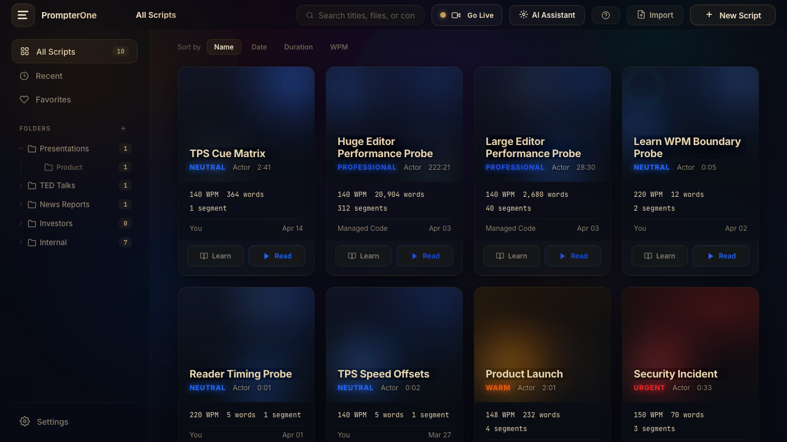
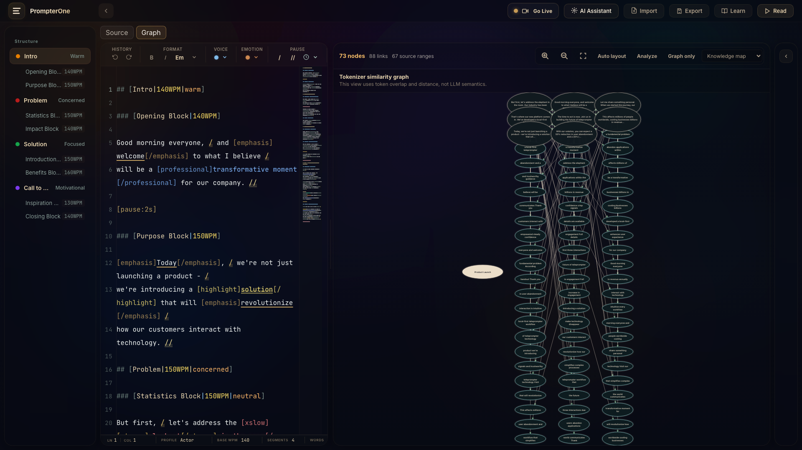
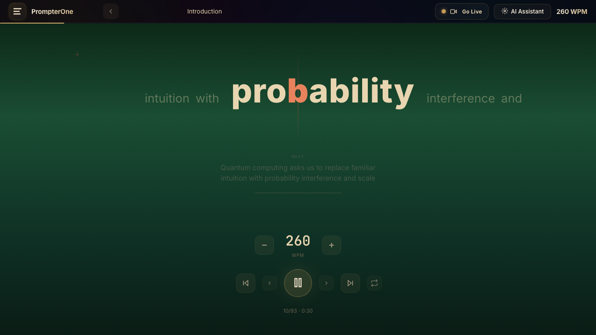
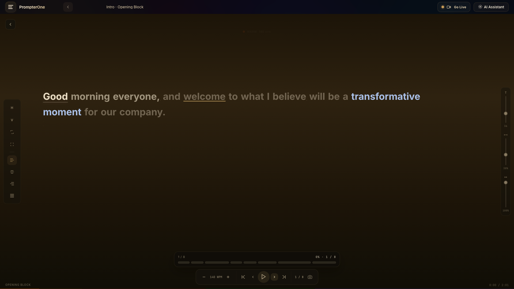
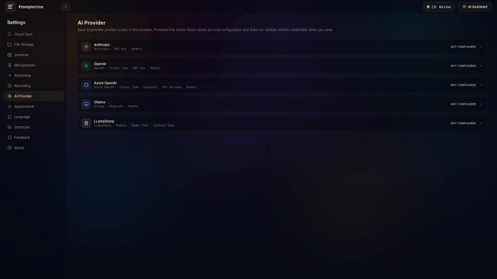
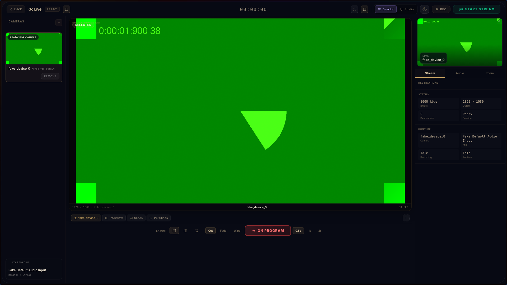

# PrompterOne

`PrompterOne` is a browser-first writing, rehearsal, teleprompter, and live-session studio for people who need to move from script to delivery without bouncing between disconnected tools.

It is built as a standalone Blazor WebAssembly app that runs directly in the browser. There is no PrompterOne backend in the runtime shape, no desktop wrapper, and no hidden media server tier. The product goal is simple: keep the whole flow client-side, honest, and operational.

## Why PrompterOne Exists

Most speaking and live-delivery workflows are fragmented:

- scripts live in one tool
- rehearsal happens in another
- teleprompter reading happens somewhere else
- live output, recording, and destination setup happen in a different control surface

`PrompterOne` brings those stages together into one browser workspace so the same script can move through:

1. `Library`
2. `Editor`
3. `Learn`
4. `Teleprompter`
5. `Go Live`

That makes it useful for founders, presenters, streamers, coaches, production operators, and teams who want one product to cover authoring, rehearsal, reading, and browser-side live operation.

## Product Gallery

### Library

The library is the launch surface for the whole workflow: browse scripts, organize folders, and jump into learn mode, reader mode, or authoring from the same card.



### Editor

The editor uses a TPS-oriented authoring surface with structure-aware writing, pace markers, semantic emphasis, and metadata that carry through into rehearsal and reading.



### Learn

`Learn` is the rapid rehearsal mode. It presents one word at a time with an ORP-style focal point so the user can tighten delivery, pacing, and confidence without reading line-by-line.



### Teleprompter

The teleprompter reader is the delivery surface: large readable type, phrase-aware emphasis, focal controls, and a clean stage designed for on-camera use.



### Go Live And Settings

`Settings` owns the operational setup. `Go Live` owns the session. That keeps configuration explicit and the runtime surface focused.

| Settings | Go Live |
| --- | --- |
|  |  |

## Core Workflows

### 1. Script Library

Why it exists:

- gives teams a single place to start a session
- keeps scripts, folders, and launch actions close together
- makes rehearsal and delivery feel like two views of the same content, not two separate products

Example:

- a presenter keeps keynote scripts, investor pitches, and incident-response notes in one library, then opens the same script in `Editor`, `Learn`, or `Teleprompter` depending on the task

### 2. TPS Authoring In Editor

Why it exists:

- plain text is not enough for delivery work
- scripts need pacing, structure, emotion, emphasis, and pronunciation hints that survive into playback

Example:

- a product launch script marks intros, blocks, pace changes, pauses, and emphasis so rehearsal timing and live reading stay aligned with the authored intent

### 3. RSVP Rehearsal In Learn

Why it exists:

- rehearsal needs speed and focus
- the user should be able to practice phrasing, cadence, and timing without the full teleprompter stage

Example:

- a speaker uses `Learn` to practice at higher WPM, then slows down for the final read without changing the underlying script

### 4. Delivery In Teleprompter

Why it exists:

- final delivery needs a calmer, more readable surface than RSVP rehearsal
- the user needs focal controls, readable width, and phrase-aware emphasis for real speaking conditions

Example:

- a host reads a script on camera with the teleprompter stage while preserving the same authored emphasis and pacing prepared in the editor

### 5. Browser-Side Session Operation In Go Live

Why it exists:

- recording and session operation should happen from the same browser workspace as the script
- the operator should see the actual state of the session instead of fictional destination states

Example:

- a producer opens `Go Live`, selects the browser-owned program feed, records locally, and arms transport connections such as `VDO.Ninja` and `LiveKit` when the chosen path actually supports the session

### 6. Explicit Media And Streaming Setup In Settings

Why it exists:

- device choice, sync, capture profiles, recording defaults, and transport configuration should not be hidden in screen-local state
- the live surface should operate a prepared configuration, not invent it on the fly

Example:

- a creator sets output resolution, local recording behavior, and transport connection details in `Settings`, then opens `Go Live` with the runtime already shaped for the session

## Product Status

`PrompterOne` is in active alpha. The product is already usable for authoring, rehearsal, teleprompter delivery, and browser-side session control, but some advanced workflows are intentionally still constrained.

### Ready Now

| Area | Status | What is ready |
| --- | --- | --- |
| Library | `Ready` | browse scripts, organize folders, open workflows from the same surface |
| Editor | `Ready` | TPS-oriented authoring, structure navigation, metadata rail, formatting and pacing controls |
| Learn | `Ready` | RSVP rehearsal flow, ORP-style display, pacing controls, context-aware playback |
| Teleprompter | `Ready` | browser reader stage, focus controls, phrase-aware emphasis, delivery surface |
| Settings | `Ready` | media setup, recording defaults, transport configuration, distribution-target modeling |
| Local recording | `Ready` | browser-side recording from the composed program feed |
| Go Live core runtime | `Working` | browser-owned program feed, source rails, runtime telemetry, transport orchestration |
| Localization | `Working` | browser-driven language negotiation with supported runtime cultures and persisted preference |

### Working But Still Expanding

| Area | Status | What exists today |
| --- | --- | --- |
| `VDO.Ninja` integration | `Working` | transport-aware connection and publish model inside the browser runtime |
| `LiveKit` integration | `Working` | transport-aware connection and publish model inside the browser runtime |
| Distribution targets | `Working` | target modeling and capability-gated routing instead of fake “broadcast everywhere” claims |
| Cloud and provider panels | `Working` | explicit configuration surfaces that are browser-local and credential-driven |

### Not Finished Yet

- `PrompterOne` does not claim generic direct browser RTMP fan-out to every platform.
- downstream targets such as `YouTube`, `Twitch`, and custom RTMP are only valid when the active transport path supports them honestly
- the live runtime is intentionally stricter than many streaming dashboards; unsupported paths stay blocked instead of being faked
- AI and cloud-provider experiences are configuration-first today, not turnkey managed services

## Roadmap

These are the current product directions, not release-date promises.

### Near Term

- stronger `Go Live` operational polish for source switching, destination health, and session telemetry
- better transport setup flows for `VDO.Ninja` and `LiveKit`
- sharper product onboarding so first-time users understand the script -> rehearse -> read -> go-live flow faster
- broader product docs and examples around real presenter and streaming scenarios

### After That

- deeper export, sync, and portability workflows for scripts and settings
- richer operator workflows around remote guests and destination routing
- more complete AI-assisted writing and transformation flows once provider integration is mature enough to be honest by default

## Technology Stack

- [.NET 10](https://dotnet.microsoft.com/en-us/download/dotnet/10.0)
- [Blazor WebAssembly](https://dotnet.microsoft.com/en-us/apps/aspnet/web-apps/blazor)
- Razor Class Library
- browser media APIs: `MediaDevices`, `WebRTC`, `MediaRecorder`, `Web Audio`
- automated testing with [xUnit](https://xunit.net/), [bUnit](https://bunit.dev/), and [Playwright](https://playwright.dev/)
- transport integrations with [LiveKit](https://livekit.com/) and [VDO.Ninja](https://vdo.ninja/)

## Architecture At A Glance

- host: [`src/PrompterOne.App`](src/PrompterOne.App)
- routed UI and browser interop: [`src/PrompterOne.Shared`](src/PrompterOne.Shared)
- reusable domain logic: [`src/PrompterOne.Core`](src/PrompterOne.Core)
- automated tests: [`tests/`](tests/)
- design reference: [`design/`](design/)
- architecture map: [`docs/Architecture.md`](docs/Architecture.md)

Useful deeper docs:

- [`docs/Features/EditorAuthoring.md`](docs/Features/EditorAuthoring.md)
- [`docs/Features/ReaderRuntime.md`](docs/Features/ReaderRuntime.md)
- [`docs/Features/GoLiveRuntime.md`](docs/Features/GoLiveRuntime.md)
- [`docs/Features/SettingsMediaFeedback.md`](docs/Features/SettingsMediaFeedback.md)
- [`docs/Features/AppVersioningAndGitHubPages.md`](docs/Features/AppVersioningAndGitHubPages.md)
- [`docs/Features/VendoredStreamingSdkReleases.md`](docs/Features/VendoredStreamingSdkReleases.md)

## Quality And Testing

`PrompterOne` treats real browser verification as the primary acceptance bar.

The quality stack is:

- solution build with warnings as errors
- core domain tests
- component and UI contract tests
- Playwright browser acceptance tests for the main user flows
- GitHub Actions PR validation before merge

Canonical local commands:

```bash
dotnet build -warnaserror
dotnet test
dotnet test --collect:"XPlat Code Coverage"
```

## Run Locally

Requirements:

- [.NET 10 SDK](https://dotnet.microsoft.com/en-us/download/dotnet/10.0)

Run the standalone app host:

```bash
dotnet run
```

## Deployment

`PrompterOne` is deployed as a static GitHub Pages build of the standalone WebAssembly app.

- production domain target: [https://prompter.managed-code.com/](https://prompter.managed-code.com/)

The Pages artifact ships the browser app only. There is no PrompterOne server deployment behind it.

## Versioning

The app version is shown inside `Settings > About`.

Version source of truth:

- [`Directory.Build.props`](Directory.Build.props)
- [`src/PrompterOne.App/Program.cs`](src/PrompterOne.App/Program.cs)

## Credits And Inspirations

- [LiveKit](https://livekit.com/)
- [VDO.Ninja](https://vdo.ninja/)
- [cameron/squirt](https://github.com/cameron/squirt) for RSVP inspiration
- [GitHub Pages](https://docs.github.com/en/pages)
- [Inter](https://rsms.me/inter/)
- [JetBrains Mono](https://www.jetbrains.com/lp/mono/)
- [Playfair Display](https://fonts.google.com/specimen/Playfair+Display)
- [Feather Icons](https://feathericons.com/)

## License

This project is licensed under [MIT](LICENSE).
