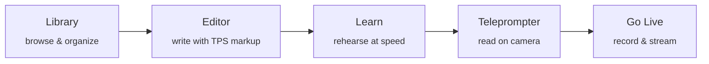

<h1 align="center">PrompterOne</h1>

<p align="center">
  <strong>Write. Rehearse. Read. Go live. All from the browser.</strong><br/>
  An open-source, browser-first teleprompter studio built around <a href="https://github.com/managedcode/TPS">TPS</a> so the same script can move from first draft to rehearsal, reader mode, recording, and live delivery without a backend.
</p>

<p align="center">
  <a href="https://prompter.managed-code.com/">Try it now</a> &middot;
  <a href="https://github.com/managedcode/PrompterOne">GitHub</a> &middot;
  <a href="https://github.com/managedcode/TPS">TPS</a> &middot;
  <a href="docs/Architecture.md">Architecture</a> &middot;
  <a href="#quick-start">Run locally</a> &middot;
  <a href="#license">License</a>
</p>

<p align="center">
  
  
  
</p>

<h2 align="center">🚀 Build In Public</h2>

<p align="center">
  <a href="https://www.youtube.com/watch?v=SBcsYblO1AI&list=PLIyi2UvDCig2IgzRQLJXcS5MYdZVDu2EM">
    
  </a>
</p>

<p align="center">
  <a href="https://www.youtube.com/@managedcode">
    
  </a>
</p>


---

## The Problem

If you speak on camera, stream, or present live, the workflow usually fragments immediately. Drafts live in one app. Rehearsal happens somewhere else. The teleprompter is a separate tool. Recording and streaming need another stack entirely. Every switch breaks context, strips timing cues, and turns delivery into a copy-paste problem.

**PrompterOne** keeps that flow in one browser tab. You write once in TPS, rehearse the same script in Learn, read it in the teleprompter, and send the same composed program feed into local recording or transport-aware live output. Pacing, emphasis, structure, metadata, and reader settings stay attached to the script instead of getting rebuilt at every stage.

No PrompterOne backend. No desktop install. No account wall. Open the app, start writing, and keep the runtime in the browser.

## What Works Today

- **Library**: browse scripts, create folders, move documents, sort by multiple columns, and jump straight into edit, Learn, or Teleprompter flows from the same card.
- **Editor**: author real TPS with metadata hydration, structure-aware navigation, floating formatting controls, syntax-aware rendering, and responsive large-draft typing.
- **Learn**: rehearse with ORP-aligned RSVP, context rails, phrase-aware timing, WPM controls, stepping, looping, and punctuation-safe word progression.
- **Teleprompter**: read with persisted font and width controls, focal-line positioning, horizontal and vertical mirror toggles, orientation switching, browser fullscreen, segmented progress, and optional camera background.
- **Settings**: manage appearance, media permissions, camera and microphone setup, sync offsets, recording defaults, cloud snapshot targets, and transport credentials from one routed screen.
- **Go Live**: run the browser-owned studio shell and save the composed program feed locally with decodable video and audio while remote transport and destination routing continue to expand.

## What You Get

### Script Library

The operating desk for the rest of the app. The library keeps starter scripts and your own documents in browser storage, supports nested folders, and lets you branch straight into editing, rehearsal, or reading from the same card. It is built for quick route switching instead of export-import churn.


---

### Smart Script Editor

This is not a plain textarea. The editor understands **TPS** (Teleprompter Script), so you can write in segments, blocks, pacing markers, emphasis, emotion tags, pronunciation guides, pause cues, and speed modifiers directly in the source. Front matter is parsed into the metadata rail and kept out of the visible body instead of lingering inline.

The authoring surface includes structure navigation on the left, a full formatting and insert toolbar, floating selection controls, a metadata rail for front matter and speed offsets, and syntax-aware highlighting over the live source. Recent UI work tightened dropdown behavior, tooltip behavior, date-field layout, and large-draft responsiveness so the editor remains usable on both polished demo scripts and very large seeded drafts.


---

### RSVP Rehearsal (Learn)

**Learn** is the rehearsal surface. It presents one word at a time using RSVP (Rapid Serial Visual Presentation) with an ORP-style focal point so the eye lands in a predictable place even as word lengths change.

Context rails show nearby words without clipping into the focal lane, phrase-aware pauses come from the TPS source, and speed is adjustable while you rehearse. Step controls, loop mode, stop-at-end behavior, and sentence-local context make it useful for both memorization and pacing work before you step into the reader.


---

### Teleprompter

The delivery surface. Large readable text, phrase-aware emphasis, adjustable font size, adjustable reader width, and a focal guide you can reposition without leaving the route. TPS formatting carries through here too: speed modifiers affect spacing, inline emphasis stays intact, punctuation is attached correctly, and emphasis groups stay continuous instead of breaking word by word.

A live camera feed can run behind the reader as a background layer, and the operator controls stay on-screen: horizontal mirror, vertical mirror, reader orientation toggle, browser fullscreen, font controls, width controls, focal positioning, segmented block progress, and transport-style playback controls all live inside the same reader shell. Smooth block-to-block transitions keep the reading flow readable in both forward and backward navigation.

Reader preferences persist between sessions, so your chosen layout, focal position, mirrors, and camera background do not have to be rebuilt every time.


---

### Go Live

A browser-owned studio session. PrompterOne captures a composed program feed directly in the browser, so canvas composition, audio monitoring, and source switching stay client-side.

**Local recording** saves the composed feed to a file on your machine and is the strongest part of the current live stack. **Remote publishing** is transport-aware through [LiveKit](https://livekit.io/) and [VDO.Ninja](https://vdo.ninja/): the browser keeps one real upstream transport path active for a session, and downstream targets are routed or blocked according to what that transport can actually service.

Distribution targets such as YouTube, Twitch, and custom RTMP are capability-gated: unsupported paths are blocked instead of being faked. PrompterOne does not hide a private relay tier behind the UI. The browser remains the only app runtime.

| Settings | Go Live |
| :---: | :---: |
|  |  |

---

### Settings

Settings holds the operational state for the rest of the app: appearance, browser language, cloud snapshot targets, camera selection with preview, microphone setup with live meters, delay and sync offsets, output quality profiles, recording defaults, and transport credentials. Theme changes and layout preferences persist, and appearance changes propagate across tabs instead of drifting out of sync.

---

### Localization

PrompterOne negotiates the initial language from your browser and remembers your explicit choice after that. Localized chrome and persisted user override are part of the browser runtime, not post-build demo copy.

## The Full Flow



Every stage works with the same script. Pacing, emphasis, structure, and metadata you add in the editor show up in rehearsal, in the teleprompter, and in the live session. No re-importing, no copy-paste, no format conversion.

## Product Status

PrompterOne is in **active alpha**: the core authoring, rehearsal, reader, and local-recording flow is solid now; remote publishing and portability layers are still expanding.

| Area | Status | Current reality |
| --- | :---: | --- |
| **Library** | ✅ | Script browsing, folder organization, create and move flows, workflow launchers, persisted browser storage |
| **Editor** | ✅ | TPS authoring, front-matter hydration, metadata rail, floating formatting controls, syntax-aware rendering, responsive large-draft typing |
| **Learn** | ✅ | ORP-aligned RSVP, phrase-aware timing, context rails, WPM controls, stepping, looping, punctuation-safe progression |
| **Teleprompter** | ✅ | Reader width and font controls, focal positioning, horizontal and vertical mirror toggles, orientation toggle, browser fullscreen, segmented progress, persisted layout |
| **Settings** | ✅ | Appearance sync, media permissions, camera and mic setup, delay offsets, recording defaults, cloud snapshot forms, transport configuration |
| **Local recording** | ✅ | Browser-side recording of the composed program feed with decodable video and audio |
| **Localization** | ✅ | Browser-negotiated chrome with persisted manual override |
| **Go Live studio shell** | ✅ | Source rails, scene switching, preview/program layout, runtime telemetry, session chrome, browser-owned operator workflow |
| **VDO.Ninja transport** | 🟡 | Real transport-aware browser integration, with operational polish still expanding |
| **LiveKit transport** | 🟡 | Real transport-aware browser integration and guest-path work, with operational polish still expanding |
| **Distribution routing** | 🟡 | Targets are capability-gated and blocked when the selected transport cannot service them |
| **Cloud storage snapshots** | 🟡 | Browser-local provider configuration ships now; broader import/export maturity is still expanding |
| **AI provider execution** | 🟡 | Provider settings and UI hooks exist, but full runtime execution is still gated behind honest provider integrations |
| **Generic RTMP fan-out** | ❌ | Intentionally unsupported without a real upstream transport path |
| **PrompterOne backend** | ❌ | By design: the browser is the only app runtime |

## Roadmap

These are product directions, not release-date promises.

**Near term:**
- Remote publish polish for VDO.Ninja and LiveKit transport flows
- Broader cloud portability for scripts, settings, and snapshots
- Better first-run onboarding across the write, rehearse, read, and record workflow
- More public documentation and real-world workflow examples

**After that:**
- Stronger guest and destination-routing workflows on top of the browser studio
- AI-assisted writing once provider integrations are real enough to document honestly
- Deeper operational telemetry and operator ergonomics in Go Live

## Quick Start

**Requirements:** [.NET 10 SDK](https://dotnet.microsoft.com/en-us/download/dotnet/10.0)

```bash
git clone https://github.com/managedcode/PrompterOne.git
cd PrompterOne
dotnet run --project src/PrompterOne.App
```

Or just open [prompter.managed-code.com](https://prompter.managed-code.com/) — no install needed.

## Technology

PrompterOne is a standalone [Blazor WebAssembly](https://dotnet.microsoft.com/en-us/apps/aspnet/web-apps/blazor) app on [.NET 10](https://dotnet.microsoft.com/en-us/download/dotnet/10.0). The browser is the runtime: media capture, composition, recording, and transport-aware output happen through browser APIs such as MediaDevices, WebRTC, MediaRecorder, Web Audio, and Canvas. Transport integrations use [LiveKit](https://livekit.io/) and [VDO.Ninja](https://vdo.ninja/). Verification uses [xUnit](https://xunit.net/), [bUnit](https://bunit.dev/), and [Playwright](https://playwright.dev/), with browser scenarios acting as the main release bar. Deployment is a static GitHub Pages build.

## For Contributors

```bash
dotnet build ./PrompterOne.slnx -warnaserror
dotnet test ./PrompterOne.slnx
dotnet format ./PrompterOne.slnx
dotnet test ./PrompterOne.slnx --collect:"XPlat Code Coverage"
```

Architecture and ownership boundaries are documented in [docs/Architecture.md](docs/Architecture.md). Each project has a local `AGENTS.md` that describes purpose, entry points, and rules for that area. Feature docs live in [docs/Features/](docs/Features/).

## Credits

- [LiveKit](https://livekit.io/) and [VDO.Ninja](https://vdo.ninja/) for transport infrastructure
- [cameron/squirt](https://github.com/cameron/squirt) for RSVP inspiration
- [Inter](https://rsms.me/inter/), [JetBrains Mono](https://www.jetbrains.com/lp/mono/), [Playfair Display](https://fonts.google.com/specimen/Playfair+Display)
- [Feather Icons](https://feathericons.com/)
- Deployed on [GitHub Pages](https://docs.github.com/en/pages)

## License

[MIT](LICENSE)
