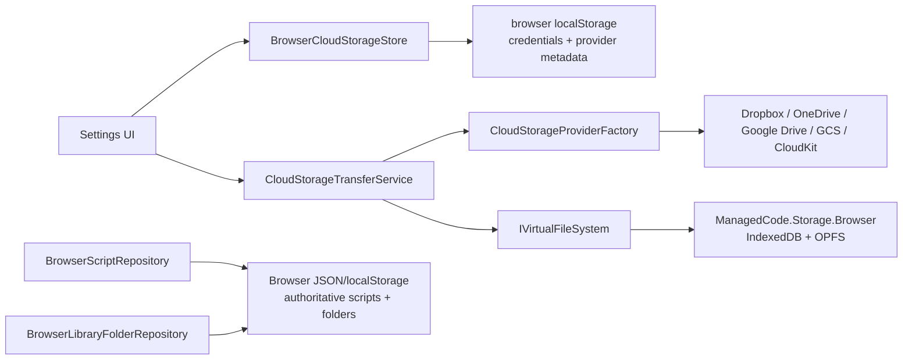

# ADR-0001: Browser VFS And Cloud Storage For Scripts And Settings

Status: Implemented  
Date: 2026-04-01  
Related Features: [Architecture Overview](/Users/ksemenenko/Developer/PrompterLive/docs/Architecture.md)

## Implementation plan (step-by-step)

- [x] Analyze the existing browser-only storage shape for scripts, folders, and settings.
- [x] Add ManagedCode.Storage packages and register browser storage plus virtual file system in the WASM host.
- [x] Integrate browser storage plus VFS for cloud/import-export flows while keeping the primary script and folder runtime store on authoritative browser JSON/localStorage for product stability.
- [x] Add provider preference and credential persistence for Dropbox, OneDrive, Google Drive, Google Cloud Storage, and CloudKit.
- [x] Add scripts/settings import-export through the configured provider set.
- [x] Add automated component and browser coverage for the new settings flow and storage contracts.
- [x] Update architecture documentation and record this ADR.

## Context

- `PrompterLive` is a standalone Blazor WebAssembly app with no backend runtime.
- Scripts and folders were persisted through ad-hoc browser localStorage JSON blobs.
- The product now needs browser-local persistence plus optional cloud import/export for scripts and settings.
- The user explicitly wants Managed Code storage providers, browser localStorage for provider keys and metadata, and no server-side secret store.
- Future video-stream export is expected, but this task must stop at scripts and settings.

Goals:

- Keep the app browser-only.
- Add a durable browser-storage boundary for cloud transfers now, while keeping the primary script and folder runtime path stable.
- Let Settings configure real cloud providers for import/export.
- Keep provider credentials and connection metadata in browser `localStorage`.

Non-goals:

- Recorded video upload or archive flows.
- Background sync engines or multi-device conflict resolution.
- OAuth popup/redirect orchestration hosted by PrompterLive.

## Stakeholders

| Role | What they need to know | Questions this ADR must answer |
| --- | --- | --- |
| Product | What users can store now and what is deferred | Can users keep scripts local-first and move them to cloud now? |
| Engineering | Which boundary owns persistence and cloud transfers | Where do browser VFS, provider credentials, and import/export logic live? |
| QA | Which flows must stay green | How do we verify local persistence, provider setup, and import/export safely? |
| Security | Where secrets sit in a backend-free app | Why are provider credentials in browser localStorage, and what risk does that create? |

## Decision

PrompterLive will register `ManagedCode.Storage.Browser` plus `ManagedCode.Storage.VirtualFileSystem` inside the WASM host for browser-local blob storage and provider-backed transfers, while the primary day-to-day script and folder runtime store remains an authoritative browser JSON/localStorage repository. Browser `localStorage` also remains the store for provider credentials, provider metadata, and lightweight settings values. Cloud providers are configured in Settings and currently support snapshot import/export of scripts and settings only.

Key points:

- Primary scripts and folders stay on an authoritative browser JSON/localStorage path so editor/library autosave stays stable under real WASM browser flows.
- Browser storage plus VFS remain active as the local storage abstraction for cloud snapshot import/export and future stream-export expansion.
- Provider credentials stay client-side because the runtime has no backend secret store.
- Cloud import/export is explicit and user-driven, not automatic bidirectional sync.
- The requested Google Cloud Storage provider is implemented through the actual package `ManagedCode.Storage.Gcp`.

## Diagram

## Alternatives considered

### Keep everything in ad-hoc localStorage blobs

- Pros: minimal code churn, no extra package integration.
- Cons: no file model, no VFS abstraction, brittle migration path, harder future expansion to cloud or stream artifacts.
- Rejected because the product now needs a durable storage boundary and provider-backed transfers.

### Introduce a backend for secrets and sync

- Pros: stronger secret handling, server-owned OAuth flows, easier centralized sync.
- Cons: violates the browser-only runtime, adds deployment and operational scope, blocks the current delivery target.
- Rejected because the app must remain standalone WASM.

### Add live cloud sync instead of snapshot import/export

- Pros: tighter cloud parity across devices.
- Cons: conflict resolution, offline semantics, provider-specific edge cases, higher failure surface.
- Rejected because scripts/settings transfer is needed now, while continuous sync is not.

## Consequences

### Positive

- Cloud transfer and future media-export work now have a real browser-storage and VFS abstraction available inside the app boundary.
- Cloud providers can be connected without introducing backend infrastructure.
- Import/export logic is isolated from page markup and provider SDK details.
- The storage boundary is reusable for later video-stream export work without forcing the editor and library to ride a less stable primary persistence path today.

### Negative / risks

- Provider credentials live in browser localStorage and are therefore exposed to the current browser profile.
  Mitigation: keep the app backend-free by design, persist only the provider credentials and metadata required for runtime use, and document that these connections are browser-profile scoped.
- Cloud import/export is a snapshot flow, so concurrent edits across devices can overwrite expectations.
  Mitigation: keep transfers explicit and user-triggered, not silent background sync.
- Browser test infrastructure must serve static web assets for storage packages as well as app assets.
  Mitigation: the UI test harness now reads `staticwebassets.development.json` and maps package `_content/*` assets dynamically.

## Impact

### Code

- Affected modules and services:
  - `src/PrompterLive.Shared/AppShell/Services/PrompterLiveServiceCollectionExtensions.cs`
  - `src/PrompterLive.Shared/Library/Services/Storage/*`
  - `src/PrompterLive.Shared/Storage/*`
  - `src/PrompterLive.Shared/Storage/Cloud/*`
  - `src/PrompterLive.Shared/Settings/Components/SettingsCloudSection.*`
  - `tests/PrompterLive.App.Tests/Settings/*`
  - `tests/PrompterLive.App.UITests/Settings/*`
  - `tests/PrompterLive.App.UITests/Infrastructure/*`
- New boundaries and responsibilities:
  - Browser JSON/localStorage owns primary script and folder runtime persistence.
  - Browser storage plus VFS own the local blob boundary used by cloud import/export and future expansion.
  - `BrowserCloudStorageStore` owns provider preference and credential persistence.
  - `CloudStorageTransferService` owns snapshot import/export.
  - `CloudStorageProviderFactory` owns runtime provider construction and validation.
- Feature flags and toggles:
  - none

### Data / configuration

- Scripts and folders now materialize into authoritative browser JSON/localStorage payloads with an explicit version marker so seed data and user changes stay stable across reloads.
- Browser storage plus VFS stay registered for provider-backed transfers instead of becoming the primary editor/library persistence path.
- Browser localStorage keys remain the source of truth for provider credentials and metadata.
- No server secrets, environment variables, or backend config were added.

### Documentation

- Architecture docs updated in [docs/Architecture.md](/Users/ksemenenko/Developer/PrompterLive/docs/Architecture.md).
- This ADR is the source of truth for the storage boundary and credential policy.
- Root `AGENTS.md` now records the durable rule that standalone cloud credentials live in browser localStorage.

## Verification

### Objectives

- Prove that local scripts and folders persist through the authoritative browser JSON/localStorage path without editor autosave hangs.
- Prove that cloud provider preferences and credentials persist through browser localStorage.
- Prove that the Settings cloud flow works in a real browser, including reload behavior.
- Prove that the UI-test self-hosted server can boot the app with package static assets present.

### Test environment

- Environment: local browser-hosted WASM runtime and self-hosted Playwright acceptance harness.
- Data and reset strategy: browser-local seed data only; tests rely on isolated runtime contexts.
- External dependencies: no real cloud credentials required for the regression suite; validation paths cover safe failure messages and state persistence.

### Testing methodology

- Core flows and invariants that must be proven:
  - scripts and folders persist locally through the authoritative browser repository path
  - provider settings survive reload
  - the chosen primary cloud provider opens and remains configurable after reload
  - invalid provider credentials fail safely with a visible validation message
- Positive flows that must pass:
  - component-level persistence for cloud preferences
  - browser-level configuration and reload of the Dropbox provider path
- Negative and safe-failure flows that must be covered:
  - missing Dropbox credentials do not connect and instead surface validation text
  - disconnect removes stored credentials and resets the UI subtitle
- Edge flows that must be covered:
  - runtime seed data and existing browser-local payloads can still materialize into the authoritative repositories without resurrecting deleted items
  - self-hosted browser suite serves package `_content/*` assets from the static web assets manifest
- Required realism level:
  - real browser flow for acceptance
  - no mocks or service doubles in verification flows added for this change
- Pass criteria:
  - build, relevant tests, full solution tests, coverage, and format all pass

### Test commands

- build: `dotnet build /Users/ksemenenko/Developer/PrompterLive/PrompterLive.slnx -warnaserror`
- test: `dotnet test /Users/ksemenenko/Developer/PrompterLive/PrompterLive.slnx`
- format: `dotnet format /Users/ksemenenko/Developer/PrompterLive/PrompterLive.slnx`
- coverage: `dotnet test /Users/ksemenenko/Developer/PrompterLive/PrompterLive.slnx --collect:"XPlat Code Coverage"`

### New or changed tests

| ID | Scenario | Level | Expected result | Notes |
| --- | --- | --- | --- | --- |
| TST-001 | Save Dropbox draft settings and reload the Settings page | UI | Provider selection, label, and validation message persist | `SettingsCloudStorageFlowTests` |
| TST-002 | Disconnect Dropbox and clear persisted credentials | Component | Credentials are removed and subtitle resets to disconnected | `SettingsInteractionTests` |
| TST-003 | Load the stored primary provider and auto-open its card | Component | Selected provider card renders open after state load | `SettingsInteractionTests` |

### Regression and analysis

- Regression suites to run:
  - `tests/PrompterLive.Core.Tests`
  - `tests/PrompterLive.App.Tests`
  - `tests/PrompterLive.App.UITests`
  - full solution tests
- Static analysis:
  - repo build under `-warnaserror`
  - `dotnet format`
- Coverage comparison:
  - solution coverage must stay at least at the previous baseline or improve

## Rollout and migration

- Migration steps:
  - ship the browser-storage and VFS wiring with the updated Settings UI
  - allow repository services to materialize runtime seeds and prior browser payloads into authoritative local browser JSON on first mutation
- Backwards compatibility:
  - existing local library payloads are read and migrated instead of being dropped
  - settings still use browser-local persistence
- Rollback:
  - revert the storage wiring, cloud UI, and repository changes together; partial rollback would break the storage boundary

## References

- [managedcode/Storage](https://github.com/managedcode/Storage)
- [ManagedCode Storage docs](https://storage.managed-code.com/)
- [docs/Architecture.md](/Users/ksemenenko/Developer/PrompterLive/docs/Architecture.md)

## Filing checklist

- [x] File saved under `docs/ADR/ADR-0001-browser-vfs-and-cloud-storage.md`.
- [x] Status reflects the implemented state.
- [x] Diagram section contains at least one Mermaid diagram.
- [x] Testing methodology includes positive, negative, and edge flows plus pass criteria.
- [x] New or updated automated tests exist for the changed behaviour.
- [x] `docs/Architecture.md` updated for the new storage boundary.
