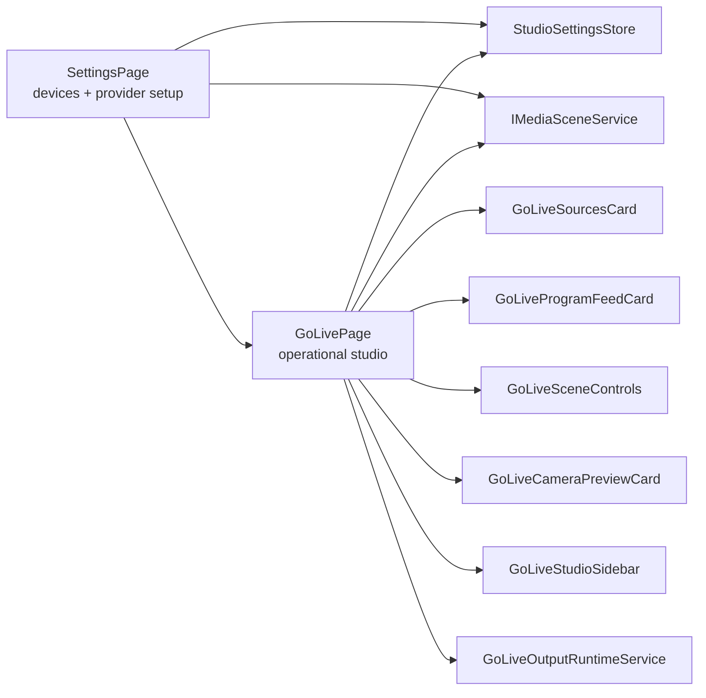

# ADR-0002: Go Live Operational Studio Surface

Status: Implemented  
Date: 2026-04-01  
Related Features: [Go Live Runtime](/Users/ksemenenko/Developer/PrompterOne/docs/Features/GoLiveRuntime.md), [Architecture Overview](/Users/ksemenenko/Developer/PrompterOne/docs/Architecture.md)

## Implementation plan (step-by-step)

- [x] Audit the existing routed `Go Live` page against `new-design/golive.html`.
- [x] Replace the design drifted routing form layout with a studio shell that matches the design rails and canvas.
- [x] Bind the studio shell to real browser media state, real scene cameras, and honest destination readiness summaries.
- [x] Keep detailed provider setup in `Settings` and reduce `Go Live` to operational toggles plus links back to setup.
- [x] Add component and browser coverage for source selection, take-to-air, destination arming, and deterministic browser media behavior.
- [x] Update architecture and feature documentation to reflect the new boundary.

## Context

- The prior `Go Live` page mixed an operational studio surface with a large lower deck of inline provider forms.
- That shape diverged from `new-design/golive.html`, pushed the most important controls below the fold, and encouraged duplicate ownership of provider credentials between `Go Live` and `Settings`.
- The product already has browser media services, scene state, output runtime services, and persisted provider settings. The problem was not missing capability; it was a blurred page contract.
- The user explicitly asked for a real `Go Live` studio with camera switching, live preview, honest data, and design fidelity instead of a fake or placeholder surface.

Goals:

- Keep `Go Live` visually faithful to `new-design/golive.html`.
- Make `Go Live` operational, not administrative.
- Keep live status, room state, and destination readiness truthful to what the browser runtime actually knows.
- Cover the main studio flow with automated component and browser tests.

Non-goals:

- Adding new server-side relay infrastructure.
- Moving provider credential editing out of `Settings`.
- Inventing packet-loss, guest, or network telemetry that the browser runtime does not own.

## Decision

`Go Live` becomes the operational studio surface for the current scene, while `Settings` remains the only page that edits provider credentials, ingest endpoints, and detailed device or streaming configuration.

Key points:

- The routed `Go Live` page now mirrors the design shell with a top session bar, left input rail, center program monitor, scene control strip, and right live/studio rail.
- The center monitor shows the currently selected program source. The right preview rail shows the currently on-air source until the operator takes the selected source live.
- Destination cards in the right rail only arm or disarm persisted targets and show honest readiness summaries derived from stored settings and runtime availability.
- If the browser exposes cameras and the scene is empty, `Go Live` seeds the first available camera so the studio does not boot into a dead state.
- Fake guest lists, fake people, and invented runtime metrics are removed. The room panel may show local-host state and persisted room identity only when no real guest transport exists.

## Diagram

## Alternatives considered

### Keep provider forms inside `Go Live`

- Pros: fewer clicks for provider editing.
- Cons: duplicates `Settings` ownership, keeps the studio surface bloated, and continues the design mismatch.
- Rejected because it preserves the exact ambiguity that caused the current UI drift.

### Build a design-faithful shell but populate it with placeholder data

- Pros: fast visual parity.
- Cons: violates the product requirement for honest browser-backed state and would make tests prove a fake flow.
- Rejected because `Go Live` is an operational screen, not a mockup.

### Move all live controls into `Settings`

- Pros: one page for every live concern.
- Cons: destroys the operational studio workflow and breaks the design reference.
- Rejected because the user needs a dedicated live-production surface.

## Consequences

### Positive

- `Go Live` now reads like a studio surface instead of a settings form.
- Runtime ownership is clearer: `Settings` configures providers, `Go Live` operates them.
- Source switching and take-to-air behavior are easier to reason about and test.
- The page no longer renders fake people or fabricated provider/network state.

### Negative / risks

- Operators must leave `Go Live` for deep provider edits.
  Mitigation: destination cards link directly to `Settings`, and the right rail explains that detailed setup lives there.
- Browser runtime metrics remain limited compared to a server relay.
  Mitigation: the UI shows honest summaries and avoids pretending the browser has relay telemetry.
- Auto-seeding a default camera changes empty-scene boot behavior.
  Mitigation: this only happens when the scene is empty and real browser cameras are available, which avoids a dead operational surface.

## Impact

### Code

- Affected modules and services:
  - `src/PrompterOne.Shared/GoLive/Pages/*`
  - `src/PrompterOne.Shared/GoLive/Components/*`
  - `src/PrompterOne.Shared/Contracts/UiTestIds.cs`
  - `tests/PrompterOne.App.Tests/GoLive/GoLivePageTests.cs`
  - `tests/PrompterOne.App.UITests/GoLive/GoLiveFlowTests.cs`
  - `tests/PrompterOne.App.UITests/Scenarios/StudioWorkflowScenarioTests.cs`
- New boundaries and responsibilities:
  - `GoLivePage` owns the operational studio layout and quick toggles.
  - `Settings` owns provider configuration and detailed streaming setup.
  - `GoLiveStudioSidebar` summarizes provider readiness but does not edit secrets or ingest fields.

### Documentation

- [docs/Features/GoLiveRuntime.md](/Users/ksemenenko/Developer/PrompterOne/docs/Features/GoLiveRuntime.md) now documents the operational-studio boundary.
- [docs/Architecture.md](/Users/ksemenenko/Developer/PrompterOne/docs/Architecture.md) now maps `Go Live` and `Settings` responsibilities more explicitly.

## Verification

### Testing methodology

- Prove the compact studio layout through routed component tests.
- Prove browser-realistic source selection, take-to-air, and destination arming through deterministic Playwright media flows.
- Keep screenshot artifacts for the main studio scenario under `output/playwright/`.

### Test commands

- `dotnet build /Users/ksemenenko/Developer/PrompterOne/PrompterOne.slnx -warnaserror`
- `dotnet test /Users/ksemenenko/Developer/PrompterOne/tests/PrompterOne.App.Tests/PrompterOne.App.Tests.csproj --filter "FullyQualifiedName~GoLivePageTests"`
- `dotnet test /Users/ksemenenko/Developer/PrompterOne/tests/PrompterOne.App.UITests/PrompterOne.App.UITests.csproj --filter "FullyQualifiedName~GoLiveFlowTests"`
- `dotnet test /Users/ksemenenko/Developer/PrompterOne/tests/PrompterOne.App.UITests/PrompterOne.App.UITests.csproj --filter "FullyQualifiedName~StudioWorkflow_SettingsAndGoLiveStudio_CapturesArtifacts"`

### New or changed tests

| ID | Scenario | Level | Expected result |
| --- | --- | --- | --- |
| TST-001 | Open `Go Live` with persisted destinations | Component | Ready summaries render from persisted settings without inline provider forms |
| TST-002 | Select the secondary camera and take it live | UI | Program monitor switches first, live preview switches only after take-to-air |
| TST-003 | Arm LiveKit, YouTube, OBS, and recording from the studio surface | UI | Quick toggles persist and reload into the operational studio |

## References

- [new-design/golive.html](/Users/ksemenenko/Developer/PrompterOne/new-design/golive.html)
- [docs/Features/GoLiveRuntime.md](/Users/ksemenenko/Developer/PrompterOne/docs/Features/GoLiveRuntime.md)
- [docs/Architecture.md](/Users/ksemenenko/Developer/PrompterOne/docs/Architecture.md)
