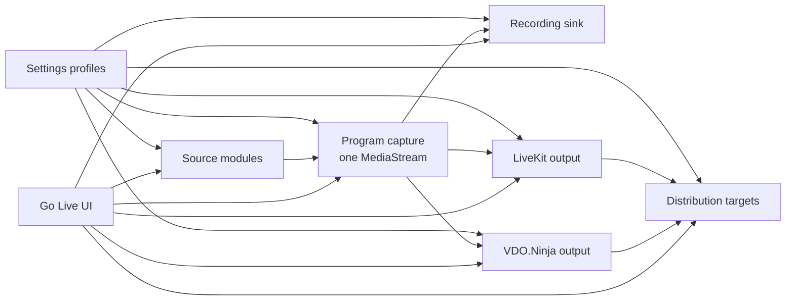

# ADR-0003: Go Live Transport Modules And Downstream Target Routing

Status: Accepted  
Date: 2026-04-02  
Related Features: [Go Live Runtime](../Features/GoLiveRuntime.md), [Architecture Overview](../Architecture.md)

## Context

`Go Live` already had a browser compositor and browser-local recording, but the surrounding model was still shaped like a mixed set of output toggles:

- a legacy browser-output path was still represented as a product path
- `LiveKit`, `VDO.Ninja`, and RTMP-style targets were mixed together as flat “destinations”
- the model did not distinguish remote source intake, program publishing, and downstream targets
- the settings and runtime contracts could not express concurrent `LiveKit + VDO.Ninja` publish or capability-gated downstream targets cleanly

The user then locked these rules:

- the legacy browser-output path is removed completely
- PrompterOne stays browser-only and does not add a PrompterOne backend
- `VDO.Ninja` and `LiveKit` may both be active publish transports in one session
- local recording remains first-class and always hangs off the same browser-owned program feed
- downstream targets must be blocked unless the bound transport actually supports them

## Decision

`Go Live` will use one canonical browser-owned program feed and modular transport contracts built around `sources + program + sinks`.

The accepted runtime model is:

- `Source modules`
  - local browser scene sources
  - `VDO.Ninja` remote intake
  - `LiveKit` remote intake
- `Program capture`
  - one canonical composed `MediaStream`
- `Output modules`
  - local recording
  - `VDO.Ninja` publish
  - `LiveKit` publish
- `Distribution targets`
  - `YouTube`
  - `Twitch`
  - `Custom RTMP`
  - bound to explicit transport connection ids

### Locked outcomes

- There is no legacy browser-output path in the architecture.
- There is no backward compatibility for the old local-output settings shape.
- `LiveKit` and `VDO.Ninja` are both valid active publish modules at the same time.
- Local recording is not modeled as an external destination.
- Downstream targets do not imply native browser RTMP support.
- Target readiness is derived from bound transport capabilities, not from target presence alone.

## Rationale

This model matches the real runtime better:

- the browser compositor already owns the only truthful program feed
- recording and publishing should consume that same feed
- remote intake and downstream routing are different concerns and should not share one flat profile type
- the UI needs to render capability-driven cards instead of hardcoded provider branches

It also keeps the browser-only constraint honest:

- PrompterOne does not mint tokens or run secret-bearing relay control inside WebAssembly
- `LiveKit` server APIs and similar control-plane actions remain outside the browser runtime
- unsupported browser-native RTMP paths stay blocked instead of being implied

## Architecture

## Consequences

### Positive

- The runtime model now matches the actual browser pipeline.
- `Settings` can configure transport connections and distribution targets without special local-output cases.
- `Go Live` can render module-driven cards and honest blocked states.
- Concurrent `LiveKit + VDO.Ninja` publish is now expressible and testable.

### Negative

- The old local-output storage shape is intentionally discarded.
- UI tests and component tests must be migrated aggressively because the old shape is not preserved.
- Some downstream targets remain blocked until a real transport capability exists.

## Alternatives Considered

### Keep the old flat destination model

- Rejected because it hides the difference between intake, publish, and downstream routing.

### Preserve the legacy local-output mode

- Rejected because the product is the streaming system itself, not a wrapper around another local output surface.

### Force exactly one active upstream transport

- Rejected because the user explicitly approved concurrent `VDO.Ninja + LiveKit` publish for the same session.

### Pretend every downstream target is a native browser publish path

- Rejected because that would misrepresent real browser and transport constraints.

## Implementation Impact

- `PrompterOne.Core/Streaming` owns the new source/output module contracts and the new profile types.
- `PrompterOne.Shared/Settings` owns editing of program capture, recording, transport connections, and distribution targets.
- `PrompterOne.Shared/GoLive` owns operating the composed program feed and visualizing module/target state.
- Browser runtime JS is split between program composition, recording, and transport-specific publish helpers.

## Verification

- `dotnet build ./PrompterOne.slnx -warnaserror`
- `dotnet test ./tests/PrompterOne.Core.Tests/PrompterOne.Core.Tests.csproj`
- `dotnet test ./tests/PrompterOne.Web.Tests/PrompterOne.Web.Tests.csproj`
- `dotnet test ./tests/PrompterOne.Web.UITests/PrompterOne.Web.UITests.csproj --no-build --filter "FullyQualifiedName~GoLive"`
