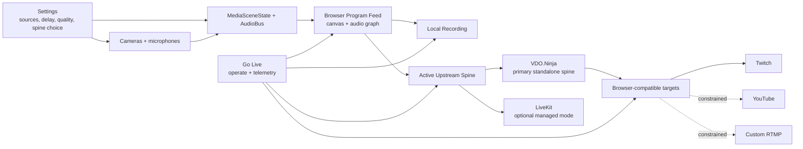

# ADR-0003: Go Live Broadcast Spine And Relay Architecture

Status: Proposed  
Date: 2026-04-02  
Related Features: [Go Live Runtime](/Users/ksemenenko/Developer/PrompterOne/docs/Features/GoLiveRuntime.md), [Architecture Overview](/Users/ksemenenko/Developer/PrompterOne/docs/Architecture.md), [Go Live Broadcast Spine Architecture Plan](/Users/ksemenenko/Developer/PrompterOne/go-live-broadcast-spine-architecture.plan.md)

## Context

`Go Live` needs to become a real browser-first production surface, not only a set of destination toggles.

The required operator model is:

- multiple video and audio inputs are configured in `Settings`
- each source can carry its own delay, gain, and routing rules
- the browser composes those sources into one program feed
- that same program feed is the source of truth for local recording and remote publishing
- the left rail stays the operator's source-control surface
- the right rail becomes the runtime output surface with real telemetry and metadata

The current repo already contains several critical building blocks:

- browser-side program composition via canvas and `AudioContext`
- `AudioBusState.DelayMs`, gain, mute, and route-target contracts
- `GoLiveOutputRequestFactory` and `GoLiveOutputRuntimeService` for one composed program session
- provider descriptors for LiveKit, VDO.Ninja, and RTMP-style destinations
- browser-local recording and runtime metadata work already centered on the same composed program stream

What is still missing is the canonical transport architecture. The codebase currently exposes multiple provider types, but it does not yet document which one is the main upstream broadcast spine and which ones are optional integrations or downstream targets.

The user then tightened the core runtime rule:

- there is no PrompterOne backend
- there is no PrompterOne-managed relay or media server
- the browser is the only PrompterOne runtime
- if signaling, TURN, or WHIP infrastructure exists, it must belong to the chosen third-party platform rather than to PrompterOne

That ambiguity creates several product risks:

- duplicated publish paths for the same session
- confused runtime telemetry because multiple providers claim ownership
- direct-browser fan-out expectations that do not match real platform ingest constraints
- UI drift between source control and destination/runtime control

## Decision

`Go Live` will use one browser-composed `Program Feed` and one active upstream broadcast spine per session.

Under the hard rule that PrompterOne stays a pure standalone browser runtime with no PrompterOne-owned server tier, the default and primary upstream spine becomes `VDO.Ninja`.

`LiveKit` moves to an optional future integration mode that is only valid if the product explicitly accepts a managed media-server transport outside the browser-only purity model.

`YouTube`, `Twitch`, and `Custom RTMP` are no longer treated as “solved by default” in one generic way. Under the standalone-only rule:

- `Local Recording` is fully in scope
- `Twitch` is in scope through VDO.Ninja's documented browser-first WHIP path
- `YouTube` is also in scope through VDO.Ninja-driven browser publishing workflows and is explicitly called out by VDO.Ninja as a use case
- `Custom RTMP` remains constrained unless the chosen browser transport exposes a real browser-compatible path for it

### Decision Details

- The browser compositor remains the single source of truth for the live program:
  - selected cameras and overlays compose into one canvas stream
  - routed microphones and other inputs mix into one program audio graph
  - local recording and remote publishing both consume that same program feed
- `Settings` owns:
  - source inventory
  - camera and microphone defaults
  - per-device delay/sync offsets
  - gain and route settings
  - output quality profiles
  - the chosen upstream broadcast spine for the setup
- `Go Live` owns:
  - source switching and scene operation
  - arming the chosen spine
  - arming local recording
  - displaying real runtime metadata, audio levels, connection state, and downstream destination health
- Only one upstream browser transport may be active for a session:
  - `VDO.Ninja` by default
  - `LiveKit` only in an explicitly different managed-transport mode
  - never both as the same session's primary publish path
- Multiple downstream destinations are allowed only behind that chosen spine:
  - local recording
  - browser-reachable publish targets supported by that spine
  - platform fan-out only where a real browser-compatible path exists, with `YouTube` and `Twitch` treated as valid VDO-driven targets

## Why VDO.Ninja Becomes The Primary Spine

Under the stricter standalone rule, VDO.Ninja matches the product model better:

- the SDK can publish a `MediaStream` directly from the browser compositor
- the model is room-oriented and aligns with the “director creates the room, participants join, output comes from the director/browser” workflow
- the service is explicitly built around P2P or light-signaling operation instead of requiring a PrompterOne-managed backend
- the SDK exposes browser-usable runtime hooks such as `getStats`, `peerLatency`, connection events, and a `WHIPClient`

That makes it the most coherent default for:

- browser-only room orchestration
- guest or participant joining
- director-controlled composition
- local recording from the same program feed

## Why LiveKit Is No Longer The Default Under This Constraint

LiveKit is still technically strong, but it no longer fits the strictest version of the product rule as the default:

- it is centered on an SFU/media-server transport rather than a browser-as-the-only-runtime story
- it becomes a better fit only if the product accepts a managed external media-server platform as part of the runtime architecture
- that is a materially different product posture from “the browser is the server”

LiveKit therefore stays valuable as a fallback or future optional mode if the standalone purity rule is intentionally relaxed later.

## Diagram

## Alternatives Considered

### Use VDO.Ninja As The Primary Studio Backbone

- Pros:
  - simple browser publishing API
  - strong P2P story
  - built-in WHIP/WHEP helpers
  - optional zero-infrastructure workflows
- Cons:
  - weaker match for centralized multi-destination production and downstream egress
  - room-scale and handshake model are less aligned with an operational studio backbone
  - telemetry and platform fan-out story are less cohesive for this product shape
- Accepted under the browser-only standalone rule.

### Use LiveKit As The Primary Studio Backbone

- Pros:
  - strong JS SDK
  - explicit media publish controls
  - strong downstream egress story
- Cons:
  - relies on a managed media-server transport model
  - conflicts with the tighter requirement that the browser is the only PrompterOne runtime
- Rejected as the default under the current product rule. May be revisited only if that rule changes.

### Publish The Same Session Through LiveKit And VDO.Ninja In Parallel

- Pros:
  - maximum flexibility in theory
- Cons:
  - doubles browser encode/publish complexity
  - duplicates telemetry ownership
  - makes operator state harder to understand
  - creates sync and failure-mode ambiguity
- Rejected because one session must have one upstream spine.

### Publish Directly From The Browser To Every Final Platform

- Pros:
  - conceptually simple UI
- Cons:
  - does not match real platform ingest requirements consistently
  - makes per-platform scaling and telemetry harder
  - turns the browser into a multi-target encoder/orchestrator
- Rejected because the browser should own composition and the first publish, not full downstream fan-out.

## Consequences

### Positive

- The operator mental model becomes clear:
  - compose once
  - publish once
  - fan out downstream
- Local recording and remote publishing stay in sync because both use the same program feed.
- `Settings` and `Go Live` boundaries become easier to maintain:
  - `Settings` defines
  - `Go Live` operates
- Right-rail telemetry can be honest because one active runtime owns it.

### Negative / Risks

- Some target platforms still require per-platform validation under the pure standalone rule.
  Mitigation:
  keep `Local Recording` as phase one, treat `YouTube` and `Twitch` as valid VDO-driven targets, and only keep `Custom RTMP` constrained until a real browser path is confirmed.
- `VDO.Ninja` becomes the default spine, which narrows the first implementation path.
  Mitigation:
  this is desirable for initial delivery because it reduces moving parts and matches the user's director-room workflow.
- The product still needs a clearer settings model for “active spine” selection and downstream target mapping.
  Mitigation:
  implement the next slice around an explicit upstream-spine choice and a separate downstream-destination model.

## Rollout Plan

### Phase 1: Stabilize Program Feed And Local Recording

- treat the browser-composed program feed as the authoritative source
- finish local recording UX, metadata, and telemetry
- expose source, sync, gain, and route settings clearly in `Settings`
- keep the right rail focused on real recorder/runtime state

### Phase 2: Introduce Explicit Upstream Spine Selection

- add a single “active broadcast spine” setting
- ship `VDO.Ninja` as the first production spine
- keep `LiveKit` behind an explicit optional managed-transport mode
- make `Go Live` reflect only the active spine's telemetry

### Phase 3: Add Browser-Compatible Direct Publish Targets

- add browser-compatible direct publish targets first, with `YouTube` and `Twitch` as the first-class VDO-driven targets
- report target health in the right rail only when the chosen SDK exposes honest runtime state
- keep `Custom RTMP` explicitly marked as constrained unless a real browser RTMP-compatible path exists

### Phase 4: Optional Managed Transport Mode

- support `LiveKit` only as an explicit alternate product mode
- keep it mutually exclusive with the default `VDO.Ninja` publish path for a given session

## Impact

### Code

- `src/PrompterOne.Core/Streaming` becomes the owner of:
  - upstream spine selection
  - downstream destination modeling
  - standalone transport constraints
- `src/PrompterOne.Core/Media` remains the owner of:
  - source inventory
  - audio delay/gain/route contracts
- `src/PrompterOne.Shared/Settings` becomes the owner of:
  - per-device sync and quality controls
  - the active spine choice
  - destination configuration
- `src/PrompterOne.Shared/GoLive` becomes the owner of:
  - runtime telemetry
  - operator controls
  - source switching
  - right-rail output status

### Documentation

- [docs/Features/GoLiveRuntime.md](/Users/ksemenenko/Developer/PrompterOne/docs/Features/GoLiveRuntime.md) must distinguish current runtime behavior from the target broadcast-spine rollout.
- [docs/Architecture.md](/Users/ksemenenko/Developer/PrompterOne/docs/Architecture.md) must show the new upstream/downstream boundary explicitly.

## Verification

### Research Basis

- Verify the decision against official LiveKit, VDO.Ninja, and platform-ingest documentation.
- Verify the repo fit against current provider registrations, output contracts, and scene/audio settings already in the codebase.

### Implementation Validation For The Next Slice

- `dotnet build /Users/ksemenenko/Developer/PrompterOne/PrompterOne.slnx -warnaserror`
- `dotnet test /Users/ksemenenko/Developer/PrompterOne/tests/PrompterOne.App.UITests/PrompterOne.App.UITests.csproj --filter "FullyQualifiedName~GoLive"`

## References

- [VDO.Ninja SDK home: P2P model, WHIP/WHEP support, room guidance, and licensing notes](https://sdk.vdo.ninja/)
- [VDO.Ninja SDK API reference: publish, getStats, peerLatency, WHIPClient, Twitch WHIP endpoint](https://sdk.vdo.ninja/docs/api-reference.html)
- [LiveKit JS LocalParticipant publishTrack](https://docs.livekit.io/reference/client-sdk-js/classes/LocalParticipant.html)
- [LiveKit media configuration: capture vs publish, bitrate, framerate, simulcast, dynacast](https://docs.livekit.io/transport/media/advanced/)
- [VDO.Ninja use cases, including publishing to YouTube](https://docs.vdo.ninja/readme/use-cases)
- [YouTube Live encoder settings and RTMPS guidance](https://support.google.com/youtube/answer/2853702)
- [Twitch broadcast overview and RTMP ingest model](https://dev.twitch.tv/docs/video-broadcast/)
