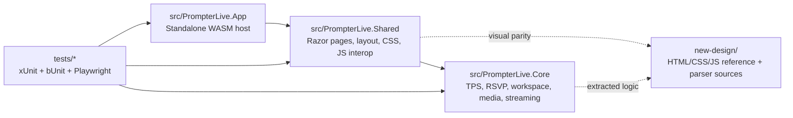
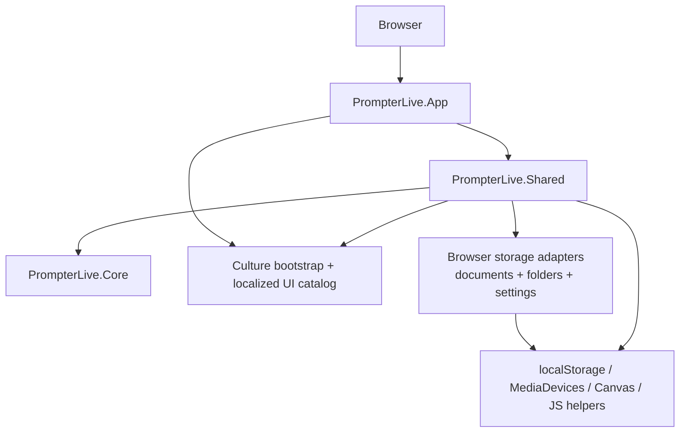
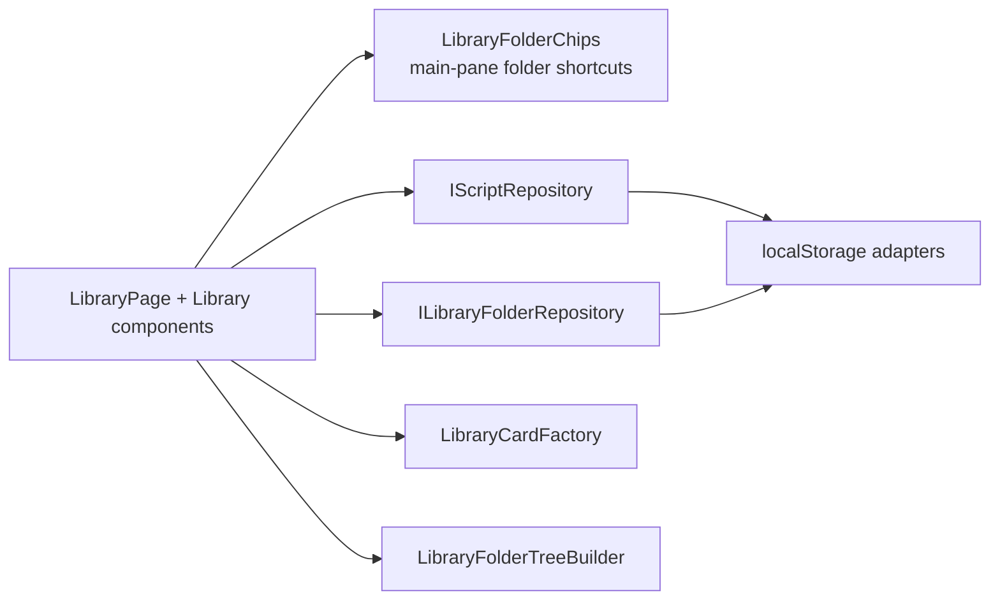
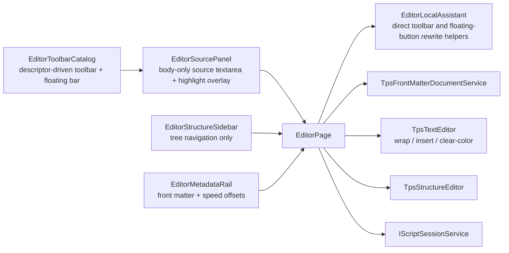
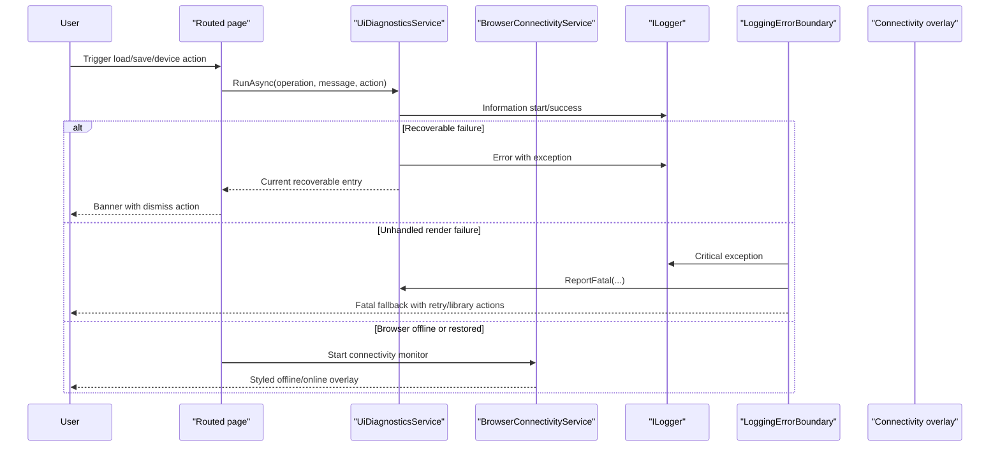
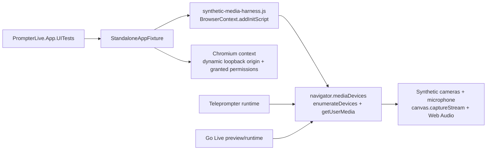
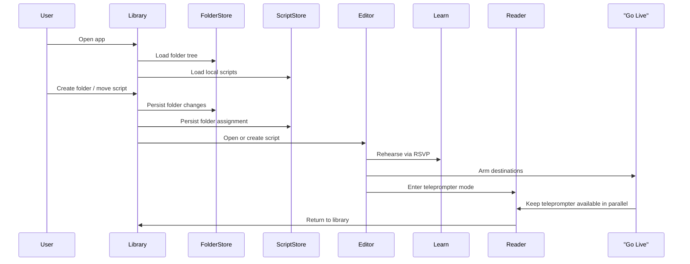
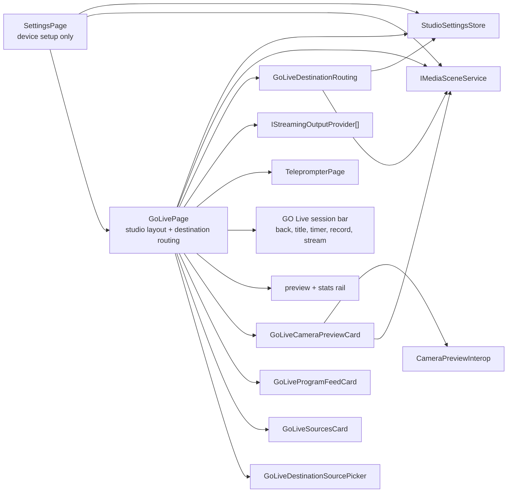
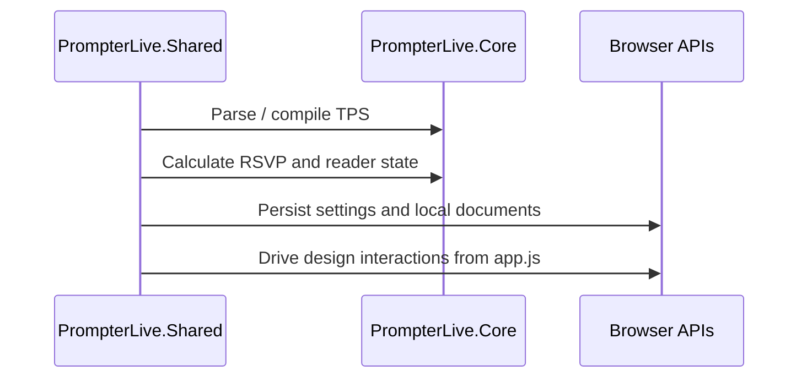
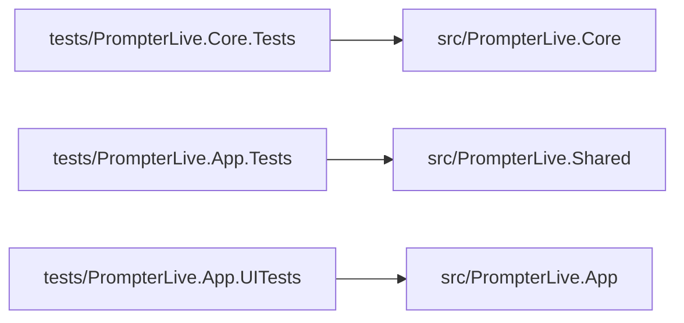

# PrompterLive Architecture

## Intent

`PrompterLive` is a standalone Blazor WebAssembly teleprompter app.

The acceptance target is a browser-only runtime that:

- matches the local `new-design/` UI closely
- parses and exports TPS content
- supports RSVP learn mode and teleprompter reading mode
- keeps media, scene, and streaming state client-side
- ships all automated tests under `tests/`

There is no backend in the runtime architecture.

## Architecture Document Contract

`docs/Architecture.md` is the required entry point before any non-trivial change.

Every agent or contributor must read it first to answer three questions before editing:

1. where the target behavior lives
2. which component owns the change
3. which boundary must stay untouched

This document must stay detailed enough that a new contributor can use it as the primary map for both implementation and discovery.

It must always include:

- the full app structure and how the top-level projects relate
- every major component or feature slice with:
  - what it is
  - why it exists
  - where it lives in the repo
  - what it owns
  - what it must not own
- the design principles that drive UI implementation
- the architecture and dependency principles that drive code placement
- the main places to look when adding, debugging, or reshaping behavior
- Mermaid diagrams that render and reflect the current structure

If a change introduces a new major component, moves ownership, or changes how contributors should discover the code, update this document in the same task.

## Solution Layout

## Vertical Slice Layout

- `src/PrompterLive.Shared` keeps routed UI in feature slices: `AppShell`, `Diagnostics`, `Editor`, `Library`, `Learn`, `Teleprompter`, `GoLive`, `Settings`, and `Media`.
- `src/PrompterLive.Core` keeps host-neutral behavior in matching domain slices: `Tps`, `Editor`, `Workspace`, `Library`, `Rsvp`, `Media`, `Streaming`, and `Localization`.
- `tests/PrompterLive.Core.Tests`, `tests/PrompterLive.App.Tests`, and `tests/PrompterLive.App.UITests` mirror those feature slices and reserve `Support` or `Infrastructure` for shared harness code.

## Design And Structure Principles

### UI Design Principles

- `new-design/` is the visual source of truth for layout, hierarchy, spacing, controls, color direction, and interaction tone.
- UI work should port markup, structure, and class intent from `new-design/` instead of inventing a parallel design language.
- Routed screens should keep strong visual identities while still using the shared shell and contracts from `AppShell`.
- Stable `data-testid` hooks are part of the UI contract, not optional test-only extras.
- Browser-first behavior matters more than server assumptions. Media, storage, and stream state stay client-side.

### Code Structure Principles

- `src/PrompterLive.App` hosts only bootstrapping and runtime startup concerns.
- `src/PrompterLive.Shared` owns routed pages, Razor components, CSS, UI state wiring, and browser interop.
- `src/PrompterLive.Core` owns reusable domain logic, parsing, workspace state, media models, and streaming logic.
- `tests/` mirrors production ownership and proves behavior through real UI, component, and core flows.
- New code should be added where the owning boundary already lives; do not create duplicate feature centers.

## Component Ownership Map

| Component / Slice | What It Is | Why It Exists | Where It Lives | Owns | Must Not Own |
| --- | --- | --- | --- | --- | --- |
| `PrompterLive.App` | Browser host and startup shell | Boots the standalone WASM app on the stable local origin | `src/PrompterLive.App` | startup, host config, app shell entrypoint | domain logic, feature behavior, server runtime code |
| `AppShell` | Shared routed layout and navigation shell | Keeps one navigation, header, widget, and screen-frame contract across the app | `src/PrompterLive.Shared/AppShell` | layout chrome, route-aware header state, persistent shell widgets | feature-specific editing, streaming, or document logic |
| `Library` | Script and folder browsing surface | Lets users discover, search, and organize scripts | `src/PrompterLive.Shared/Library`, `src/PrompterLive.Core/Library` | cards, folder tree UI, repository-backed browse flows | TPS authoring rules, reader rendering, streaming orchestration |
| `Editor` | TPS authoring surface | Creates and reshapes scripts with structure-aware tooling | `src/PrompterLive.Shared/Editor`, `src/PrompterLive.Core/Editor`, `src/PrompterLive.Core/Tps` | source editing UI, toolbar actions, front matter, TPS transforms | shell navigation policy, teleprompter playback, live runtime wiring |
| `Learn` | RSVP rehearsal mode | Trains delivery with timing and context | `src/PrompterLive.Shared/Learn`, `src/PrompterLive.Core/Rsvp` | ORP playback, rehearsal pacing, next-phrase context | document storage, scene routing, destination configuration |
| `Teleprompter` | Read-mode playback surface | Presents the script for live reading with camera-backed composition | `src/PrompterLive.Shared/Teleprompter` | reading layout, background camera composition, runtime reading flow | script persistence rules, destination setup screens |
| `GoLive` | Live production and routing surface | Arms outputs, switches sources, previews cameras, and exposes live telemetry | `src/PrompterLive.Shared/GoLive`, `src/PrompterLive.Core/Streaming` | studio layout, output controls, destination routing, live session state | server-side stream processing, unrelated editor or library concerns |
| `Settings` | Device and scene setup surface | Configures cameras, microphones, overlays, and base scene state | `src/PrompterLive.Shared/Settings`, `src/PrompterLive.Core/Media` | device selection UI, scene transforms, scene persistence flows | live output orchestration policy, document editing |
| `Diagnostics` | Error and operation feedback layer | Makes recoverable and fatal issues visible in the shell | `src/PrompterLive.Shared/Diagnostics` | banners, error boundary reporting, operation status wiring | owning business logic of the failing feature |
| `Localization` | Culture and UI text contract | Keeps supported runtime languages consistent and browser-driven | `src/PrompterLive.Shared/Localization`, `src/PrompterLive.Core/Localization` | text catalogs, culture bootstrap, supported culture rules | feature behavior or screen-specific layout ownership |
| `Workspace` | Active script/session state model | Gives editor, learn, read, and go-live one shared script context | `src/PrompterLive.Core/Workspace` | loaded script state, previews, estimated duration, active session metadata | feature-specific rendering details |
| `Media` | Browser media and scene domain | Models cameras, microphones, transforms, and audio bus state | `src/PrompterLive.Core/Media`, `src/PrompterLive.Shared/Media` | media device models, scene state, browser media interop | routed screen layout ownership |
| `Streaming` | Output and target routing domain | Defines how program output is described and routed to destinations | `src/PrompterLive.Core/Streaming` | stream settings, target descriptors, routing normalization | Razor UI or page layout concerns |
| `tests` | Verification layers | Protects behavior with browser, component, and core assertions | `tests/*` | acceptance flows, component contracts, domain verification | production logic ownership |

## Build Governance

- `Directory.Packages.props` is the canonical source for NuGet package versions.
- `Directory.Build.props` is the canonical source for shared target framework, analyzer policy, and assembly/app version settings.
- `global.json` pins the expected .NET SDK for local and CI builds.
- Vendored browser SDK release pins live in `vendored-streaming-sdks.json`, and the exact release sync or watch flow is documented in `docs/Features/VendoredStreamingSdkReleases.md`.

## Runtime Boundaries

## Library Contracts

## Editor Authoring Contracts

## Diagnostics Contracts

## Media Permission Model

- Browser-first WASM is the only active runtime today, so media access comes from browser origin permissions.
- Keep local development on the stable launch-settings origin. Do not rotate ports randomly because camera and microphone permissions are origin-bound.
- The Playwright browser-test harness is a separate synthetic environment. It may bind to a dynamic loopback origin, but it must pass the resolved origin into the Playwright browser context and permission grants.
- There is no server backend in the runtime path. `getUserMedia()` and device enumeration must stay client-side.

## Browser Media Test Harness

- Browser acceptance now installs a deterministic synthetic media harness before page scripts run.
- The static SPA host now binds to a dynamic loopback HTTP port and exposes the resolved origin through the fixture.
- The harness overrides `enumerateDevices()` and `getUserMedia()` inside the Playwright browser context only.
- Synthetic video comes from `canvas.captureStream()`.
- Synthetic audio comes from `AudioContext.createMediaStreamDestination()`.
- `teleprompter`, `settings`, and `go-live` tests assert real `MediaStream` attachment through `video.srcObject`, not only CSS state.

If a native embedded browser host returns later, media access must not rely on system permission alone. Follow the dedicated macOS note in [MacEmbeddedWebViewPermissions.md](./MacEmbeddedWebViewPermissions.md).

## Project Responsibilities

### `src/PrompterLive.App`

- standalone Blazor WebAssembly host
- serves the app shell and static asset references
- applies browser-language culture selection before the WASM runtime starts rendering routed UI
- must stay free of server-only runtime dependencies

### `src/PrompterLive.Shared`

- routed Razor screens: `library`, `editor`, `learn`, `teleprompter`, `go-live`, `settings`
- vertical slices own their routed pages, components, renderers, and feature-local services under folders such as `Editor/`, `Library/`, `Teleprompter/`, and `GoLive/`
- only true cross-cutting UI assets stay outside feature slices: `Contracts/`, `Localization/`, `wwwroot/`, root bootstrap files, and `AppShell/`
- exact design shell and imported `new-design` assets
- shared UI localization catalog for supported browser cultures
- browser interop and app DI wiring
- dynamic library folder components and folder/document browser storage adapters
- UI diagnostics banner and global error boundary
- debounced editor autosave and body-only TPS source authoring
- centered RSVP ORP playback in `learn`
- single background camera layer under text in `teleprompter`
- dedicated `go-live` routing surface that arms multiple live destinations while reusing the same browser-composed scene
- settings split between device setup (`settings`) and destination routing (`go-live`)

Rules:

- keep markup aligned with `new-design`
- do not move business logic here if it belongs in `Core`
- preserve `data-testid` selectors for browser tests

### `src/PrompterLive.Core`

- feature slices keep related abstractions, models, previews, and services together under `Tps/`, `Editor/`, `Workspace/`, `Library/`, `Rsvp/`, `Media/`, and `Streaming/`
- TPS parser, compiler, exporter
- RSVP helpers
- workspace state and preview generation
- media scene and streaming descriptor models

Rules:

- no Blazor dependencies
- no JS interop
- no host-specific APIs

## Main User Flows

## Go Live Contracts

## Test Topology

## Test Strategy

- `PrompterLive.Core.Tests`: domain correctness and regression tests grouped by core slice plus `Support/`
- `PrompterLive.App.Tests`: bUnit coverage grouped by routed feature slice plus `Support/`
- `PrompterLive.App.UITests`: Playwright browser flows grouped by browser feature slice plus `Infrastructure/`, `Scenarios/`, `Media/`, and `Support/`

## Constraints

- The runtime must remain backend-free.
- Browser-language localization must default to English and support `en`, `uk`, `fr`, `es`, `pt`, and `it`.
- Russian is intentionally unsupported and must fall back to English.
- Visual fidelity should prefer copying the exact design classes and structure over inventing replacements.
- Browser tests require Playwright Chromium to be installed locally.
- Build verification is expected to pass with `-warnaserror`.
- Editor metadata belongs in the right metadata rail and must not be rendered as visible front matter in the source editor.
- `learn` must keep the ORP letter aligned to the center guide while stepping words.
- `teleprompter` must render camera only as a background layer; overlay camera boxes are not part of the current reference UI.
- If macOS embedding returns later, use a persistent `WKWebView` data store, a stable trusted origin, and explicit `requestMediaCapturePermissionFor` handling so camera and microphone prompts are not repeated on every launch.
