# PrompterOne Architecture

## Intent

`PrompterOne` is a standalone Blazor WebAssembly teleprompter app.

The acceptance target is a browser-only runtime that:

- matches the shipped routed Blazor UI and runtime stylesheet contracts closely
- parses and exports TPS content
- supports RSVP learn mode and teleprompter reading mode
- keeps media, scene, and streaming state client-side
- ships all automated tests under `tests/`

There is no backend in the runtime architecture.

## Architecture Document Contract

`docs/Architecture.md` is the required entry point before any non-trivial change.

Every agent or contributor must read it first to answer three questions before editing:

1. where the target behavior lives
2. which component owns the change
3. which boundary must stay untouched

This document must stay detailed enough that a new contributor can use it as the primary map for both implementation and discovery.

It must always include:

- the full app structure and how the top-level projects relate
- every major component or feature slice with:
  - what it is
  - why it exists
  - where it lives in the repo
  - what it owns
  - what it must not own
- the design principles that drive UI implementation
- the architecture and dependency principles that drive code placement
- the main places to look when adding, debugging, or reshaping behavior
- Mermaid diagrams that render and reflect the current structure

If a change introduces a new major component, moves ownership, or changes how contributors should discover the code, update this document in the same task.

## Solution Layout

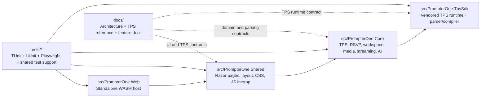

## Vertical Slice Layout

- `src/PrompterOne.Shared` keeps routed UI in feature slices: `AppShell`, `Diagnostics`, `Editor`, `Library`, `Learn`, `Teleprompter`, `GoLive`, `Settings`, and `Media`.
- `src/PrompterOne.Core` keeps host-neutral behavior in matching domain slices: `Tps`, `Editor`, `Workspace`, `Library`, `Rsvp`, `Media`, `Streaming`, `Localization`, and `AI`.
- `src/PrompterOne.TpsSdk` keeps the vendored `ManagedCode.Tps` parser/compiler/runtime that `PrompterOne.Core` adapts into app-owned contracts.
- `tests/PrompterOne.Core.Tests` and `tests/PrompterOne.Web.Tests` mirror the core and component slices.
- `tests/PrompterOne.Web.UITests` owns the shared Playwright/browser-host harness, browser test assets, and cross-suite helpers for browser acceptance.
- `tests/PrompterOne.Web.UITests.Shell`, `tests/PrompterOne.Web.UITests.Studio`, `tests/PrompterOne.Web.UITests.Editor`, and `tests/PrompterOne.Web.UITests.Reader` own the runnable browser acceptance suites by routed concern.
- `tests/PrompterOne.Testing` owns reusable test assertions and runner configuration shared across multiple test projects.

## Design And Structure Principles

### UI Design Principles

- `src/PrompterOne.Shared/wwwroot/design/*` is the shipped runtime stylesheet manifest; it is not a separate prototype product.
- UI work should fix the shipped Blazor routes, runtime CSS assets, and documented screen contracts instead of reviving a deleted root prototype tree.
- Routed screens should keep strong visual identities while still using the shared shell and contracts from `AppShell`.
- Stable dedicated test hooks are part of the UI contract, not optional test-only extras.
- Browser-first behavior matters more than server assumptions. Media, storage, and stream state stay client-side.

### Code Structure Principles

- `src/PrompterOne.Web` hosts only bootstrapping and runtime startup concerns.
- `src/PrompterOne.Shared` owns routed pages, Razor components, CSS, UI state wiring, and browser interop.
- `src/PrompterOne.Core` owns reusable domain logic, parsing, workspace state, media models, streaming logic, and agent orchestration.
- `src/PrompterOne.TpsSdk` owns vendored TPS parser/compiler internals and spec-aligned runtime contracts; `PrompterOne.Core` should adapt it, not duplicate it.
- `tests/` mirrors production ownership and proves behavior through real UI, component, and core flows.
- New code should be added where the owning boundary already lives; do not create duplicate feature centers.

## Component Ownership Map

| Component / Slice | What It Is | Why It Exists | Where It Lives | Owns | Must Not Own |
| --- | --- | --- | --- | --- | --- |
| `PrompterOne.Web` | Browser host and startup shell | Boots the standalone WASM app on the stable local origin | `src/PrompterOne.Web` | startup, host config, app shell entrypoint, production-only telemetry and error-monitoring provider ids | domain logic, feature behavior, server runtime code |
| `AppShell` | Shared routed layout and navigation shell | Keeps one navigation, header, widget, and screen-frame contract across the app | `src/PrompterOne.Shared/AppShell` | layout chrome, route-aware header state, persistent shell widgets, runtime page/event telemetry ownership | feature-specific editing, streaming, or document logic |
| `Library` | Script and folder browsing surface | Lets users discover, search, and organize scripts | `src/PrompterOne.Shared/Library`, `src/PrompterOne.Core/Library` | cards, folder tree UI, repository-backed browse flows | TPS authoring rules, reader rendering, streaming orchestration |
| `Editor` | TPS authoring surface | Creates and reshapes scripts with structure-aware tooling | `src/PrompterOne.Shared/Editor`, `src/PrompterOne.Core/Editor`, `src/PrompterOne.Core/Tps` | source editing UI, toolbar actions, front matter, TPS transforms | shell navigation policy, teleprompter playback, live runtime wiring |
| `PrompterOne.TpsSdk` | Vendored TPS parser/compiler/runtime | Keeps `PrompterOne` aligned with the upstream TPS contract without parallel local spec copies | `src/PrompterOne.TpsSdk` | TPS parser internals, runtime models, diagnostics, compile-time phrase/block/segment contracts | Blazor UI state, app-specific repositories, parallel repo-local parser implementations |
| `Learn` | RSVP rehearsal mode | Trains delivery with timing and context | `src/PrompterOne.Shared/Learn`, `src/PrompterOne.Core/Rsvp` | ORP playback, rehearsal pacing, next-phrase context | document storage, scene routing, destination configuration |
| `Teleprompter` | Read-mode playback surface | Presents the script for live reading with camera-backed composition | `src/PrompterOne.Shared/Teleprompter` | reading layout, background camera composition, runtime reading flow | script persistence rules, destination setup screens |
| `GoLive` | Operational browser studio surface | Operates the composed program feed and exposes honest live/runtime state | `src/PrompterOne.Shared/GoLive`, `src/PrompterOne.Core/Streaming` | studio layout, left-rail source control, selected vs on-air source state, browser-owned program capture, local recording control, concurrent transport publish state, right-rail telemetry and downstream health summaries | provider credential editing, source inventory, per-device sync definitions, PrompterOne-managed server media processing, unrelated editor or library concerns |
| `Settings` | Device, scene, and transport setup surface | Configures the inputs, sync, capture profile, transport connections, and downstream targets that `Go Live` operates | `src/PrompterOne.Shared/Settings`, `src/PrompterOne.Core/Media`, `src/PrompterOne.Core/Streaming` | device selection UI, source inventory, scene transforms, microphone gain/delay/sync, program-capture profiles, recording defaults, transport connection profiles, downstream target profiles, scene persistence flows | live output orchestration policy, document editing |
| `AI` | Local multi-agent text orchestration | Loads embedded skills, builds predefined agents through one factory, and exposes workflow execution for future UI actions | `src/PrompterOne.Core/AI`, `src/PrompterOne.Shared/Settings/Services` | per-agent classes with colocated system prompts, one agent factory, embedded markdown skills, provider-agnostic runtime settings contract, predefined sequential and group-chat workflows, settings-to-agent runtime bridge | routed UI, browser interop, server-hosted orchestration |
| `Storage` | Browser persistence and cloud transfer orchestration | Keeps scripts and settings local-first while exposing provider-backed import/export | `src/PrompterOne.Shared/Storage`, `src/PrompterOne.Shared/Library/Services/Storage` | browser `IStorage` and VFS registration, authoritative browser repositories for scripts/folders, provider credential persistence, scripts/settings snapshot transfer | routed page layout, teleprompter rendering, video-stream upload workflows |
| `Cross-Tab Messaging` | Same-origin browser runtime coordination | Lets separate WASM tabs coordinate browser-owned state without a backend | `src/PrompterOne.Shared/AppShell/Services`, `src/PrompterOne.Shared/Settings/Services`, `src/PrompterOne.Shared/wwwroot/app` | `BroadcastChannel` bridge, typed envelopes, settings fan-out, same-origin tab sync | server state, cross-origin transport, collaborative editor conflict resolution |
| `Diagnostics` | Error and operation feedback layer | Makes recoverable and fatal issues visible in the shell | `src/PrompterOne.Shared/Diagnostics` | banners, error boundary reporting, operation status wiring | owning business logic of the failing feature |
| `Localization` | Culture and UI text contract | Keeps supported runtime languages consistent, browser-driven, and user-overridable through persisted settings | `src/PrompterOne.Shared/Localization`, `src/PrompterOne.Core/Localization` | shared resource catalogs, startup culture bootstrap, browser-language negotiation, persisted user language override, supported culture rules | feature behavior or screen-specific layout ownership |
| `Workspace` | Active script/session state model | Gives editor, learn, read, and go-live one shared script context | `src/PrompterOne.Core/Workspace` | loaded script state, previews, estimated duration, active session metadata | feature-specific rendering details |
| `Media` | Browser media and scene domain | Models cameras, microphones, transforms, and audio bus state | `src/PrompterOne.Core/Media`, `src/PrompterOne.Shared/Media` | media device models, scene state, browser media interop | routed screen layout ownership |
| `Streaming` | Program capture, transport, and target routing domain | Defines how one composed program feed is described, which source/output modules can attach to it, and which external targets are genuinely reachable without a PrompterOne backend | `src/PrompterOne.Core/Streaming` | program-capture profiles, source/output module contracts, transport connection profiles, downstream target descriptors, routing normalization, standalone transport constraints | Razor UI or page layout concerns |
| `Browser UITest Base` | Shared browser acceptance harness | Keeps one authoritative Playwright host, synthetic media harness, browser constants, asset resolution, and helper drivers for browser suites | `tests/PrompterOne.Web.UITests` | self-hosted SPA fixture, synthetic media harness, screenshot/artifact capture, shared browser seed data, reusable browser helpers | routed feature test cases, production logic ownership |
| `Browser UITest Suites` | Category-based browser acceptance projects | Isolates browser verification by routed concern while allowing CI fan-out across independent test DLLs | `tests/PrompterOne.Web.UITests.Shell`, `tests/PrompterOne.Web.UITests.Studio`, `tests/PrompterOne.Web.UITests.Editor`, `tests/PrompterOne.Web.UITests.Reader` | routed browser scenarios for shell, studio, editor, and reader flows | duplicating the browser harness, production logic ownership |
| `tests` | Verification layers | Protects behavior with browser, component, and core assertions | `tests/*` | acceptance flows, component contracts, domain verification | production logic ownership |

## Build Governance

- `Directory.Packages.props` is the canonical source for NuGet package versions.
- `Directory.Build.props` is the canonical source for shared target framework, analyzer policy, and assembly/app version settings.
- `global.json` pins the expected .NET SDK for local and CI builds.
- `.github/workflows/pr-validation.yml` is the canonical pull-request validation flow for repo build and test gates; it runs the browser-realistic Playwright suites as dedicated macOS matrix entries after the non-browser test projects finish.
- `.github/workflows/deploy-github-pages.yml` is the canonical release pipeline for the standalone WASM app: build and test, resolve the release version from `Directory.Build.props`, publish the release artifact, publish the GitHub Release, and deploy GitHub Pages on the custom-domain root. Its validation stage isolates the `PrompterOne.Web.UITests.*` suite family from the supporting test projects so the self-hosted browser harness owns the test assets during each browser-suite run.
- Vendored browser SDK release pins live in `vendored-streaming-sdks.json`, and the exact release sync or watch flow is documented in `docs/Features/VendoredBrowserRuntimeReleases.md`.

## Runtime Boundaries

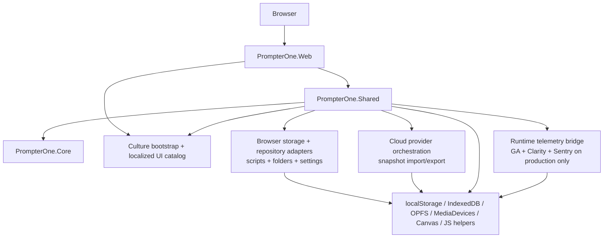

- Same-origin tab coordination is a browser-runtime concern owned in `PrompterOne.Shared`; it uses `BroadcastChannel` as a best-effort browser transport and does not change the browser-only runtime shape.

## Go Live Streaming Boundaries

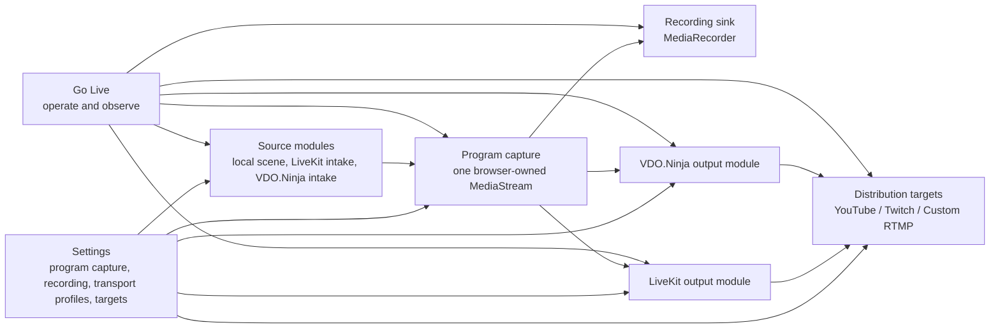

- `Go Live` now works through `sources + program + sinks`.
- The browser compositor owns one canonical program feed, and all active sinks reuse that feed instead of building separate capture graphs.
- `LiveKit` and `VDO.Ninja` may publish concurrently when both transport connections are armed.
- Downstream targets are capability-gated by the bound transport connections; the browser UI must block unsupported paths instead of pretending generic RTMP fan-out exists.

## Cross-Tab Runtime Contracts

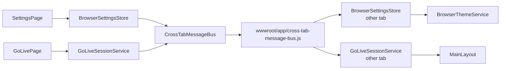

- `CrossTabMessageBus` is the reusable same-origin messaging entry point for browser tabs.
- `BrowserSettingsStore` is the current publisher and fan-out point for remote settings refresh.
- `BrowserThemeService` is the first concrete remote consumer and keeps shell appearance aligned across tabs without reload.
- `GoLiveSessionService` is the current publisher and consumer for active `Go Live` session snapshots, including startup catch-up requests.
- `MainLayout` consumes `GoLiveSessionService` and renders the global shell `Go Live` status for every screen.
- `AppShellService` owns the current in-app route and the last valid non-`Go Live` return target so the `Go Live` back control can return to the actual previous screen instead of a hardcoded reader route.
- The contract must stay message-based; tabs do not share live .NET memory.

## Library Contracts

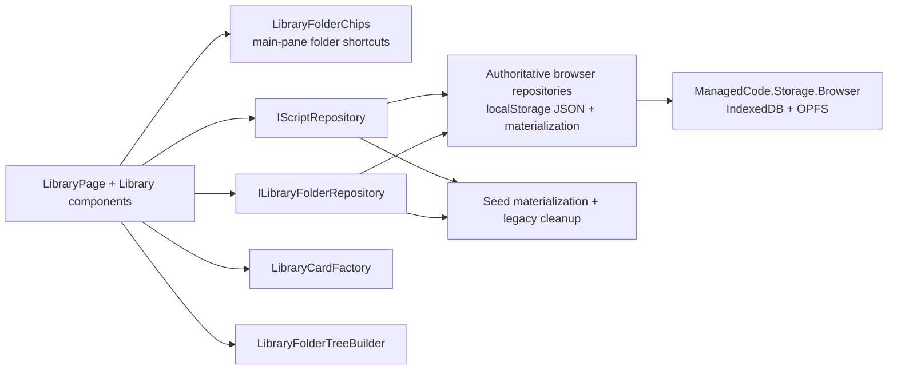

## Storage And Cloud Contracts

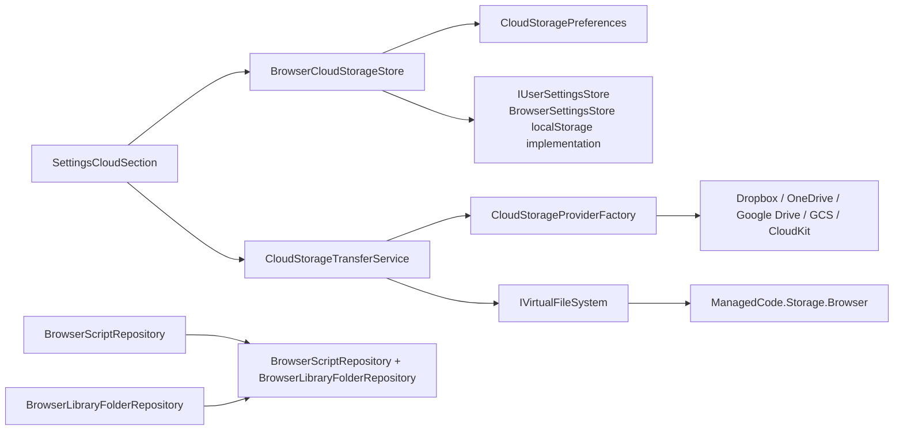

- Scripts and folders persist through authoritative browser repositories backed by versioned JSON/localStorage materialization.
- Browser `localStorage` is reserved for provider credentials, provider metadata, and lightweight settings values that must survive reloads.
- Routed pages and browser services should depend on `IUserSettingsStore` for persisted user preferences; `BrowserSettingsStore` is the browser-only implementation detail behind that contract.
- Browser storage plus VFS stay registered for cloud import/export and future stream-export work, but they are not the primary editor/library persistence path today.
- Cloud import/export currently moves one scripts-and-settings snapshot at a time; it is not a live sync engine and does not own recorded video upload.

## Editor Authoring Contracts

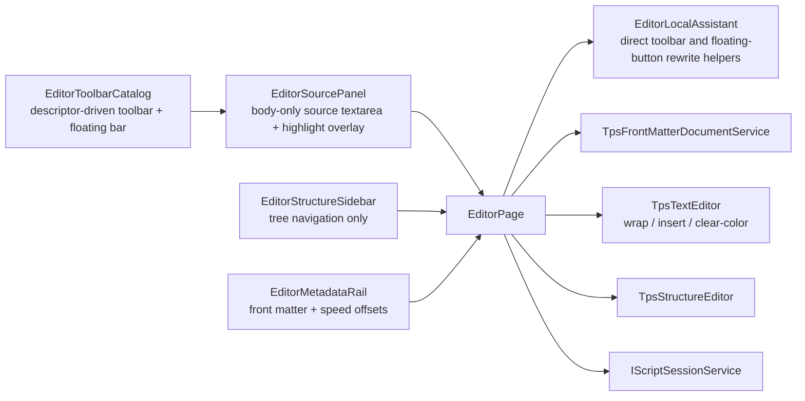

## Diagnostics Contracts

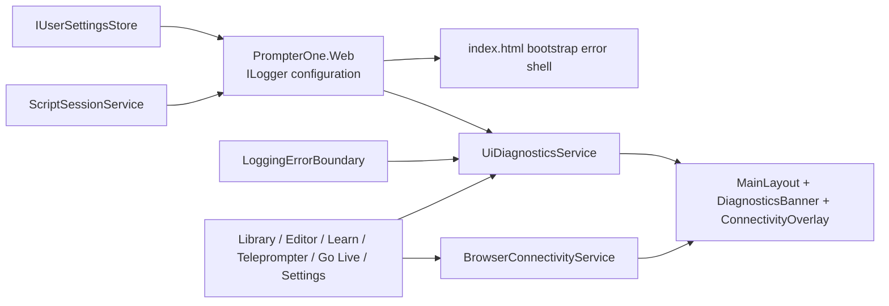

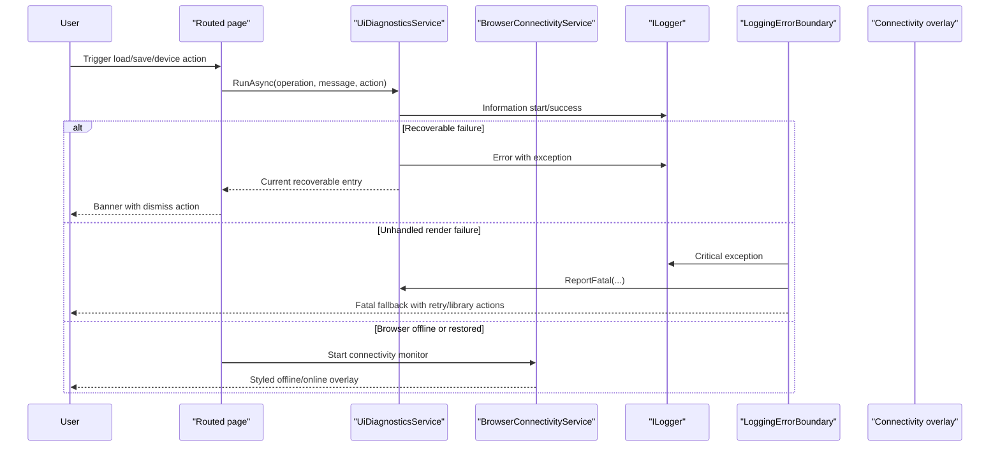

## Media Permission Model

- Browser-first WASM is the only active runtime today, so media access comes from browser origin permissions.
- Keep local development on the stable launch-settings origin. Do not rotate ports randomly because camera and microphone permissions are origin-bound.
- The Playwright browser-test harness is a separate synthetic environment. It may bind to a dynamic loopback origin, but it must pass the resolved origin into the Playwright browser context and permission grants.
- There is no server backend in the runtime path. `getUserMedia()` and device enumeration must stay client-side.

## Browser Media Test Harness

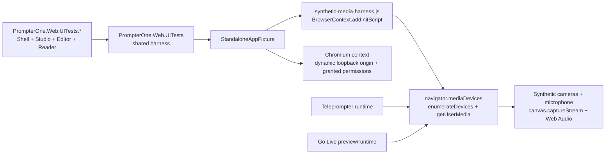

- Browser acceptance now installs a deterministic synthetic media harness before page scripts run.
- The static SPA host now binds to a dynamic loopback HTTP port and exposes the resolved origin through the fixture.
- The harness overrides `enumerateDevices()` and `getUserMedia()` inside the Playwright browser context only.
- Synthetic video comes from `canvas.captureStream()`.
- Synthetic audio comes from `AudioContext.createMediaStreamDestination()`.
- `teleprompter`, `settings`, and `go-live` tests assert real `MediaStream` attachment through `video.srcObject`, not only CSS state.

If a native embedded browser host returns later, media access must not rely on system permission alone. Follow the dedicated macOS note in [MacEmbeddedWebViewPermissions.md](./MacEmbeddedWebViewPermissions.md).

## Project Responsibilities

### `src/PrompterOne.Web`

- standalone Blazor WebAssembly host
- serves the app shell and static asset references
- applies browser-language culture selection before the WASM runtime starts rendering routed UI
- falls back to the persisted user language override from typed settings before browser negotiation, with English as the final fallback
- must stay free of server-only runtime dependencies

### `src/PrompterOne.Shared`

- routed Razor screens: `library`, `editor`, `learn`, `teleprompter`, `go-live`, `settings`
- vertical slices own their routed pages, components, renderers, and feature-local services under folders such as `Editor/`, `Library/`, `Teleprompter/`, and `GoLive/`
- only true cross-cutting UI assets stay outside feature slices: `Contracts/`, `Localization/`, `wwwroot/`, root bootstrap files, and `AppShell/`
- exact design shell and imported `design` assets
- shared UI localization catalog for supported browser cultures
- browser interop and app DI wiring
- browser-backed `IUserSettingsStore` wiring for persisted reader, theme, language, scene, and studio preferences
- dynamic library folder components and folder/document browser storage adapters
- UI diagnostics banner and global error boundary
- debounced editor autosave and body-only TPS source authoring
- centered RSVP ORP playback in `learn`
- single background camera layer under text in `teleprompter`
- teleprompter reader preferences persist through `IUserSettingsStore`, including font scale, text width, focal position, and camera auto-start preference
- dedicated `go-live` routing surface that arms multiple live destinations while reusing the same browser-composed scene
- settings split between device setup (`settings`) and destination routing (`go-live`)

Rules:

- keep markup aligned with `design`
- do not move business logic here if it belongs in `Core`
- preserve `data-test` selectors for browser tests

### `src/PrompterOne.Core`

- feature slices keep related abstractions, models, previews, and services together under `Tps/`, `Editor/`, `Workspace/`, `Library/`, `Rsvp/`, `Media/`, `Streaming/`, and `AI/`
- TPS parser, compiler, exporter
- RSVP helpers
- workspace state and preview generation
- media scene and streaming descriptor models
- predefined agent classes, one agent factory, embedded skills, and multi-agent workflow runtime

Rules:

- no Blazor dependencies
- no JS interop
- no host-specific APIs

## Main User Flows

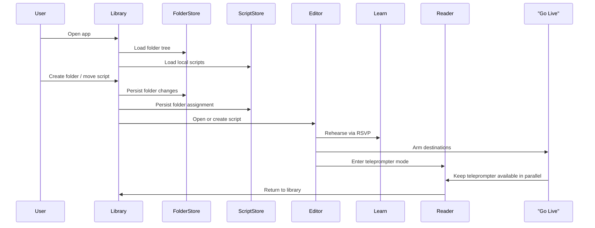

## Go Live Contracts

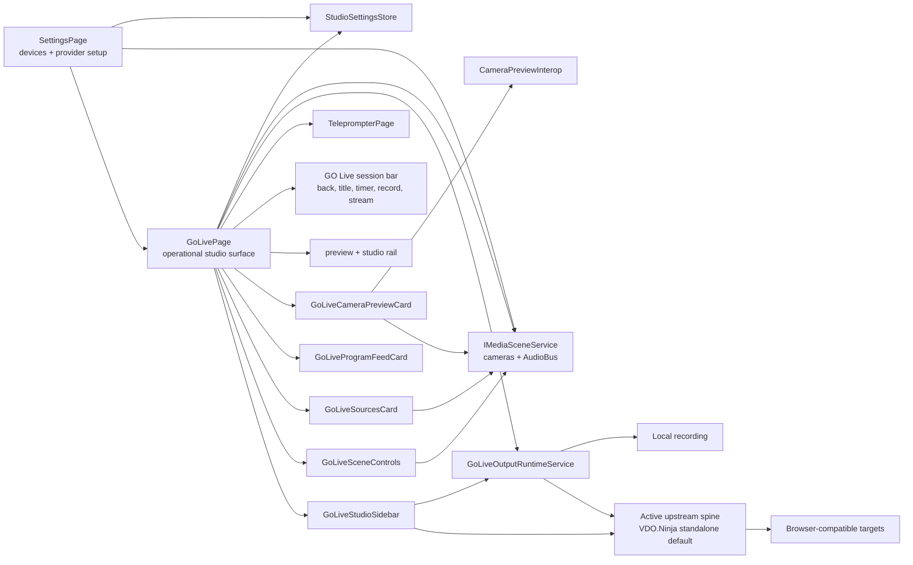

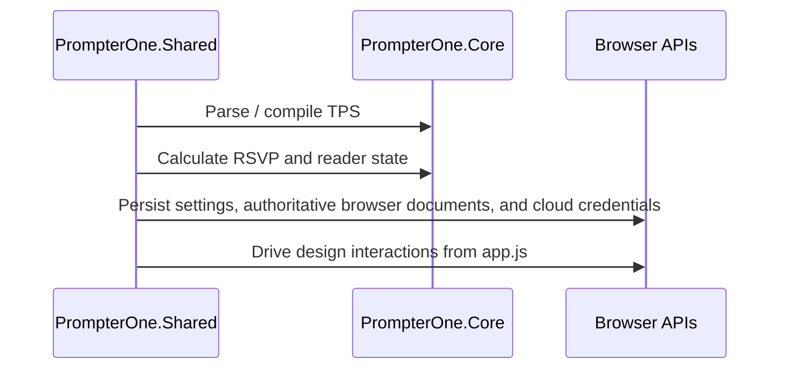

## Test Topology

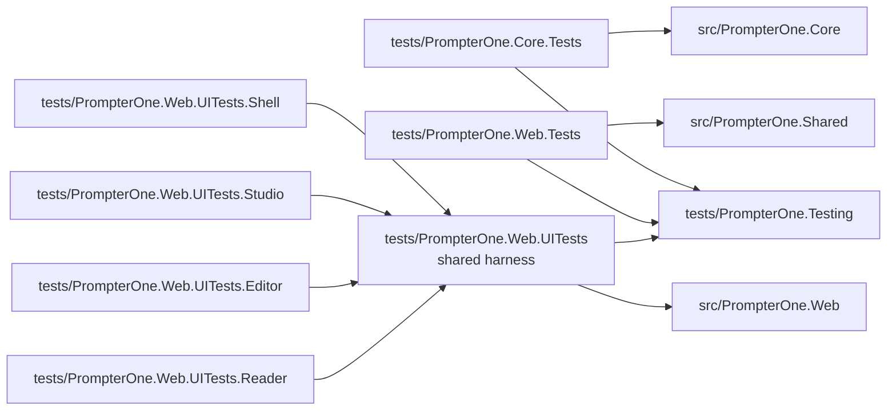

## Test Strategy

- `PrompterOne.Core.Tests`: domain correctness and regression tests grouped by core slice plus `Support/`
- `PrompterOne.Web.Tests`: bUnit coverage grouped by routed feature slice plus `Support/`
- `PrompterOne.Web.UITests`: shared Playwright/browser-host harness, synthetic media assets, browser constants, seed data, and helper drivers used by all browser suites
- `PrompterOne.Web.UITests.Shell`: Playwright browser flows for app shell, diagnostics, library, localization, settings, and browser-host infrastructure
- `PrompterOne.Web.UITests.Studio`: Playwright browser flows for GoLive, media, and end-to-end studio workflows
- `PrompterOne.Web.UITests.Editor`: Playwright browser flows for editor authoring, Monaco, toolbar, layout, and performance
- `PrompterOne.Web.UITests.Reader`: Playwright browser flows for Learn, Reader, Teleprompter, and responsive reading surfaces
- `PrompterOne.Testing`: shared test-only infrastructure such as assertion adapters and environment-aware runner limits

## Constraints

- The runtime must remain backend-free.
- `Go Live` may operate multiple concurrent browser publish transports when the operator explicitly arms them, but every active transport must still consume the same canonical browser-owned program feed.
- When a browser cannot capture multiple local cameras concurrently, `Go Live` must degrade to one live local camera preview/render at a time while preserving source switching and leaving remote feeds unaffected.
- `Go Live` must not require any PrompterOne-owned backend, relay, ingest layer, or media server; only third-party browser-facing transport infrastructure is allowed.
- Browser-language localization must default to English, must allow a persisted user override, and must support `en`, `uk`, `fr`, `es`, `it`, `de`, and `pt`.
- Russian is intentionally unsupported and must fall back to English.
- Visual fidelity should prefer copying the exact design classes and structure over inventing replacements.
- Browser tests require Playwright Chromium to be installed locally.
- Build verification is expected to pass with `-warnaserror`.
- Editor metadata belongs in the right metadata rail and must not be rendered as visible front matter in the source editor.
- `learn` must keep the ORP letter aligned to the center guide while stepping words.
- `teleprompter` must render camera only as a background layer; overlay camera boxes are not part of the current reference UI.
- If macOS embedding returns later, use a persistent `WKWebView` data store, a stable trusted origin, and explicit `requestMediaCapturePermissionFor` handling so camera and microphone prompts are not repeated on every launch.
