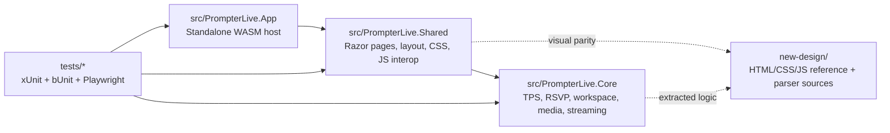
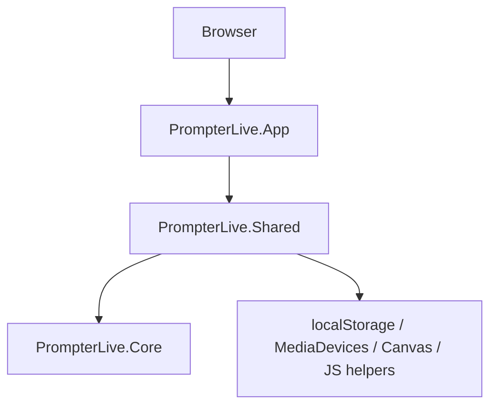
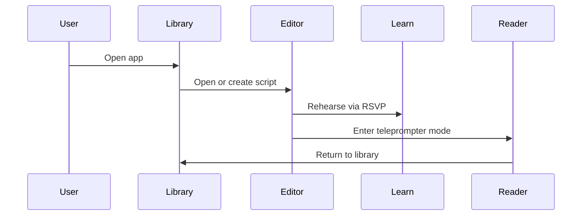
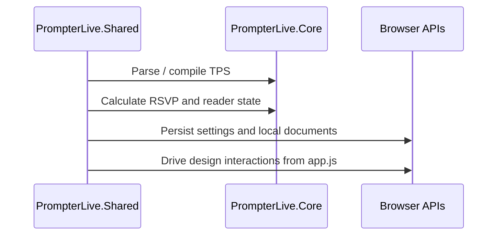
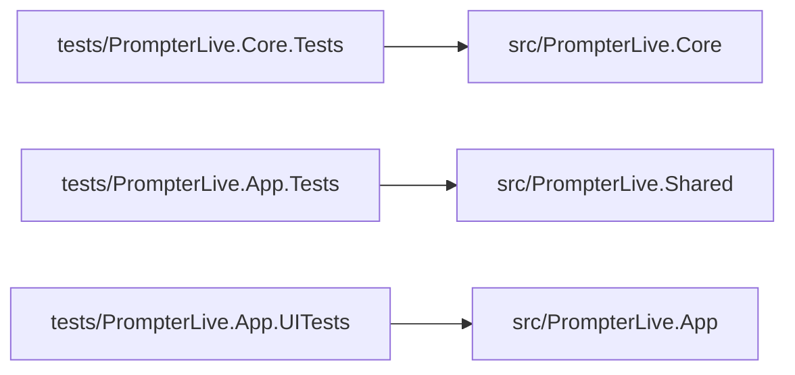

# PrompterLive Architecture

## Intent

`PrompterLive` is a standalone Blazor WebAssembly teleprompter app.

The acceptance target is a browser-only runtime that:

- matches the local `new-design/` UI closely
- parses and exports TPS content
- supports RSVP learn mode and teleprompter reading mode
- keeps media, scene, and streaming state client-side
- ships all automated tests under `tests/`

There is no backend in the runtime architecture.

## Solution Layout

## Runtime Boundaries

## Project Responsibilities

### `src/PrompterLive.App`

- standalone Blazor WebAssembly host
- serves the app shell and static asset references
- must stay free of server-only runtime dependencies

### `src/PrompterLive.Shared`

- routed Razor screens: `library`, `editor`, `learn`, `teleprompter`, `settings`
- exact design shell and imported `new-design` assets
- browser interop and app DI wiring

Rules:

- keep markup aligned with `new-design`
- do not move business logic here if it belongs in `Core`
- preserve `data-testid` selectors for browser tests

### `src/PrompterLive.Core`

- TPS parser, compiler, exporter
- RSVP helpers
- workspace state and preview generation
- media scene and streaming descriptor models

Rules:

- no Blazor dependencies
- no JS interop
- no host-specific APIs

## Main User Flows

## Test Topology

## Test Strategy

- `PrompterLive.Core.Tests`: domain correctness and regression tests
- `PrompterLive.App.Tests`: bUnit screen-shell coverage for the routed UI
- `PrompterLive.App.UITests`: Playwright browser flows that click real controls on every screen

## Constraints

- The runtime must remain backend-free.
- Visual fidelity should prefer copying the exact design classes and structure over inventing replacements.
- Browser tests require Playwright Chromium to be installed locally.
