# PrompterLive Architecture

## Intent

`PrompterLive` is a standalone Blazor WebAssembly teleprompter app.

The acceptance target is a browser-only runtime that:

- matches the local `new-design/` UI closely
- parses and exports TPS content
- supports RSVP learn mode and teleprompter reading mode
- keeps media, scene, and streaming state client-side
- ships all automated tests under `tests/`

There is no backend in the runtime architecture.

## Solution Layout

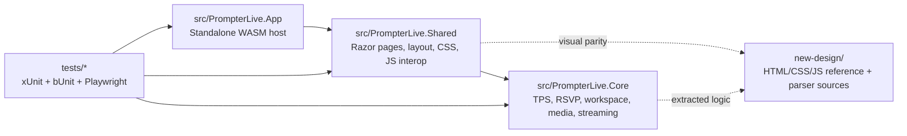

## Build Governance

- `Directory.Packages.props` is the canonical source for NuGet package versions.
- `Directory.Build.props` is the canonical source for shared target framework, analyzer policy, and assembly/app version settings.
- `global.json` pins the expected .NET SDK for local and CI builds.

## Runtime Boundaries

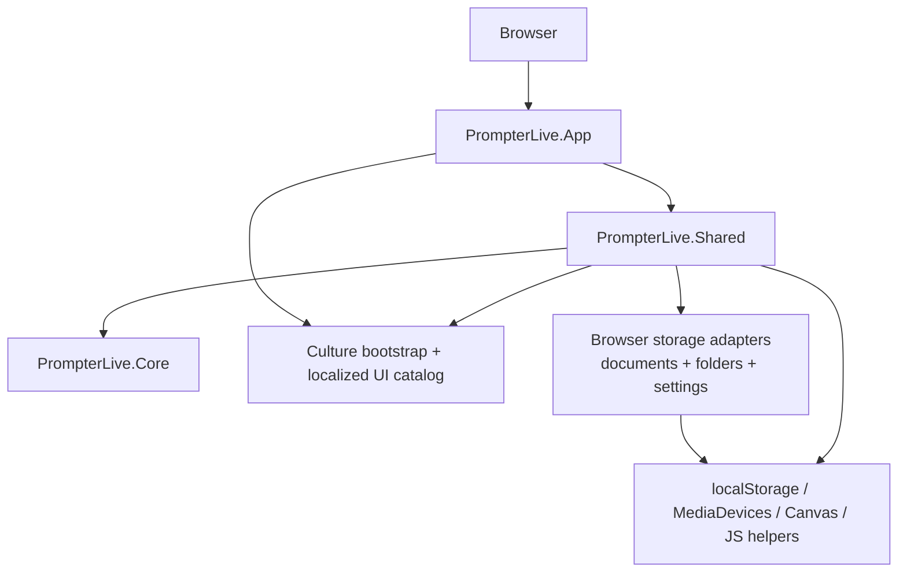

## Library Contracts

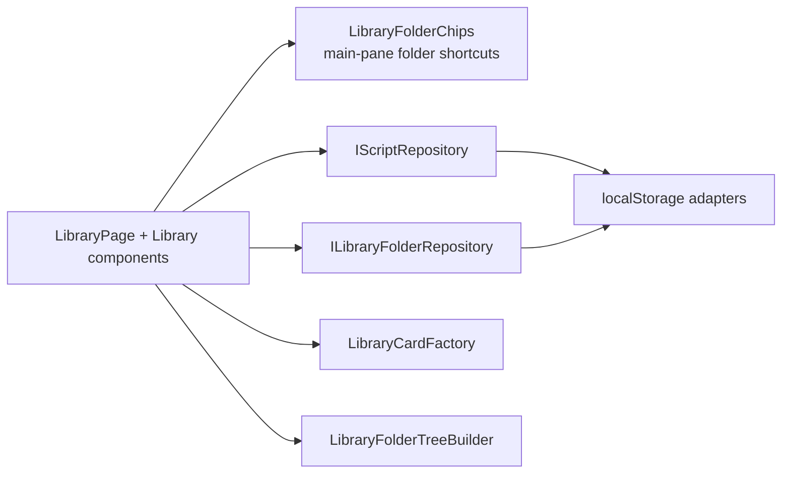

## Editor Authoring Contracts

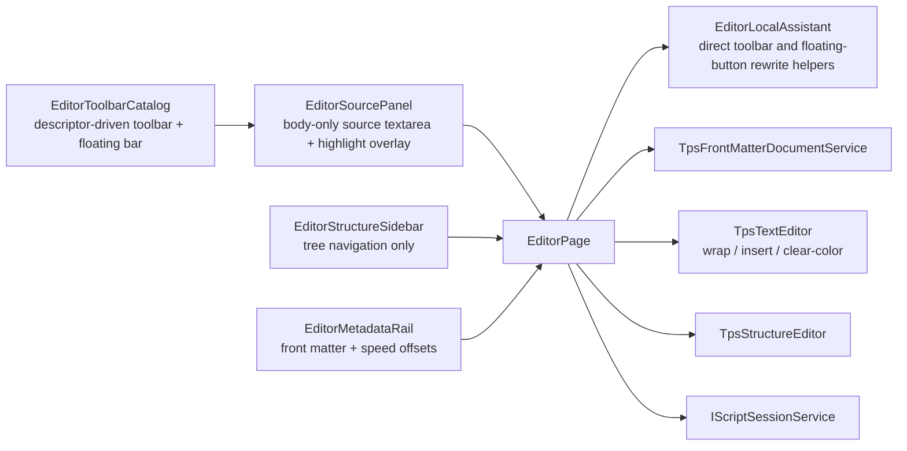

## Diagnostics Contracts

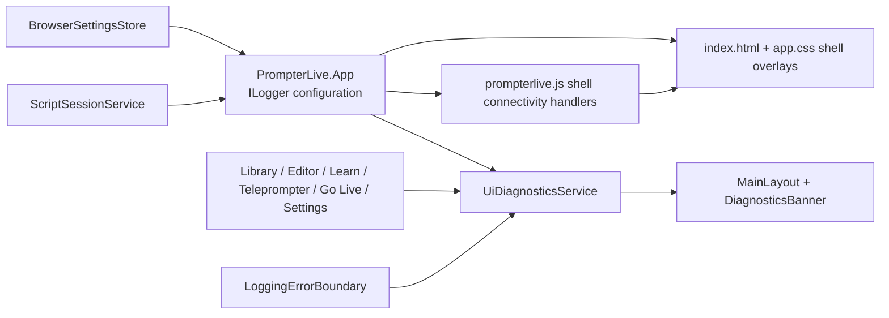

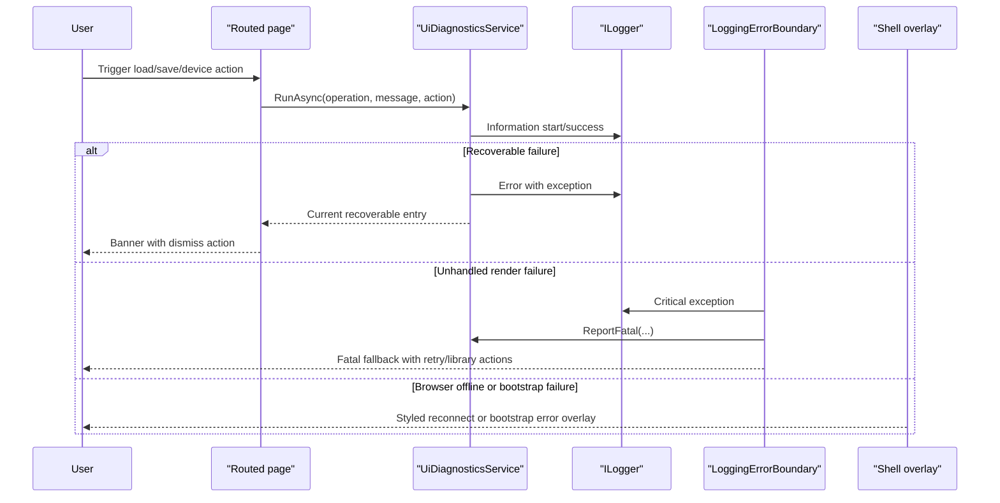

## Media Permission Model

- Browser-first WASM is the only active runtime today, so media access comes from browser origin permissions.
- Keep local development on the stable launch-settings origin. Do not rotate ports randomly because camera and microphone permissions are origin-bound.
- The Playwright browser-test harness is a separate synthetic environment. It may bind to a dynamic loopback origin, but it must pass the resolved origin into the Playwright browser context and permission grants.
- There is no server backend in the runtime path. `getUserMedia()` and device enumeration must stay client-side.

## Browser Media Test Harness

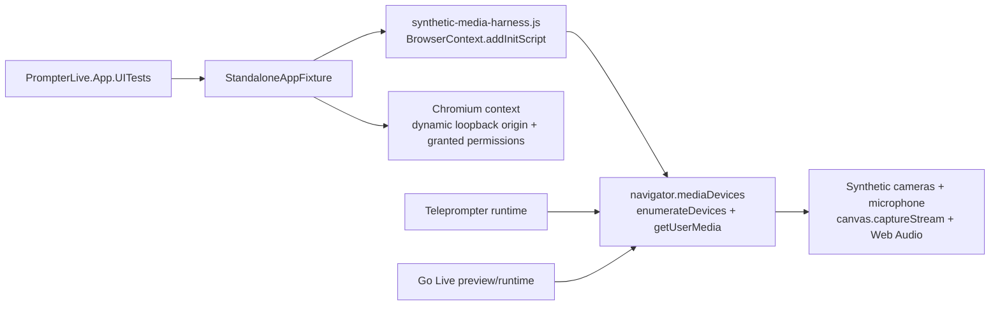

- Browser acceptance now installs a deterministic synthetic media harness before page scripts run.
- The static SPA host now binds to a dynamic loopback HTTP port and exposes the resolved origin through the fixture.
- The harness overrides `enumerateDevices()` and `getUserMedia()` inside the Playwright browser context only.
- Synthetic video comes from `canvas.captureStream()`.
- Synthetic audio comes from `AudioContext.createMediaStreamDestination()`.
- `teleprompter`, `settings`, and `go-live` tests assert real `MediaStream` attachment through `video.srcObject`, not only CSS state.

If a native embedded browser host returns later, media access must not rely on system permission alone. Follow the dedicated macOS note in [MacEmbeddedWebViewPermissions.md](./MacEmbeddedWebViewPermissions.md).

## Project Responsibilities

### `src/PrompterLive.App`

- standalone Blazor WebAssembly host
- serves the app shell and static asset references
- applies browser-language culture selection before the WASM runtime starts rendering routed UI
- must stay free of server-only runtime dependencies

### `src/PrompterLive.Shared`

- routed Razor screens: `library`, `editor`, `learn`, `teleprompter`, `go-live`, `settings`
- page files are organized as `Pages/<ScreenName>/...` so each screen keeps its Razor file and page-local partials together
- exact design shell and imported `new-design` assets
- shared UI localization catalog for supported browser cultures
- browser interop and app DI wiring
- dynamic library folder components and folder/document browser storage adapters
- UI diagnostics banner and global error boundary
- debounced editor autosave and body-only TPS source authoring
- centered RSVP ORP playback in `learn`
- single background camera layer under text in `teleprompter`
- dedicated `go-live` routing surface that arms multiple live destinations while reusing the same browser-composed scene
- settings split between device setup (`settings`) and destination routing (`go-live`)

Rules:

- keep markup aligned with `new-design`
- do not move business logic here if it belongs in `Core`
- preserve `data-testid` selectors for browser tests

### `src/PrompterLive.Core`

- TPS parser, compiler, exporter
- RSVP helpers
- workspace state and preview generation
- media scene and streaming descriptor models

Rules:

- no Blazor dependencies
- no JS interop
- no host-specific APIs

## Main User Flows

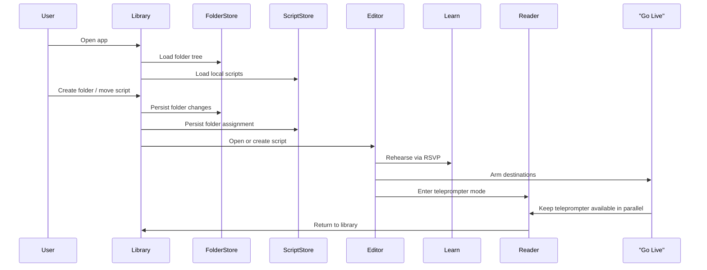

## Go Live Contracts

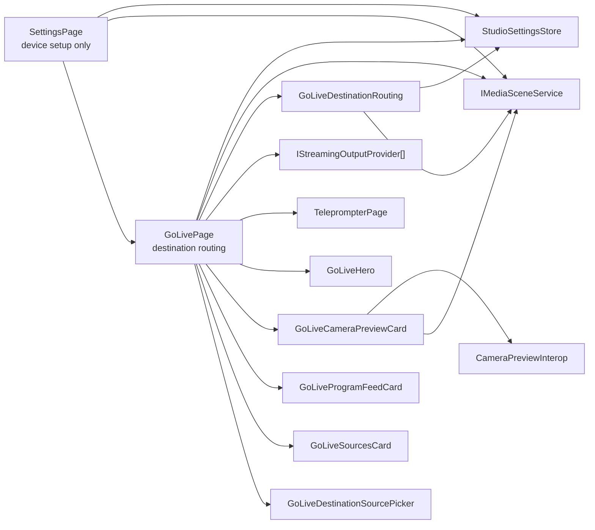

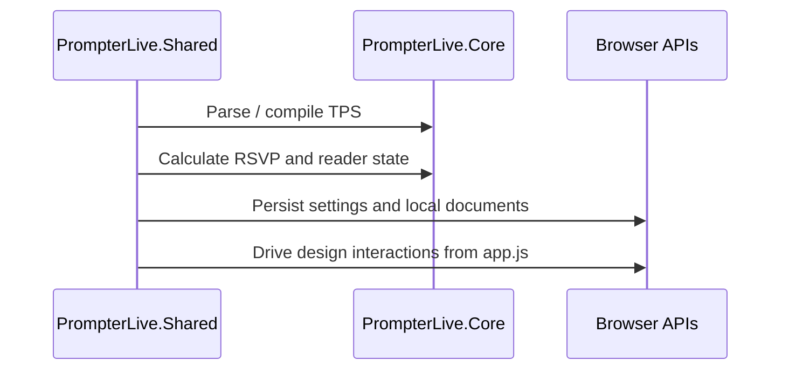

## Test Topology

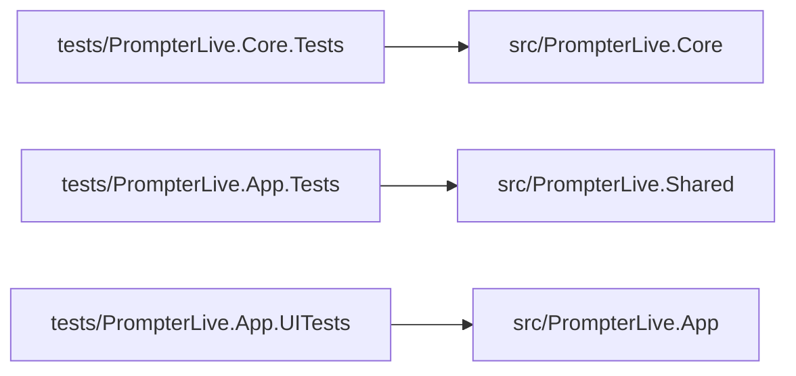

## Test Strategy

- `PrompterLive.Core.Tests`: domain correctness and regression tests
- `PrompterLive.App.Tests`: bUnit screen-shell coverage for the routed UI
- `PrompterLive.App.UITests`: Playwright browser flows that click real controls on every screen

## Constraints

- The runtime must remain backend-free.
- Browser-language localization must default to English and support `en`, `uk`, `fr`, `es`, `pt`, and `it`.
- Russian is intentionally unsupported and must fall back to English.
- Visual fidelity should prefer copying the exact design classes and structure over inventing replacements.
- Browser tests require Playwright Chromium to be installed locally.
- Build verification is expected to pass with `-warnaserror`.
- Editor metadata belongs in the right metadata rail and must not be rendered as visible front matter in the source editor.
- `learn` must keep the ORP letter aligned to the center guide while stepping words.
- `teleprompter` must render camera only as a background layer; overlay camera boxes are not part of the current reference UI.
- If macOS embedding returns later, use a persistent `WKWebView` data store, a stable trusted origin, and explicit `requestMediaCapturePermissionFor` handling so camera and microphone prompts are not repeated on every launch.
