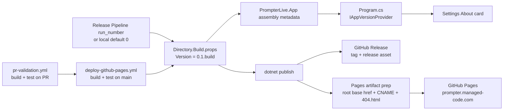

# App Versioning And GitHub Pages

## Scope

`PrompterLive` exposes the running app version inside the Settings About screen and publishes the standalone WebAssembly build through a full GitHub release pipeline.

This flow keeps the version number automated:

- local builds default to `0.1.0`
- release builds derive `0.1.<run_number>` from the active release workflow run
- the About screen reads the compiled assembly metadata instead of hardcoded copy
- the About screen links only to official Managed Code and `managedcode/PrompterLive` resources; it must never invent a team roster

## Version And Deploy Flow

## Source Of Truth

- `Directory.Build.props` is the only source of app version composition.
- `PrompterLiveBuildNumber` comes from `GITHUB_RUN_NUMBER` when CI provides it, or falls back to `0` locally.
- `.github/workflows/deploy-github-pages.yml` resolves the release version from `VersionPrefix`, so the release tag and the compiled app version stay aligned.
- `Program.cs` creates `IAppVersionProvider` from the compiled `PrompterLive.App` assembly metadata.
- `SettingsAboutSection` renders that provider value in the About card subtitle and pairs it with official Managed Code, GitHub, releases, and issues links.

## GitHub Pages Rules

- GitHub Pages publishes the standalone `src/PrompterLive.App` artifact only.
- `prompter.managed-code.com` is a custom-domain root deployment, so the Pages artifact must keep `<base href="/">`.
- The workflow copies the published `wwwroot` output, not the host wrapper files around it.
- The workflow writes `CNAME` for `prompter.managed-code.com` into the Pages artifact.
- The workflow copies `index.html` to `404.html` so client-side routes keep working on repository Pages hosting.
- `.nojekyll` must be present in the Pages artifact so framework and `_content` assets are served as-is.
- The release workflow must run build and tests before it publishes the release asset, GitHub Release, and GitHub Pages deployment.
- The Playwright browser suite must run in its own `dotnet test` step after the supporting test projects, not inside a solution-wide parallel test invocation, because the suite self-hosts shared WASM assets on a dynamic loopback origin.

## Verification

- `actionlint .github/workflows/*.yml`
- `.github/workflows/pr-validation.yml` runs `dotnet build PrompterLive.slnx -warnaserror`
- `.github/workflows/pr-validation.yml` runs `dotnet test tests/PrompterLive.Core.Tests/PrompterLive.Core.Tests.csproj --no-build`
- `.github/workflows/pr-validation.yml` runs `dotnet test tests/PrompterLive.App.Tests/PrompterLive.App.Tests.csproj --no-build`
- `.github/workflows/pr-validation.yml` runs `dotnet test tests/PrompterLive.App.UITests/PrompterLive.App.UITests.csproj --no-build`
- `dotnet test /Users/ksemenenko/Developer/PrompterLive/tests/PrompterLive.App.Tests/PrompterLive.App.Tests.csproj --filter "FullyQualifiedName~SettingsInteractionTests.AboutSection_RendersInjectedAppVersionMetadata"`
- `dotnet test /Users/ksemenenko/Developer/PrompterLive/tests/PrompterLive.App.Tests/PrompterLive.App.Tests.csproj --filter "FullyQualifiedName~SettingsInteractionTests.AboutSection_RendersInjectedAppVersionMetadata_AndOfficialManagedCodeLinks"`
- `dotnet test /Users/ksemenenko/Developer/PrompterLive/tests/PrompterLive.App.UITests/PrompterLive.App.UITests.csproj --filter "FullyQualifiedName~TeleprompterSettingsFlowTests.TeleprompterAndSettingsScreens_RespondToCoreControls"`
- `.github/workflows/deploy-github-pages.yml` publish step passes `-p:PrompterLiveBuildNumber=${{ github.run_number }}`
- `.github/workflows/deploy-github-pages.yml` publishes both the GitHub Release asset and the GitHub Pages artifact from the same release build output
