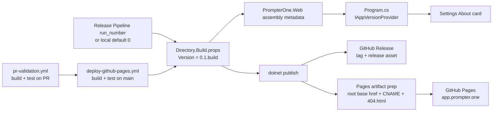

# App Versioning And GitHub Pages

## Scope

`PrompterOne` exposes the running app version inside the Settings About screen and publishes the standalone WebAssembly build through a full GitHub release pipeline.

This flow keeps the version number automated:

- local builds default to `0.1.0`
- release builds derive `0.1.<run_number>` from the active release workflow run
- the About screen reads the compiled assembly metadata instead of hardcoded copy
- the About screen links only to official Managed Code and `managedcode/PrompterOne` resources; it must never invent a team roster
- the About screen includes the official Microsoft Clarity privacy disclosure for production telemetry transparency
- the host enables production-only runtime telemetry and error monitoring for Google Analytics, Clarity, and Sentry

## Version And Deploy Flow

## Source Of Truth

- `Directory.Build.props` is the only source of app version composition.
- `PrompterOneBuildNumber` comes from `GITHUB_RUN_NUMBER` when CI provides it, or falls back to `0` locally.
- `.github/workflows/deploy-github-pages.yml` resolves the release version from `VersionPrefix`, so the release tag and the compiled app version stay aligned.
- `Program.cs` creates `IAppVersionProvider` from the compiled `PrompterOne.Web` assembly metadata.
- `SettingsAboutSection` renders that provider value in the About card subtitle and pairs it with official Managed Code, GitHub, releases, issues, and the Microsoft Clarity privacy disclosure link.

## GitHub Pages Rules

- GitHub Pages publishes the standalone `src/PrompterOne.Web` artifact only.
- `app.prompter.one` is a custom-domain root deployment, so the Pages artifact must keep `<base href="/">`.
- The workflow copies the published `wwwroot` output, not the host wrapper files around it.
- The workflow writes `CNAME` for `app.prompter.one` into the Pages artifact.
- The public landing site at `prompter.one` is hosted from the separate `PrompterOne-LandingPage` repository and must not be folded back into this app deployment.
- The workflow copies `index.html` to `404.html` so client-side routes keep working on repository Pages hosting.
- `.nojekyll` must be present in the Pages artifact so framework and `_content` assets are served as-is.
- The release workflow must run build and tests before it publishes the release asset, GitHub Release, and GitHub Pages deployment.
- The Playwright browser suite must run in its own `dotnet test` step after the supporting test projects, not inside a solution-wide parallel test invocation, because the suite self-hosts shared WASM assets on a dynamic loopback origin.

## Verification

- `actionlint .github/workflows/*.yml`
- `.github/workflows/pr-validation.yml` runs `dotnet build PrompterOne.slnx -warnaserror`
- `.github/workflows/pr-validation.yml` runs `dotnet test tests/PrompterOne.Core.Tests/PrompterOne.Core.Tests.csproj --no-build`
- `.github/workflows/pr-validation.yml` runs `dotnet test tests/PrompterOne.Web.Tests/PrompterOne.Web.Tests.csproj --no-build`
- `.github/workflows/pr-validation.yml` runs `dotnet test tests/PrompterOne.Web.UITests/PrompterOne.Web.UITests.csproj --no-build`
- `dotnet test ./tests/PrompterOne.Web.Tests/PrompterOne.Web.Tests.csproj --filter "FullyQualifiedName~SettingsInteractionTests.AboutSection_RendersInjectedAppVersionMetadata"`
- `dotnet test ./tests/PrompterOne.Web.Tests/PrompterOne.Web.Tests.csproj --filter "FullyQualifiedName~SettingsInteractionTests.AboutSection_RendersInjectedAppVersionMetadata_AndOfficialManagedCodeLinks"`
- `dotnet test ./tests/PrompterOne.Web.UITests/PrompterOne.Web.UITests.csproj --filter "FullyQualifiedName~TeleprompterSettingsFlowTests.TeleprompterAndSettingsScreens_RespondToCoreControls"`
- `.github/workflows/deploy-github-pages.yml` publish step passes `-p:PrompterOneBuildNumber=${{ github.run_number }}`
- `.github/workflows/deploy-github-pages.yml` publishes both the GitHub Release asset and the GitHub Pages artifact from the same release build output
