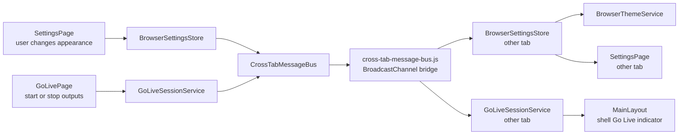

# Cross-Tab Messaging

## Intent

`PrompterOne` stays browser-only, but multiple same-origin tabs still need a safe way to coordinate browser-owned state. The cross-tab messaging contract adds a reusable `BroadcastChannel` bus in `PrompterOne.Shared` and uses it to fan out browser settings changes plus active `Go Live` session state without introducing any backend runtime.

## Main Flow

## Message Catalog

| Message Type | Payload | Published By | Read By | Reaction |
| --- | --- | --- | --- | --- |
| `settings-changed` | `BrowserSettingChangePayload` with `Key` and `ChangeKind` | `BrowserSettingsStore` after local save or remove | `BrowserSettingsStore` in other tabs | raises local `Changed` notifications so downstream consumers reload the latest value from browser storage |
| `go-live-session-requested` | `GoLiveSessionSyncRequest` empty payload | `GoLiveSessionService` when a tab joins cross-tab sync | `GoLiveSessionService` in other tabs that already have an active session | answers with a fresh `go-live-session-changed` snapshot so newly joined tabs can catch up |
| `go-live-session-changed` | `GoLiveSessionState` snapshot | `GoLiveSessionService` after stream start or stop, recording start or stop, active source switch during an active session, and request-response catch-up | `GoLiveSessionService` in other tabs | replaces the local session snapshot and triggers shell or page rerender through the existing `StateChanged` event |

## Consumers And UI Reactions

- `BrowserThemeService` listens to `BrowserSettingsStore.Changed`, reloads `SettingsPagePreferences`, and reapplies the browser theme without page reload.
- `SettingsPage` listens to the same settings change notifier and reloads the visible appearance controls when the remote change affects that feature slice.
- `GoLiveSessionService` listens directly to cross-tab messages and updates the shared `GoLiveSessionState` snapshot in each tab.
- `MainLayout` already listens to `GoLiveSessionService.StateChanged`, so the shell `Go Live` button and the persistent live widget update automatically on every screen.
- Any open `GoLivePage` instance already listens to `GoLiveSessionService.StateChanged`, so session badges and shell-linked state stay aligned with the latest snapshot.

## Behavior

- each browser tab keeps its own isolated .NET runtime and joins the shared same-origin channel `prompterone.cross-tab.v1`
- `CrossTabMessageBus` owns typed cross-tab envelopes and leaves JavaScript responsible only for `BroadcastChannel` lifecycle and message forwarding
- `BrowserSettingsStore` publishes `settings-changed` notifications after local save and remove operations
- other tabs do not receive raw values through the event contract; they reload the current value from browser storage using the existing settings store
- `BrowserThemeService` listens for remote `SettingsPagePreferences` updates and reapplies the active browser theme without reload
- `SettingsPage` listens for the same remote appearance-preferences change and refreshes the visible controls when another tab changes them
- `GoLiveSessionService` publishes active-session snapshots when stream or recording state changes, and it answers startup catch-up requests from other tabs
- the shell `Go Live` indicator uses the existing session state and renders the idle gold treatment when no session is active plus the active red treatment when streaming or recording is active
- the current concrete live-sync behavior covers appearance preferences and `Go Live` session state; the bus itself is reusable for future same-origin browser coordination

## Non-Blocking Runtime Contract

- the user-facing stream or recording action completes on the initiating tab first: `GoLivePage` updates the local runtime and local `GoLiveSessionService` state before any remote tab acknowledgement exists
- cross-tab publishing is fire-and-forget from the service layer; remote tabs are informed asynchronously and never block the initiating UI command path
- remote tabs only apply the latest immutable `GoLiveSessionState` snapshot and trigger rerender through the existing `StateChanged` event; they do not invoke local browser output interop just because a message arrived
- the JavaScript bridge does not own business state and does not execute streaming logic; it only forwards envelopes between `BroadcastChannel` and `.NET`
- startup catch-up uses a lightweight request-response pattern, not polling, so an already-active session can hydrate newly joined tabs without turning the bus into a storage system

## Boundaries

- same-origin only: protocol, host, and port must match
- no shared memory between WebAssembly instances
- no backend transport, SignalR hub, or server session
- no cross-origin communication
- no collaborative conflict resolution for rich editing flows

## Verification

- `dotnet test /Users/ksemenenko/Developer/PrompterOne/tests/PrompterOne.App.Tests/PrompterOne.App.Tests.csproj --filter "FullyQualifiedName~GoLiveCrossTabTests"`
- `dotnet test /Users/ksemenenko/Developer/PrompterOne/tests/PrompterOne.App.Tests/PrompterOne.App.Tests.csproj --filter "FullyQualifiedName~BrowserSettingsCrossTabTests"`
- `dotnet test /Users/ksemenenko/Developer/PrompterOne/tests/PrompterOne.App.UITests/PrompterOne.App.UITests.csproj --filter "FullyQualifiedName~GoLiveShellSessionFlowTests.GoLivePage_RecordingState_PropagatesAcrossSharedTabsAndReturnsToIdleAfterStop"`
- `dotnet test /Users/ksemenenko/Developer/PrompterOne/tests/PrompterOne.App.UITests/PrompterOne.App.UITests.csproj --filter "FullyQualifiedName~SettingsCrossTabSyncTests"`
- `dotnet build /Users/ksemenenko/Developer/PrompterOne/PrompterOne.slnx -warnaserror`
- `dotnet test /Users/ksemenenko/Developer/PrompterOne/PrompterOne.slnx`
- `dotnet format /Users/ksemenenko/Developer/PrompterOne/PrompterOne.slnx`
