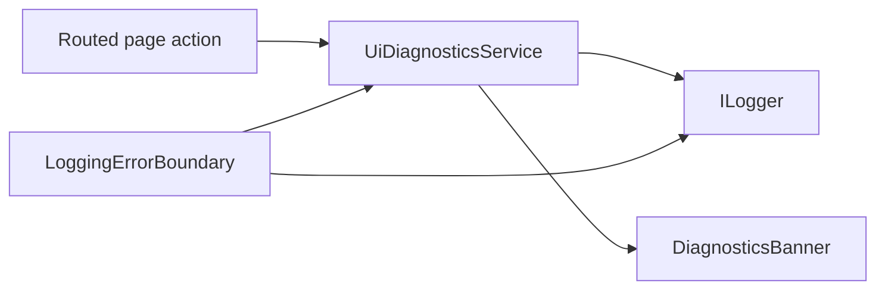

# Diagnostics

## Intent

PrompterOne stays browser-only, so local debugging has to be visible inside the UI. Recoverable failures should surface as a dismissible banner, while unhandled render exceptions should land in a fatal fallback instead of failing silently.

## Main Flow

## Behavior

- recoverable page operations run through `UiDiagnosticsService.RunAsync`
- `UiDiagnosticsService` logs `Information` at operation start/success and `Error` on failure
- recoverable failures render a top-level banner with the user-facing message and exception detail
- unhandled render exceptions go through `LoggingErrorBoundary`, log `Critical`, and render a retry/library fallback
- editor TPS syntax issues surface as recoverable diagnostics without leaking front matter into the visible editor body

## Verification

- `dotnet test /Users/ksemenenko/Developer/PrompterOne/tests/PrompterOne.App.Tests/PrompterOne.App.Tests.csproj --filter "FullyQualifiedName~DiagnosticsTests"`
- `dotnet test /Users/ksemenenko/Developer/PrompterOne/tests/PrompterOne.App.UITests/PrompterOne.App.UITests.csproj --filter "FullyQualifiedName~DiagnosticsUiTests" --no-build`
- `dotnet test /Users/ksemenenko/Developer/PrompterOne/PrompterOne.slnx`
