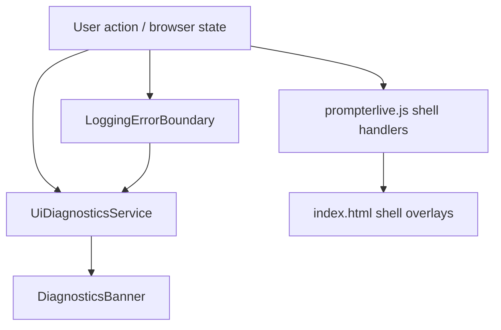

# Diagnostics Shell

## Scope

`PrompterLive` uses three branded diagnostics surfaces:

- recoverable in-app banner via `DiagnosticsBanner`
- fatal UI crash fallback via `LoggingErrorBoundary`
- shell overlays in `index.html` for bootstrap errors and browser connectivity/reconnect states

## Flow

## Rules

- `#blazor-error-ui` keeps the standard Blazor id, but it must render in PrompterLive styling.
- Standalone WASM has no server reconnect modal, so browser connectivity states are surfaced through the branded shell overlay.
- Runtime diagnostics must expose stable `data-testid` hooks for browser coverage.
- Fatal and recoverable diagnostics labels must come from the shared localization catalog.
