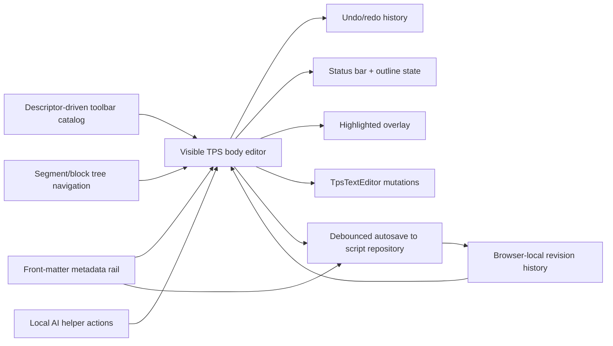
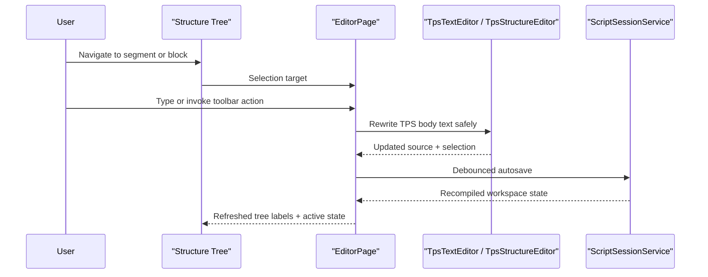

# Editor Authoring

## Intent

The `/editor` screen is a TPS-native authoring surface. The visible editor is body-only and styled inline, while metadata lives exclusively in the metadata rail and is composed back into the persisted TPS document during autosave.

## Main Flow

## Source And Navigation Contract

## Current Behavior

- floating selection toolbar supports formatting actions and stays anchored to the selection
- toolbar and floating-bar actions are rendered from a shared descriptor catalog instead of duplicated hardcoded markup
- visible source input never shows front matter; metadata is edited only in the metadata rail
- the left sidebar is tree-only and no longer renders the legacy `ACTIVE SEGMENT` / `ACTIVE BLOCK` inspector
- direct source header edits refresh the structure tree after reparse
- toolbar dropdowns open explicitly by click and expose stable test selectors
- color formatting includes a deterministic `remove color` action that strips TPS color tags from the selected region
- toolbar AI and floating AI buttons execute deterministic local rewrite helpers without opening a separate editor panel
- speed-offset metadata fields persist into front matter during autosave
- `Duration` in the metadata rail now edits `display_duration` in front matter, stays hidden from the visible body editor, and survives reloads
- source edits refresh metadata, tree labels, preview overlay, and status
- metadata edits rewrite the persisted TPS document without surfacing YAML in the editor body
- typing stays local-first while autosave persists on a short debounce instead of every keystroke
- browser-local autosave can be disabled from Settings, in which case editor mutations stay in the in-memory session until the user explicitly triggers a new internal save path
- successful internal saves capture recent browser-local revisions, and the metadata rail exposes restore actions that reapply an older persisted TPS revision without leaking front matter into the visible source
- the styled TPS overlay remains visible while the real textarea owns caret and selection, so editing stays inline instead of switching to a plain-text mode
- highlight overlay refresh is coalesced to the next animation frame, so typing stays immediate without dropping the editor into a plain-text fallback state
- the highlight overlay subtree is JS-owned while Blazor keeps workflow state, preventing per-keystroke DOM diff churn and keeping browser typing responsive
- plain `input` events no longer force a page-wide Blazor render; sidebar, metadata rail, and status refresh only after draft analysis or explicit selection/navigation interactions
- selection interop stays off the keystroke path and runs only for caret/selection workflows that actually need toolbar anchoring or focus moves
- the source highlight and textarea share the same wrapping metrics, preventing caret/text drift on multiline editing
- segment and block header lines keep their styled header treatment even while the user is in a temporarily dirty edit state such as trailing text after `]` or an incomplete closing bracket
- the authoring surface exposes a single vertical scroll container so the editor body does not fight a nested shell scrollbar
- the floating selection toolbar emotion affordance opens a real TPS emotion picker instead of applying a single hardcoded wrap
- the top toolbar shows direct TPS structure insert actions for `##` segments and `###` blocks, with the same actions still available from the insert dropdown
- native textarea clicks own caret placement; the stage shell no longer steals click-to-caret behavior
- `EditorSourcePanel` owns its editor-only CSS and browser support script, so the shell keeps loading support assets but the active editor surface no longer depends on global stylesheet or shell-script rules

## Verification

- `dotnet test ./tests/PrompterOne.Core.Tests/PrompterOne.Core.Tests.csproj`
- `dotnet test ./tests/PrompterOne.Web.Tests/PrompterOne.Web.Tests.csproj`
- `dotnet test ./tests/PrompterOne.Web.UITests/PrompterOne.Web.UITests.csproj`
- `dotnet test ./tests/PrompterOne.Web.Tests/PrompterOne.Web.Tests.csproj --filter "FullyQualifiedName~EditorLocalRevisionStoreTests|FullyQualifiedName~EditorLocalHistoryInteractionTests|FullyQualifiedName~SettingsInteractionTests"`
- `dotnet test ./tests/PrompterOne.Web.UITests/PrompterOne.Web.UITests.csproj --filter "FullyQualifiedName~EditorLocalHistoryFlowTests|FullyQualifiedName~EditorLayoutTests"`
- `dotnet test ./tests/PrompterOne.Web.UITests/PrompterOne.Web.UITests.csproj --no-build --filter "FullyQualifiedName~EditorTypingTests"`
- `dotnet test ./tests/PrompterOne.Web.UITests/PrompterOne.Web.UITests.csproj --filter "FullyQualifiedName~EditorTypingTests|FullyQualifiedName~EditorSourceSyncTests|FullyQualifiedName~EditorInteractionTests"`
- `dotnet test ./tests/PrompterOne.Web.Tests/PrompterOne.Web.Tests.csproj --filter "FullyQualifiedName~Editor"`
- `dotnet test ./tests/PrompterOne.Web.UITests/PrompterOne.Web.UITests.csproj --no-build --filter "FullyQualifiedName~Editor"`
- `dotnet build ./PrompterOne.slnx -warnaserror`
