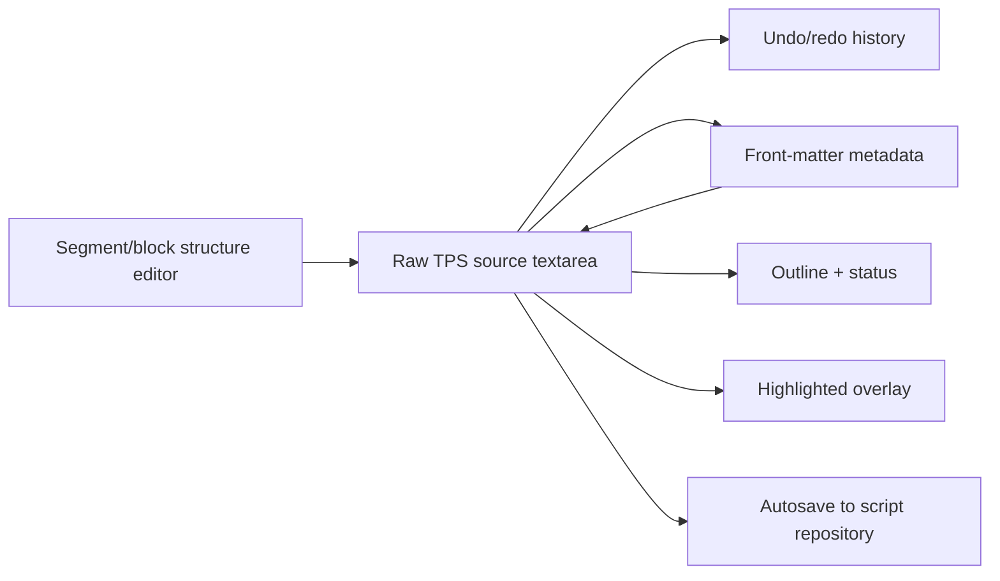
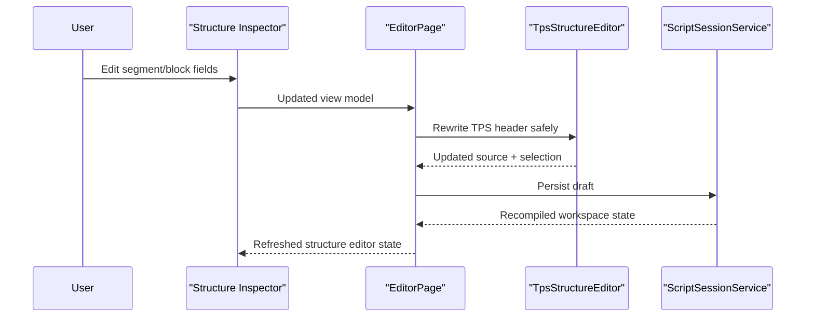

# Editor Authoring

## Intent

The `/editor` screen is a TPS-native authoring surface. The editable source remains the system of record, while the structure sidebar, metadata rail, status bar, and highlighted overlay stay synchronized with that source.

## Main Flow

## Structure Editing Contract

## Current Behavior

- floating selection toolbar supports formatting actions and stays anchored to the selection
- active segment and block can be edited through the left sidebar inspector
- speed-offset metadata fields persist into front matter
- source edits refresh metadata, outline, and status
- metadata and structure edits rewrite the source rather than bypassing it

## Verification

- `dotnet test /Users/ksemenenko/Developer/PrompterLive/tests/PrompterLive.Core.Tests/PrompterLive.Core.Tests.csproj`
- `dotnet test /Users/ksemenenko/Developer/PrompterLive/tests/PrompterLive.App.Tests/PrompterLive.App.Tests.csproj`
- `dotnet test /Users/ksemenenko/Developer/PrompterLive/tests/PrompterLive.App.UITests/PrompterLive.App.UITests.csproj`
