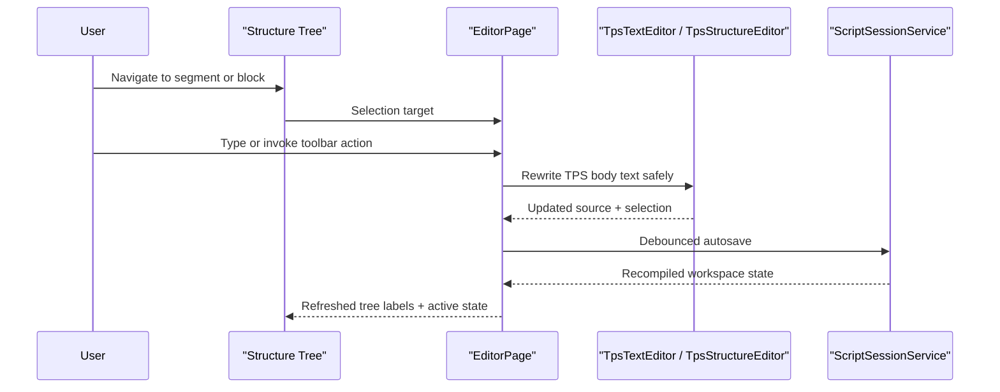

# Editor Authoring

## Intent

The `/editor` screen is a TPS-native authoring surface. The visible editor is body-only and styled inline, while metadata lives exclusively in the metadata rail and is composed back into the persisted TPS document during autosave.

## Main Flow

```mermaid
flowchart LR
    Source["Visible TPS body editor"]
    History["Undo/redo history"]
    Toolbar["Descriptor-driven toolbar catalog"]
    FrontMatter["Front-matter metadata rail"]
    Outline["Segment/block tree navigation"]
    LocalAi["Local AI helper actions"]
    Status["Status bar + outline state"]
    Highlight["Highlighted overlay"]
    TextMutations["TpsTextEditor mutations"]
    Save["Debounced autosave to script repository"]

    Toolbar --> Source
    Source --> History
    FrontMatter --> Source
    Source --> Status
    Source --> Highlight
    Outline --> Source
    LocalAi --> Source
    Source --> TextMutations
    Source --> Save
    FrontMatter --> Save
```

## Source And Navigation Contract

## Current Behavior

- floating selection toolbar supports formatting actions and stays anchored to the selection
- toolbar and floating-bar actions are rendered from a shared descriptor catalog instead of duplicated hardcoded markup
- visible source input never shows front matter; metadata is edited only in the metadata rail
- the left sidebar is tree-only and no longer renders the legacy `ACTIVE SEGMENT` / `ACTIVE BLOCK` inspector
- direct source header edits refresh the structure tree after reparse
- toolbar dropdowns open explicitly by click and expose stable test selectors
- color formatting includes a deterministic `remove color` action that strips TPS color tags from the selected region
- toolbar AI and floating AI buttons execute deterministic local rewrite helpers without opening a separate editor panel
- speed-offset metadata fields persist into front matter during autosave
- `Duration` in the metadata rail now edits `display_duration` in front matter, stays hidden from the visible body editor, and survives reloads
- source edits refresh metadata, tree labels, preview overlay, and status
- metadata edits rewrite the persisted TPS document without surfacing YAML in the editor body
- typing stays local-first while autosave persists on a short debounce instead of every keystroke
- the styled TPS overlay remains visible while the real textarea owns caret and selection, so editing stays inline instead of switching to a plain-text mode
- the source highlight and textarea share the same wrapping metrics, preventing caret/text drift on multiline editing
- native textarea clicks own caret placement; the stage shell no longer steals click-to-caret behavior
- `EditorSourcePanel` owns its editor-only CSS and browser support script, so the shell keeps loading support assets but the active editor surface no longer depends on global stylesheet or shell-script rules

## Verification

- `dotnet test /Users/ksemenenko/Developer/PrompterLive/tests/PrompterLive.Core.Tests/PrompterLive.Core.Tests.csproj`
- `dotnet test /Users/ksemenenko/Developer/PrompterLive/tests/PrompterLive.App.Tests/PrompterLive.App.Tests.csproj`
- `dotnet test /Users/ksemenenko/Developer/PrompterLive/tests/PrompterLive.App.UITests/PrompterLive.App.UITests.csproj`
- `dotnet test /Users/ksemenenko/Developer/PrompterLive/tests/PrompterLive.App.UITests/PrompterLive.App.UITests.csproj --filter "FullyQualifiedName~EditorTypingTests|FullyQualifiedName~EditorSourceSyncTests|FullyQualifiedName~EditorInteractionTests"`
