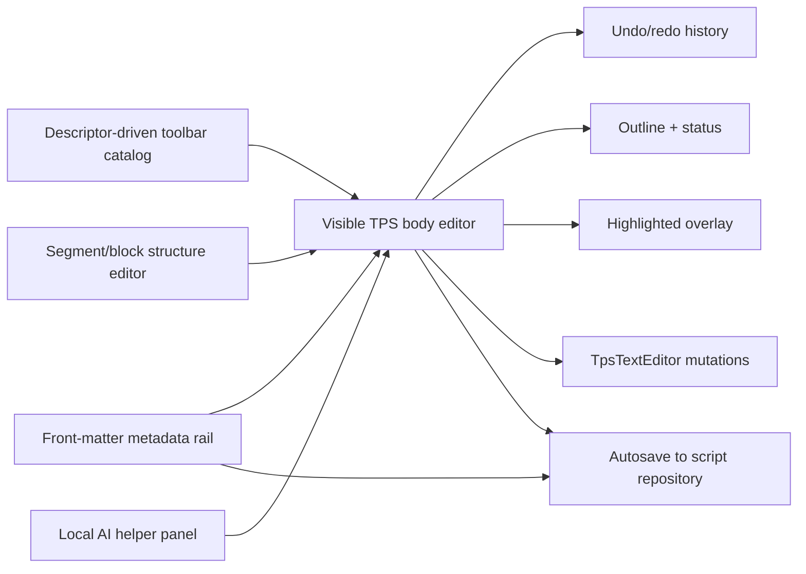
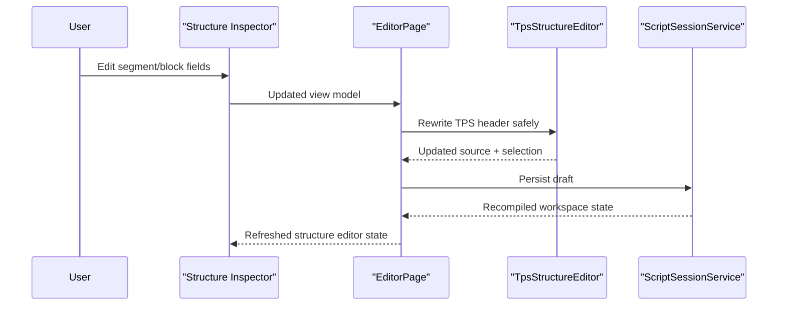

# Editor Authoring

## Intent

The `/editor` screen is a TPS-native authoring surface. The visible editor is body-only and styled inline, while metadata lives exclusively in the metadata rail and is composed back into the persisted TPS document during autosave.

## Main Flow

## Structure Editing Contract

## Current Behavior

- floating selection toolbar supports formatting actions and stays anchored to the selection
- toolbar and floating-bar actions are rendered from a shared descriptor catalog instead of duplicated hardcoded markup
- visible source input never shows front matter; metadata is edited only in the metadata rail
- active segment and block can be edited through the left sidebar inspector
- direct source header edits refresh the structure inspector after autosave and reparse
- toolbar dropdowns open explicitly by click and expose stable test selectors
- color formatting includes a deterministic `remove color` action that strips TPS color tags from the selected region
- local AI panel provides deterministic simplify, expand, and pause-format helpers without a backend
- floating AI from the selection toolbar survives the immediate follow-up selection event instead of closing instantly
- speed-offset metadata fields persist into front matter during autosave
- source edits refresh metadata, outline, and status
- metadata and structure edits rewrite the source rather than bypassing it

## Verification

- `dotnet test /Users/ksemenenko/Developer/PrompterLive/tests/PrompterLive.Core.Tests/PrompterLive.Core.Tests.csproj`
- `dotnet test /Users/ksemenenko/Developer/PrompterLive/tests/PrompterLive.App.Tests/PrompterLive.App.Tests.csproj`
- `dotnet test /Users/ksemenenko/Developer/PrompterLive/tests/PrompterLive.App.UITests/PrompterLive.App.UITests.csproj`
- `dotnet test /Users/ksemenenko/Developer/PrompterLive/tests/PrompterLive.App.UITests/PrompterLive.App.UITests.csproj --filter "FullyQualifiedName~EditorToolbarCoverageTests|FullyQualifiedName~EditorSourceSyncTests"`
