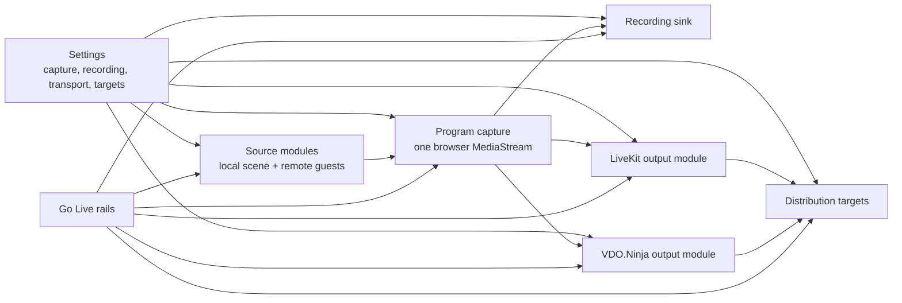
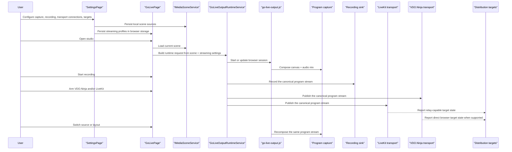
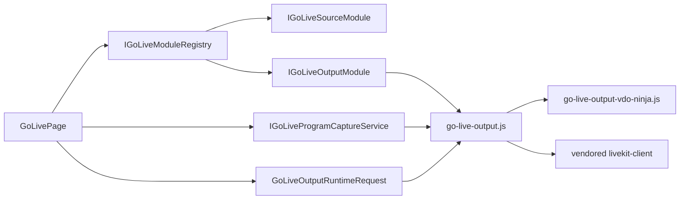
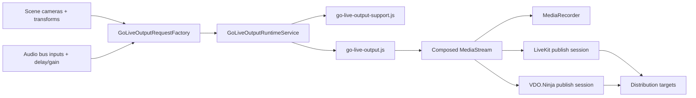

# Go Live Runtime

## Scope

`Go Live` is the browser-only operational studio for `PrompterOne`.

It owns:

- source switching for local scene cameras and remote guest sources
- one browser-owned program feed
- local recording from that same program feed
- live transport startup and stop for `VDO.Ninja` and `LiveKit`
- right-rail runtime telemetry and downstream target status

It does not own:

- provider credential editing
- source inventory or per-device sync offsets
- any PrompterOne-managed relay, ingest, encoder, or media server

`Settings` is the source of truth for:

- `ProgramCaptureProfile`
- `RecordingProfile`
- `TransportConnectionProfile`
- `DistributionTargetProfile`

## Runtime Shape

The runtime now uses explicit `sources + program + sinks` layers.

- `Source modules`
  - local browser scene sources
  - `VDO.Ninja` remote intake
  - `LiveKit` remote intake
- `Program capture`
  - one canonical composed `MediaStream`
  - owns canvas composition, overlay composition, and audio mix
- `Sink modules`
  - local recording
  - `VDO.Ninja` publish
  - `LiveKit` publish
  - downstream transport-aware targets

The browser compositor is the single source of truth. All sinks reuse that same program feed.

## Main Rules

- There is no legacy local-output path in the runtime architecture.
- There is no backward compatibility for the old local-output settings shape or the old local-output UI concepts.
- `VDO.Ninja` and `LiveKit` may both publish concurrently when both transport connections are armed.
- Local recording is a first-class sink and is not modeled as a fake external destination.
- Downstream targets such as `YouTube`, `Twitch`, and `Custom RTMP` are bound to transport connections and are only activatable when the chosen transport exposes that path honestly.
- Unsupported downstream paths must be shown as blocked, not silently degraded.
- When the browser cannot capture multiple local cameras concurrently, `Go Live` must fall back to one live local camera preview at a time while preserving fast source switching and keeping remote guest feeds live.

## Operator Surface

The routed `Go Live` page keeps the design shell:

- top session bar
- left source rail
- center program monitor
- scene controls bar
- right operational rail

The right rail now renders destination rows from two persisted collections:

- `TransportConnections`
- `DistributionTargets`

Local recording stays controlled by the `REC` action and runtime metadata instead of showing up as a fake destination row.

On browsers with single-local-camera capture limits, the operator surface must stay honest:

- only one local camera may render live across the local preview/program surfaces at a time
- selecting another local camera moves the live local preview to that source
- the live-status rail must explain the limitation instead of pretending all armed local cameras are simultaneously live

## Architecture

## Main Flow

## Contracts

The browser runtime is driven by these contracts:

- `IGoLiveProgramCaptureService`
- `IGoLiveSourceModule`
- `IGoLiveOutputModule`
- `IGoLiveModuleRegistry`

The persisted settings model is:

- `ProgramCaptureProfile`
- `RecordingProfile`
- `TransportConnectionProfile`
- `DistributionTargetProfile`

## Browser Pipeline

## Destination Semantics

- `Transport connections`
  - can ingest remote sources, publish the program, or both
  - own room, server, token, base URL, publish URL, and view URL fields
- `Distribution targets`
  - own RTMP-style target data and bound transport connection ids
  - do not imply native browser RTMP support by themselves

Current capability model:

- `LiveKit`
  - can ingest remote sources
  - can publish the program
  - can expose downstream-target capability
- `VDO.Ninja`
  - can ingest remote sources
  - can publish the program
  - supports hosted and self-hosted base/publish/view URL paths
  - does not claim generic downstream relay capability in the current implementation

## Testing Methodology

- Browser UI verification is the primary acceptance bar.
- Component and core tests prove settings normalization, routing, and runtime-request shaping.
- Go Live browser scenarios must prove:
  - local recording can start from the composed program feed
  - `VDO.Ninja` publish can start from the composed program feed
  - `LiveKit` publish can start from the composed program feed
  - both transports can be active in one session
  - source switching updates the live program state
  - single-local-camera browsers show an explicit fallback hint and move the live local preview when the operator selects another camera
  - blocked downstream targets are shown honestly

## Rules

- `Settings` owns source inventory, per-device sync, program-capture defaults, recording defaults, transport connections, and downstream targets.
- `Go Live` operates those persisted settings; it must not reintroduce inline provider credential editors.
- The browser runtime must not pretend to publish generic RTMP directly unless a real transport path exists.
- The browser runtime must not invent telemetry values that the active transport or recorder does not provide.
- Local recording must continue to capture the same composed program feed that live publish uses.
- Remote guest intake and live publish must stay modular; the UI shell should not change when a module is swapped.

## Verification

- `dotnet build ./PrompterOne.slnx -warnaserror`
- `dotnet test ./tests/PrompterOne.Core.Tests/PrompterOne.Core.Tests.csproj`
- `dotnet test ./tests/PrompterOne.Web.Tests/PrompterOne.Web.Tests.csproj`
- `dotnet test ./tests/PrompterOne.Web.UITests/PrompterOne.Web.UITests.csproj --no-build --filter "FullyQualifiedName~GoLive"`
