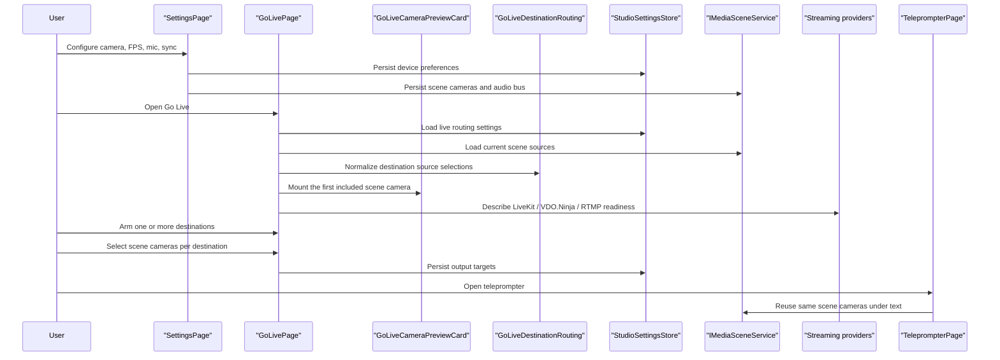
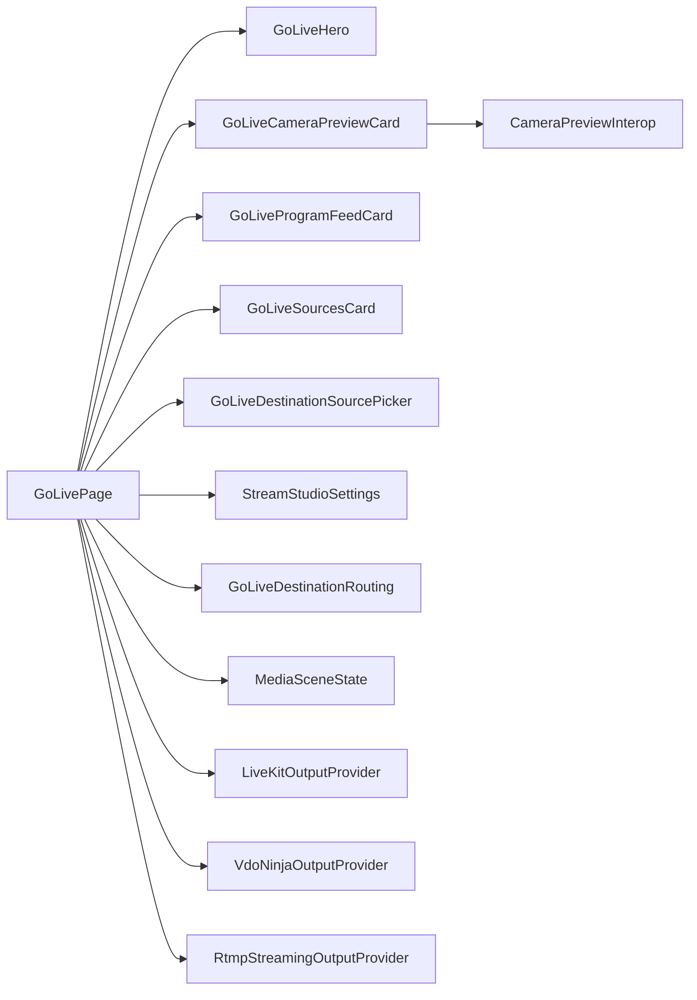

# Go Live Runtime

## Scope

`Go Live` is the dedicated browser-only routing surface for arming live destinations.

It is separate from:

- `Settings`, which owns device setup such as camera selection, resolution, FPS, microphones, and audio sync
- `Teleprompter`, which owns the read experience and can run alongside the armed live configuration

## Main Flow

## Contracts

## Rules

- `Settings` must not own live destination routing anymore.
- `Settings` must expose a visible CTA into `Go Live` so device setup and live routing stay discoverable as separate flows.
- `Go Live` may arm multiple destinations at the same time.
- `Go Live` must reuse the browser-composed scene and not invent a separate media graph.
- `Go Live` must show a live camera preview inside the program feed area, using the first included scene camera and falling back to the first visible scene camera.
- `Go Live` must show a stable empty preview state instead of mounting camera interop when the current scene has no cameras.
- each live destination must persist its own selected scene cameras, independent of the shared program feed source list
- legacy streaming settings must normalize to the current included program cameras so existing browser storage keeps working
- Camera source inclusion is persisted through `MediaSceneState`.
- Destination credentials and endpoints are persisted only in browser storage for this standalone runtime.
- Browser acceptance verifies `Go Live` preview and source switching against deterministic synthetic cameras, not only against static DOM state.
