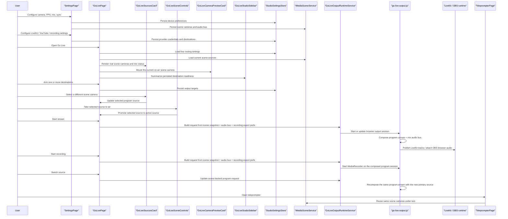
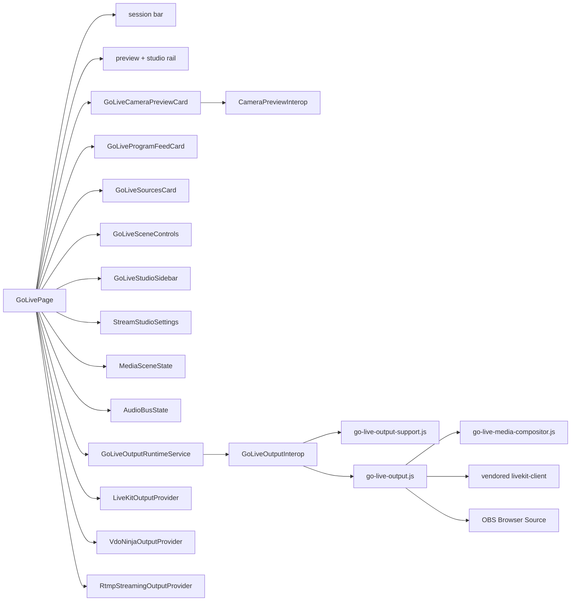
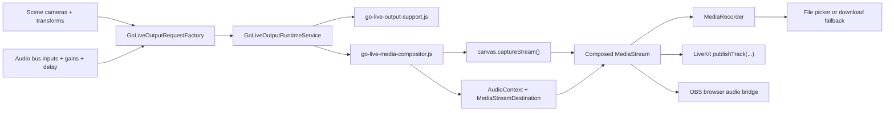

# Go Live Runtime

## Scope

`Go Live` is the dedicated browser-only operational studio surface for switching real scene inputs, previewing the current on-air camera, and arming live destinations that are already configured in browser storage.

The current page layout is a production-style studio surface:

- top session bar for back, title, timer, record, and stream controls
- left input rail for scene cameras, add-camera action, utility sources, and microphone route status
- center program stage for the selected program source and current script/session state
- scene controls bar for selecting the active studio mode and taking the selected source to air
- right rail for the current live preview plus compact stream, audio, and room/runtime panels
- destination cards that arm OBS, recording, LiveKit, and YouTube from persisted settings instead of editing credentials inline

The runtime now owns real browser media outputs for the composed program scene and the current audio bus:

- `Go Live` auto-seeds the first available browser camera into the scene when the scene is empty and the browser exposes a real camera list
- the center program stage always shows the currently selected scene camera, while the right preview rail shows the currently on-air camera until the operator takes the selected source live
- `Go Live` builds one browser-side program stream from the scene camera cards by drawing the selected primary camera full-frame and then layering additional included cameras as positioned overlays on a canvas
- the scene `AudioBus` is mixed into one program audio track through `AudioContext`, delay, and gain nodes before the final program stream is published or recorded
- OBS browser output stays browser-only and exposes the composed program audio inside an OBS Browser Source environment
- LiveKit publishing uses the vendored browser SDK and publishes real composed `MediaStreamTrack` objects for video and audio
- local recording uses the browser `MediaRecorder` API against the same composed program stream and prefers `showSaveFilePicker()` for real local file writing when the browser allows it, with download fallback otherwise
- recording export profiles are honest browser probes only: the runtime checks `MediaRecorder.isTypeSupported()` and `MediaCapabilities.encodingInfo()` before choosing the resolved MIME type and falls back to a supported browser codec/container when the requested profile is unavailable
- stream start, stop, recording start, recording stop, and source switching update the active browser output session instead of only flipping local UI state
- the session timer and right-rail `Status` / `Runtime` cards are driven from live session/runtime state, not hardcoded demo telemetry

Relay-only destinations stay configuration surfaces:

- YouTube, Twitch, custom RTMP, and similar RTMP-style targets still persist credentials and routing in browser storage
- `Go Live` only exposes quick arm/disarm toggles and readiness summaries for those targets
- detailed destination credentials, ingest URLs, and provider-specific configuration live in `Settings`
- these targets do not publish directly from the browser runtime; they require an external relay or ingest layer outside this standalone WASM app

It is separate from:

- `Settings`, which owns device setup, provider credentials, ingest endpoints, and other detailed studio configuration such as camera selection, resolution, FPS, microphones, and audio sync
- `Teleprompter`, which owns the read experience and can run alongside the armed live configuration

## Main Flow

## Contracts

## Runtime Pipeline

## Rules

- `Settings` must not own live destination routing anymore.
- `Settings` owns provider credentials, ingest endpoints, and detailed streaming configuration. `Go Live` may only arm or disarm those persisted targets and link back to `Settings` for setup.
- `Settings` must expose a visible CTA into `Go Live` so device setup and live routing stay discoverable as separate flows.
- the shared header shell must keep `Go Live` reachable from every non-`Go Live` routed page because it is a primary studio action
- `Go Live` may arm multiple destinations at the same time.
- `Go Live` must reuse the browser-composed scene and not invent a separate media graph.
- `Go Live` must auto-seed the first available browser camera into the scene when the scene is empty and devices are available.
- `Go Live` must show the selected program source in the center monitor and the currently on-air source in the right preview rail until the operator explicitly takes the selected source live.
- `Go Live` must show a stable empty preview state instead of mounting camera interop when the current scene has no cameras.
- any shared `Go Live` localized copy must come from `PrompterOne.Shared.Localization.UiTextCatalog`, so supported browser cultures localize the studio surface without feature-local string copies.
- quick destination cards must only expose honest readiness summaries and arm/disarm toggles; fake in-page credential editors are forbidden on the operational studio surface
- legacy streaming settings must normalize to the current included program cameras so existing browser storage keeps working
- `VirtualCamera` mode normalizes to OBS armed by default, so browser sessions keep the legacy desktop-capture workflow unless the user explicitly turns OBS off
- Camera source inclusion is persisted through `MediaSceneState`.
- Destination credentials and endpoints are persisted only in browser storage for this standalone runtime.
- LiveKit browser publishing must use the vendored SDK shipped in the repo, not a CDN copy.
- OBS browser integration must stay a thin browser bridge; no server relay or backend media graph is introduced.
- local recording must stay browser-local and use the same active program media session as OBS / LiveKit so record and source switching stay in sync
- local recording must prefer real local file writing through the File System Access API when the browser exposes it, but must fall back to browser download instead of pretending save-to-disk is universally available
- recording codec/container export must never advertise unsupported browser encoders as if they are guaranteed; the runtime must probe support and choose a real fallback profile
- right-rail telemetry must never show fake packet-loss, jitter, ping, or upload metrics when the browser runtime does not actually own those measurements
- remote room UI must not render fake guest personas; when no real remote guest transport exists, it may only show honest local-host state and persisted room identity
- Browser acceptance verifies `Go Live` preview and source switching against deterministic synthetic cameras, not only against static DOM state.
- Browser acceptance for LiveKit and OBS verifies real `getUserMedia` audio/video requests and runtime session state, not only button labels.

## Exception Notes

- `src/PrompterOne.Shared/wwwroot/media/go-live-media-compositor.js` temporarily exceeds the root `file_max_loc` limit because canvas compositing, shared device capture, and audio-bus graph ownership are tightly coupled around browser-only APIs. Scope: only the browser program graph. Removal plan: split video composition and audio graph helpers once the pipeline stabilizes and the recording/export profile surface is no longer moving.
- `src/PrompterOne.Shared/wwwroot/media/go-live-output-support.js` temporarily exceeds the root `file_max_loc` limit because request normalization, codec probing, and local-save recording helpers must currently stay aligned with the browser runtime contract in one place. Scope: request normalization and browser recording/export helpers. Removal plan: split request normalization from recording/export helpers after the profile mapping rules settle.
