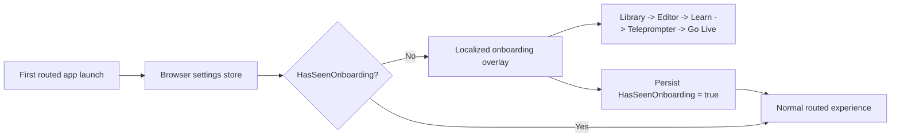
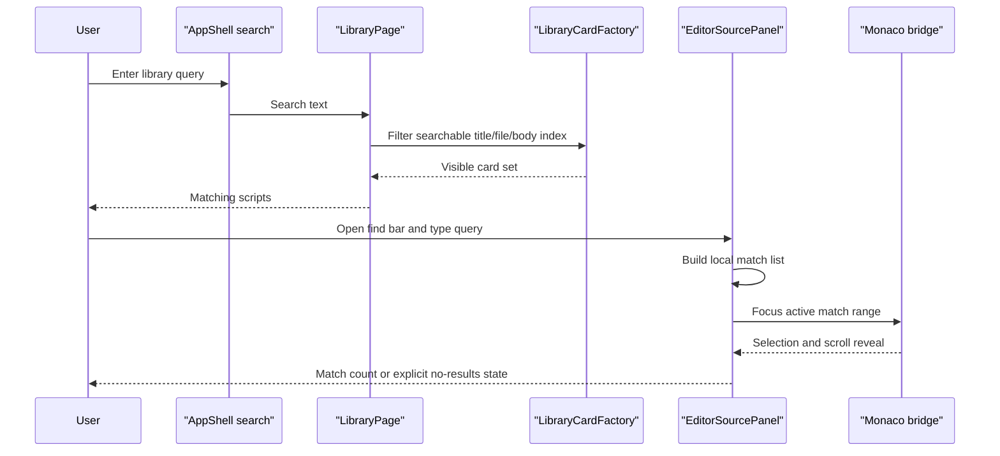

# Onboarding And Search Experience

## Intent

PrompterOne now explains itself on first launch instead of dropping a new user into a dense browser studio with no context. The first-run walkthrough introduces the product model, TPS, RSVP, Editor, Learn, Teleprompter, and Go Live, then stays dismissed once the user finishes or explicitly opts out.

The same slice also makes script discovery and authoring searchable:

- Library search matches script title, stored file name, and script body content.
- Editor search lets the user find text inside the current TPS document without leaving the routed editor.

## First-Run Flow

## Search Contracts

## Current Behavior

- `MainLayout` checks `SettingsPagePreferences.HasSeenOnboarding` from the browser-owned settings store after bootstrap.
- When the flag is `false`, the shell mounts a localized onboarding overlay and routes the user through Library, Editor, Learn, Teleprompter, and Go Live.
- Completing the tour or choosing `Not interested` persists the same browser-local settings flag so the walkthrough does not reappear on the next load.
- Onboarding copy is localized for all supported UI cultures: `en`, `uk`, `fr`, `es`, `it`, `de`, and `pt`.
- The onboarding copy explains the product model in user terms:
  - PrompterOne is browser-first and local-first.
  - TPS is the structured plain-text TelePrompterScript format used across authoring and reading.
  - RSVP in Learn is for focused rehearsal and pacing.
  - Teleprompter is the live reading surface.
  - Go Live is the browser control surface for program, routing, and recording state.
- Library search no longer depends only on visible card title/author metadata; it now searches normalized title, document name, author, and stored script body text.
- Editor search is Blazor-owned state with a thin Monaco focus bridge: the query, match counting, empty state, and next/previous controls live in `EditorSourcePanel`, while Monaco only receives the selected range to reveal.
- Test harnesses seed onboarding as already seen by default so unrelated browser and component suites keep their old baseline; onboarding-specific tests explicitly override the stored flag to `false`.

## Verification

- `dotnet build ./PrompterOne.slnx -warnaserror`
- `dotnet test ./tests/PrompterOne.Web.Tests/PrompterOne.Web.Tests.csproj --filter "FullyQualifiedName~MainLayoutOnboardingTests|FullyQualifiedName~LibrarySearchInteractionTests|FullyQualifiedName~EditorSourcePanelFindTests"`
- `dotnet test ./tests/PrompterOne.Web.Tests/PrompterOne.Web.Tests.csproj --no-build --filter "FullyQualifiedName~ScreenShellContractTests|FullyQualifiedName~MainLayoutActionTests|FullyQualifiedName~EditorSourcePanelInteractionTests|FullyQualifiedName~Library"`
- `dotnet test ./tests/PrompterOne.Web.UITests/PrompterOne.Web.UITests.csproj --no-build --filter "FullyQualifiedName~OnboardingFlowTests|FullyQualifiedName~LibrarySearchFlowTests|FullyQualifiedName~EditorFindFlowTests"`
- `dotnet test ./tests/PrompterOne.Web.UITests/PrompterOne.Web.UITests.csproj --no-build --filter "FullyQualifiedName~OnboardingFlowTests|FullyQualifiedName~LibraryScreenFlowTests|FullyQualifiedName~LibrarySearchFlowTests|FullyQualifiedName~EditorFindFlowTests|FullyQualifiedName~EditorToolbarSemanticVisualTests|FullyQualifiedName~LocalizationFlowTests"`
