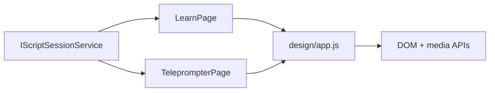

# Reader Runtime

## Intent

`learn` and `teleprompter` must follow `/Users/ksemenenko/Developer/PrompterLive/new-design/index.html` closely at runtime, not only in static markup.

The important contracts are:

- RSVP keeps the ORP letter centered on the vertical guide.
- Teleprompter camera stays behind the text as one background layer.
- Teleprompter word groups stay short enough to avoid run-on lines.

## Flow

## Runtime Rules

- `learn` uses the shared RSVP timeline from `RsvpTextProcessor` and `RsvpPlaybackEngine`.
- `learn` centers the ORP by adjusting the focus-word container only; it must not shift against the full horizontal row.
- `teleprompter` selects one primary camera device for `#rd-camera`.
- `teleprompter` does not render overlay camera elements such as `#rd-camera-overlay-*`.
- `teleprompter` groups words by pauses, sentence endings, clause endings, and short phrase limits.

## Verification

- bUnit verifies teleprompter background-camera markup and readable phrase groups.
- Playwright verifies ORP centering in `learn`.
- Playwright verifies there is no teleprompter overlay camera box and that phrase groups do not overflow.
