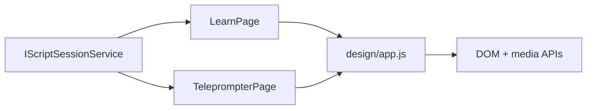

# Reader Runtime

## Intent

`learn` and `teleprompter` must follow `/Users/ksemenenko/Developer/PrompterLive/new-design/index.html` closely at runtime, not only in static markup.

The important contracts are:

- RSVP keeps the ORP letter centered on the vertical guide.
- RSVP builds phrase-aware timing from TPS scripts, not only from flat word lists.
- RSVP keeps a five-word context rail on each side, matching `new-design/app.js`.
- Teleprompter camera stays behind the text as one background layer.
- Teleprompter word groups stay short enough to avoid run-on lines.

## Flow

## Runtime Rules

- `learn` uses the shared RSVP timeline from `RsvpTextProcessor` and `RsvpPlaybackEngine`.
- `learn` must finalize TPS phrase groups before building the runtime timeline, or the `Next` phrase preview becomes incorrect.
- `learn` centers the ORP by measuring against the full horizontal word row, matching `new-design/app.js`.
- `learn` shows five context words on the left and right rails when enough words are available.
- `teleprompter` selects one primary camera device for `#rd-camera`.
- `teleprompter` does not render overlay camera elements such as `#rd-camera-overlay-*`.
- `teleprompter` groups words by pauses, sentence endings, clause endings, and short phrase limits.

## Verification

- bUnit verifies teleprompter background-camera markup and readable phrase groups.
- Core tests verify TPS scripts generate RSVP phrase groups.
- Playwright verifies ORP centering and the `security-incident` phrase-aware flow in `learn`.
- Playwright verifies there is no teleprompter overlay camera box and that phrase groups do not overflow.
- Playwright verifies the teleprompter camera button attaches and detaches a real synthetic `MediaStream` on the background video layer.
