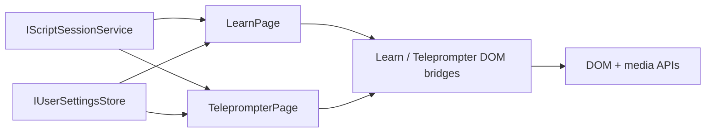

# Reader Runtime

## Intent

`learn` and `teleprompter` must follow the shipped reader runtime contract and the shared runtime styles closely at runtime, not a deleted prototype tree.

The important contracts are:

- RSVP keeps the ORP letter centered on the vertical guide.
- RSVP builds phrase-aware timing from TPS scripts, not only from flat word lists.
- RSVP keeps the nearest two visible context words on each side when they are available, without dropping left context only because a phrase pause ended.
- RSVP stops on the last word by default and only wraps when the Learn loop toggle is explicitly enabled.
- Teleprompter camera stays behind the text as one background layer.
- Teleprompter word groups stay short enough to avoid run-on lines.
- Teleprompter preserves TPS word presentation details such as pronunciation guides, inline colors, emotion styling, and speed-derived spacing/timing.
- Teleprompter pre-centers the next card before it slides in, so block transitions do not jump at the focal line.
- Teleprompter block transitions always move in one upward direction: the outgoing card exits up and the incoming card rises from below.
- Teleprompter controls stay readable at rest; they must not fade until they become unusable.
- Teleprompter route styles must already be present on first paint from the app host document; a late style attach during route entry is a regression.
- Teleprompter exposes explicit left, center, right, and full-width text alignment modes, defaults to left alignment, and keeps left- or right-aligned text optically inset so the text mass still reads near the center of the stage.
- Teleprompter side rails use delayed hover tooltips instead of browser-native `title` popups, so alignment and slider hints stay readable without covering the control itself.
- Teleprompter user-adjusted font size, text width, text alignment, focal position, and camera preference survive reloads through the shared user-settings contract.

## Flow

## Runtime Rules

- `learn` uses the shared RSVP timeline from `RsvpTextProcessor` and `RsvpPlaybackEngine`.
- `learn` must finalize TPS phrase groups before building the runtime timeline, or the `Next` phrase preview becomes incorrect.
- `learn` centers the ORP inside a fixed focus lane, so shorter or longer words do not shift the overall RSVP composition.
- `learn` shows the nearest two context words on the left and right rails when enough words are available.
- `learn` treats sentence-ending punctuation as a hard context boundary, but plain phrase pauses must not blank the left context rail.
- `learn` stops playback on the final timeline entry when loop mode is off.
- `learn` exposes a loop toggle in the playback controls; loop mode is opt-in and persisted with other Learn settings.
- `learn` must not run a second per-word rail-reflow pass after each word change; word-length changes only move the focus word inside the fixed lane.
- `teleprompter` selects one primary camera device for `#rd-camera`.
- `teleprompter` does not render overlay camera elements such as `#rd-camera-overlay-*`.
- `teleprompter` groups words by pauses, sentence endings, clause endings, and short phrase limits.
- `teleprompter` forwards TPS pronunciation metadata to word-level `title` / `data-pronunciation` attributes.
- `teleprompter` derives word-level pacing from the compiled TPS duration and carries effective WPM into the DOM for testable parity.
- `teleprompter` preserves TPS front-matter speed offsets and `[normal]` resets when rebuilding reader blocks, so relative speed tags keep both their timing math and subtle word-level spacing cues.
- `teleprompter` applies TPS inline emotion colors only when a word is explicitly tagged; untagged reader words must stay on the base reader palette instead of inheriting an implicit `neutral` word class.
- `teleprompter` keeps TPS inline colors visible even when a phrase group is active or the active word is highlighted.
- `teleprompter` keeps the active focus word calm: the active word may be brighter than its neighbors, but upcoming and read words stay gently dimmed and active-word glow stays restrained enough to avoid a bright moving patch.
- `teleprompter` exposes explicit left, center, right, and justified full-width text-alignment controls on the reader chrome; left alignment is the default and uses an optical inset instead of hard-gluing the first line to the left edge of the readable column.
- `teleprompter` keeps side-rail tooltips on a delayed custom overlay so hover help does not fight the browser-native tooltip timing or cover the rail controls.
- `teleprompter` persists font scale, text width, text alignment, focal point, and camera auto-start changes through `IUserSettingsStore` and restores them from stored `ReaderSettings` during bootstrap.
- `teleprompter` keeps forward block jumps on the straight reference path, but backward block jumps reverse that motion so the returning previous block comes in from above while the outgoing current block drops away.
- `teleprompter` uses one smooth paragraph realignment while words advance inside a card, but the first word of a newly entered card is already pre-centered so block changes do not trigger a second correction pass.
- `teleprompter` loads its feature stylesheet from the initial host `<head>` instead of relying on route-time `HeadContent`, so direct opens and route transitions share the same first-paint styling.
- `teleprompter` clamps TPS `base_wpm` to the canonical `80..220` runtime range and ignores out-of-range header WPM overrides, matching the current C# TPS contract instead of accepting unsupported playback speeds.

## Verification

- bUnit verifies teleprompter background-camera markup and readable phrase groups.
- bUnit verifies product-launch TPS modifiers survive into teleprompter word markup, timing, and pronunciation metadata.
- bUnit verifies custom TPS `speed_offsets` front matter and `[normal]` resets survive into teleprompter word classes, styles, and effective-WPM metadata.
- bUnit verifies teleprompter restores persisted reader width, text alignment, focal position, and font size and saves reader layout/camera preference changes back to stored `ReaderSettings`.
- Core tests verify TPS scripts generate RSVP phrase groups.
- Core tests verify shorthand inline WPM scopes such as `[180WPM]...[/180WPM]` survive nested tags.
- Core tests verify nested `speed_offsets:` front matter is parsed and applied to `xslow` / `slow` / `fast` / `xfast` scope math.
- Core tests verify TPS `base_wpm` clamps to the canonical runtime bounds and out-of-range header WPM overrides fall back to the clamped base value.
- Core tests verify legacy reader-settings payloads without `FocalPointPercent` deserialize with the default focal-point value.
- Core tests verify legacy reader-settings payloads without `TextAlignment` deserialize with the default left-alignment value.
- Playwright verifies ORP centering, pause-boundary left-context continuity, fixed-lane stability across short and long words, and stop-at-end versus loop-enabled playback in `learn`.
- Playwright verifies there is no teleprompter overlay camera box and that phrase groups do not overflow.
- Playwright verifies the teleprompter camera button attaches and detaches a real synthetic `MediaStream` on the background video layer.
- Playwright verifies the full `Product Launch` teleprompter scenario, including visible controls, TPS formatting parity, screenshot artifacts, and aligned post-transition playback.
- Playwright verifies teleprompter left, center, right, and justified full-width alignment controls switch real browser text layout and that the default left-aligned mode keeps the visible text mass near the stage center instead of drifting too far left.
- Playwright verifies delayed teleprompter rail tooltips stay hidden during the initial hover delay, appear after the delay, and stay outside the hovered button or slider bounds.
- Playwright verifies a dedicated reader-timing probe for both `learn` and `teleprompter`, recording emitted words in the browser and checking that sequence order and elapsed delays match the rendered timing contract word by word.
- Playwright verifies the teleprompter stylesheet is already registered in `document.styleSheets` before the app navigates into the teleprompter route.
- Playwright verifies custom TPS speed offsets change computed teleprompter `letter-spacing` while `[normal]` words reset back to neutral spacing and timing.
- Playwright verifies teleprompter width and focal settings survive a real browser reload and that backward block jumps reverse direction instead of reusing the forward upward-only path.
