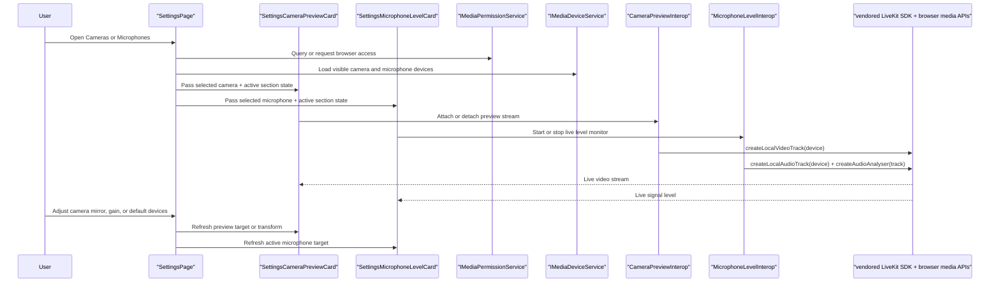
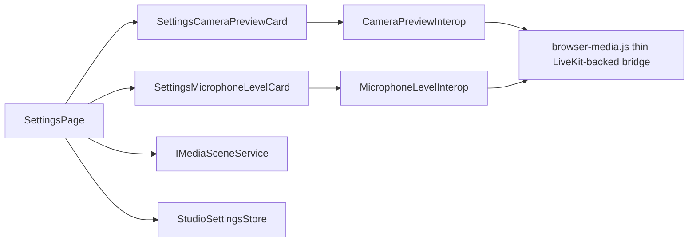

# Settings Media Feedback

## Scope

`Settings` owns device setup for the standalone browser runtime.

The camera and microphone sections now provide live feedback directly on the setup screen so the user can confirm:

- the selected camera is the one currently producing video
- mirror settings are visually obvious before opening Reader or Go Live
- the selected microphone is actively producing input signal in the browser

This feature stays separate from `Go Live` routing and from teleprompter playback.

## Main Flow

## Contracts

## Rules

- live camera preview must stay in `Settings`, not in the shared header or `Go Live`
- live microphone level must reflect real browser input, not the stored gain percentage alone
- preview and monitor lifecycles must stop when their settings section is no longer active
- the microphone meter UI must stay Blazor-owned; JS may sample browser audio and report numeric levels only
- UI contracts for the feedback cards must use stable shared `UiTestIds` and `UiDomIds`
- browser acceptance must verify real synthetic media attachment and live activity through the deterministic media harness
- settings camera and microphone feedback must use the vendored LiveKit browser SDK that is already shipped with the app, not a second CDN or ad-hoc runtime
- this document is about setup feedback only; routing remains documented in [GoLiveRuntime.md](./GoLiveRuntime.md)
