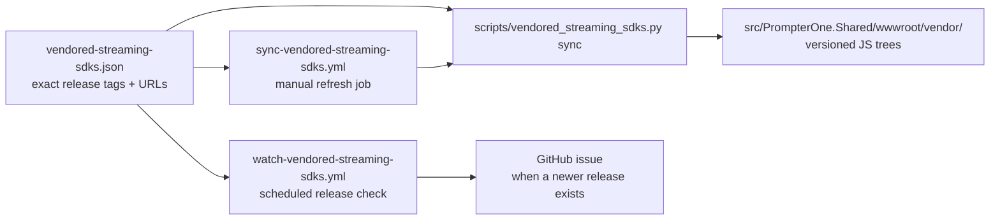

# Vendored Browser Runtime Releases

## Purpose

`PrompterOne` vendors the browser-facing runtimes for:

- `microsoft/monaco-editor`
- `livekit/client-sdk-js`
- `steveseguin/vdo.ninja`
- `steveseguin/ninjasdk`

The repo pins these runtime artifacts to exact GitHub release tags and exact GitHub release URLs. The vendored files live under `src/PrompterOne.Shared/wwwroot/vendor/` so the browser runtime does not depend on floating CDN or `latest` endpoints.

## Source Of Truth

- pinned manifest: `vendored-streaming-sdks.json`
- sync and watcher script: `scripts/vendored_streaming_sdks.py`
- scheduled watcher: `.github/workflows/watch-vendored-streaming-sdks.yml`
- independent refresh job: `.github/workflows/sync-vendored-streaming-sdks.yml`

## Current Pins

- Monaco Editor: `v0.55.1`
- LiveKit Client SDK JS: `v2.18.1`
- VDO.Ninja: `v29.0`
- VDO.Ninja SDK: `v1.3.18`

## Flow

## Update Procedure

1. Change the pinned release tag and URLs in `vendored-streaming-sdks.json`.
2. Run `python scripts/vendored_streaming_sdks.py sync`.
3. Run `python scripts/vendored_streaming_sdks.py verify`.
4. Review the versioned vendor tree under `src/PrompterOne.Shared/wwwroot/vendor/`.
5. Commit the manifest and vendored files together.

## Notes

- Monaco Editor does not publish ready-to-vendor GitHub release assets for the standalone browser runtime. The sync flow therefore builds the exact pinned GitHub release source locally, strips the upstream LSP export that currently breaks the standalone AMD packaging path, and vendors the generated `min/vs` runtime tree plus the release metadata and license files.
- LiveKit does not ship the built browser bundle as a GitHub release asset in the current release format, so the sync flow builds the exact pinned release tag from the tagged source tarball and copies only the resulting browser artifacts into the repo.
- VDO.Ninja is vendored as a runtime JS tree from the exact pinned release source tarball because its broader browser runtime spans multiple JS entrypoints and runtime-loaded dependencies.
- The official standalone browser publishing SDK comes from `steveseguin/ninjasdk` and is vendored from exact pinned GitHub release assets plus the matching license files from the release tarball.
