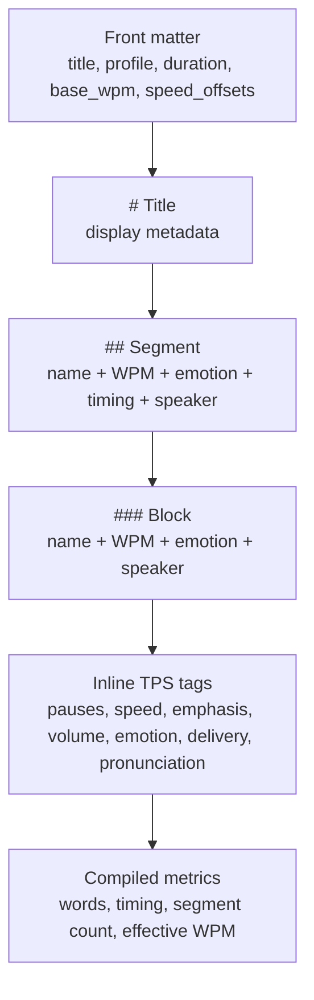

# TPS Reference

## Intent

`PrompterOne` implements the current TPS 1.1.x contract from the upstream [managedcode/TPS README](https://github.com/managedcode/TPS/blob/main/README.md). This repo-local reference replaces the deleted root TPS prototype document and records the product-facing TPS rules that the app, tests, and docs must keep aligned.

## Structure

## Canonical Upstream Source

- Upstream spec: [managedcode/TPS README](https://github.com/managedcode/TPS/blob/main/README.md)
- PrompterOne must track the upstream closed sets for:
  - emotions such as `neutral`, `warm`, `professional`, `focused`, `concerned`, `urgent`, `motivational`, `excited`, `happy`, `sad`, `calm`, and `energetic`
  - delivery tags such as `sarcasm`, `aside`, `rhetorical`, and `building`
  - volume tags such as `loud`, `soft`, and `whisper`
  - speed tags such as `[xslow]`, `[slow]`, `[normal]`, `[fast]`, `[xfast]`, and `[150WPM]...[/150WPM]`
  - pauses such as `/`, `//`, `[pause:2s]`, `[pause:1000ms]`, and `[breath]`
  - pronunciation helpers such as `[phonetic:...]`, `[pronunciation:...]`, `[stress]...[/stress]`, and `[stress:...]...[/stress]`
  - edit markers such as `[edit_point]` and `[edit_point:high]`

## PrompterOne Guardrails

- User-facing metrics must come from parsed and compiled TPS state, never from presentation-only front-matter overrides.
- Repo-owned TPS fixtures must not use `display_word_count`, `display_segment_count`, or `display_wpm`.
- `duration` or `display_duration` is author metadata only. Library cards, reader timing, learn timing, and editor stats must derive their runtime numbers from compiled words plus pause timing.
- Legacy inline color tags are unsupported in PrompterOne TPS authoring and rendering.
- Plain markdown `## Title` and `### Title` headers remain valid and must compile the same as their bracketed TPS forms with inherited defaults.

## Implementation Anchors

- Parsing: `src/PrompterOne.Core/Tps/Services/TpsParser.cs`
- Compilation: `src/PrompterOne.Core/Tps/Services/ScriptCompiler.cs`
- Library-card metrics: `src/PrompterOne.Shared/Library/Services/LibraryCardFactory.cs`
- Editor TPS authoring menus: `src/PrompterOne.Shared/Editor/Components/EditorToolbarCatalog.cs`
- Monaco TPS language support: `src/PrompterOne.Shared/wwwroot/editor/editor-monaco-tps-language-spec.js`

## Verification Expectations

- Library cards show real compiled word counts, segment counts, effective WPM, and compiled duration.
- Learn and Teleprompter timing follow compiled TPS word progression in the browser.
- Editor, Learn, and Teleprompter visuals expose TPS delivery semantics without leaking raw TPS tags into the rendered reading surface.
