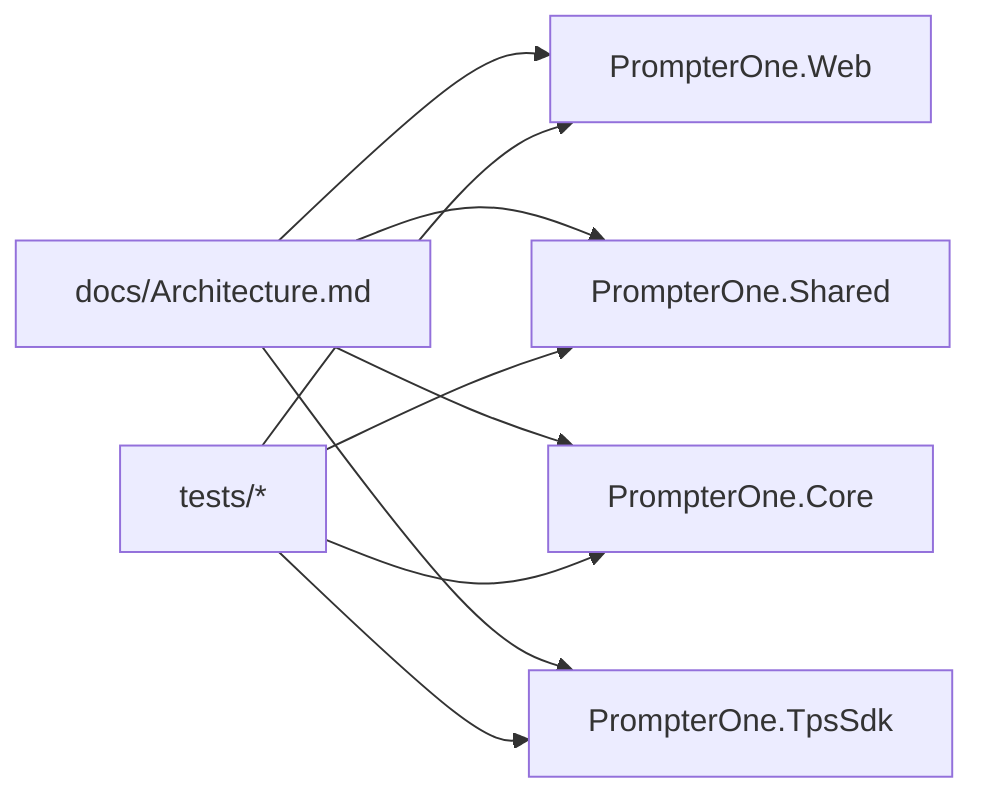

# Architecture Review

## Scope

- Repo shape, ownership boundaries, discovery docs, and major maintainability hotspots across `src/` and `tests/`.

## Summary

- Status: partially remediated
- Reviewed boundaries: `PrompterOne.Web`, `PrompterOne.Shared`, `PrompterOne.Core`, `PrompterOne.TpsSdk`, `tests/*`

## Fixed Findings

| Severity | Finding | Evidence | Status |
| --- | --- | --- | --- |
| High | The architecture map omitted `PrompterOne.TpsSdk`, even though `PrompterOne.Core` depends on it. | `docs/Architecture.md`, `src/PrompterOne.Core/PrompterOne.Core.csproj`, `src/PrompterOne.TpsSdk/*` | Fixed by adding the SDK to the solution layout, principles, and ownership map. |
| High | The architecture doc referenced a non-existent runtime-release feature document. | `docs/Architecture.md`, `docs/Features/VendoredBrowserRuntimeReleases.md` | Fixed by pointing the governance section at the real feature document. |

## Open Findings

| Severity | Finding | Evidence | Status |
| --- | --- | --- | --- |
| High | `MainLayout` is an AppShell dumping ground with route parsing, onboarding orchestration, session loading, telemetry, connectivity, theme sync, and live widget state in one boundary. | `src/PrompterOne.Shared/AppShell/Layout/MainLayout.razor.cs`, `src/PrompterOne.Shared/Services/ScriptRouteSessionLoader.cs` | Open. Needs extraction of route/query/session-loading responsibilities into reusable shell services. |
| High | Several feature surfaces remain far beyond repo maintainability limits, especially `GoLivePage`, `TeleprompterPage`, and `EditorSourcePanel`. | `src/PrompterOne.Shared/GoLive/Pages/*`, `src/PrompterOne.Shared/Teleprompter/Pages/*`, `src/PrompterOne.Shared/Editor/Components/*` | Open. Requires slice-by-slice decomposition. |
| Medium-High | `UiTestIds` is still one cross-feature static catalog and changes across nearly every routed screen. | `src/PrompterOne.Shared/Contracts/UiTestIds.cs` | Open in this batch. Split into feature-owned partials or files without changing public ids. |
| Medium-High | Test support ownership is too coarse: `TestSupport.cs` and `BrowserTestConstants.cs` each mix unrelated concerns in near-1k-line files. | `tests/PrompterOne.Web.Tests/Support/TestSupport.cs`, `tests/PrompterOne.Web.UITests/Support/BrowserTestConstants.cs` | Open. Split by harness role and feature slice. |

## Notes

- This review batch prioritized correctness and release-boundary fixes over broad file decomposition.
