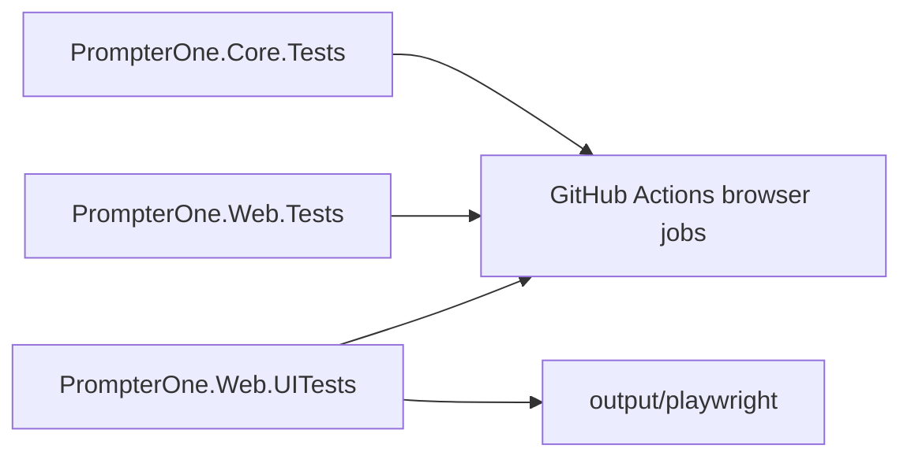

# Test Suite Review

## Scope

- Core tests, bUnit tests, Playwright acceptance tests, and CI workflow wiring under `tests/` and `.github/workflows`.

## Fixed Findings

| Severity | Finding | Evidence | Status |
| --- | --- | --- | --- |
| High | Browser CI jobs did not publish Playwright artifacts for failed or flaky UI runs. | `.github/workflows/pr-validation.yml`, `.github/workflows/deploy-github-pages.yml` | Fixed by uploading `output/playwright/` artifacts with `if: always()`. |
| Medium | Failure screenshot names could collide across data-driven UI test cases. | `tests/PrompterOne.Web.UITests/Support/UiScenarioArtifacts.cs` | Fixed by appending a UTC timestamp to failure artifact names. |
| Medium | Core regression coverage was missing for TPS phrase boundaries and smart-quote RSVP timing. | `tests/PrompterOne.Core.Tests/Tps/TpsPhraseBoundaryTests.cs`, `tests/PrompterOne.Core.Tests/Rsvp/RsvpPlaybackEngineTests.cs` | Fixed in this batch. |

## Open Findings

| Severity | Finding | Evidence | Status |
| --- | --- | --- | --- |
| Medium-High | Browser tests still contain CSS-selector dependencies instead of dedicated test ids in some areas. | `tests/PrompterOne.Web.UITests/Reader/ReaderPlaybackTimingTests.cs` and related UI tests | Open. Needs contract cleanup toward `UiTestIds`. |
| Medium-High | `BrowserTestConstants.cs` and `TestSupport.cs` are oversized cross-feature support files. | `tests/PrompterOne.Web.UITests/Support/BrowserTestConstants.cs`, `tests/PrompterOne.Web.Tests/Support/TestSupport.cs` | Open. Split by feature and harness responsibility. |
| Medium | Some component tests still use hard waits instead of tighter observable conditions. | `tests/PrompterOne.Web.Tests/Editor/*` | Open. Replace remaining `Task.Delay`-based timing with observable waits. |

## Notes

- The browser suite still needs a clean rerun in an environment without stale orphaned test processes before it can be called fully stable.
